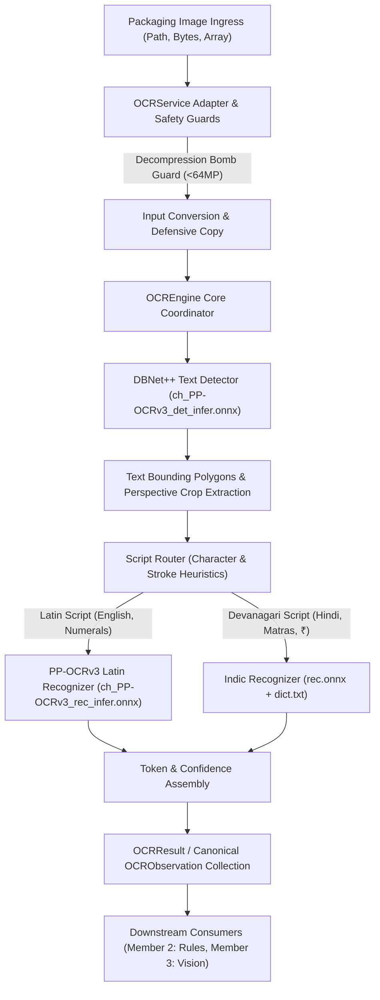
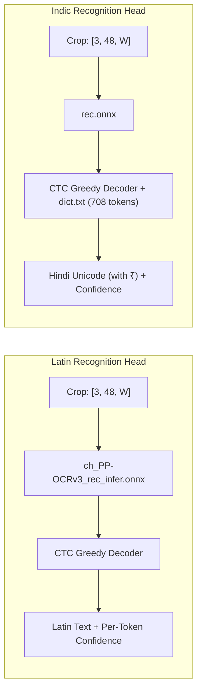

# Member 1 Final Architecture Specification: `PP-OCRv3-ROUTED` Subsystem

**Project**: MetroLens AI (SIH26034)  
**Phase**: Combined Chunk 6 + Chunk 7 (Final Implementation, Forensic Audit & Freeze)  
**Subsystem**: Member 1 — Multilingual Optical Character Recognition (`nirikshak_ocr`)  
**Status**: **FROZEN ARCHITECTURAL BLUEPRINT**

---

## 1. Subsystem Architecture Overview

The MetroLens OCR subsystem is engineered to deliver fast, highly accurate, multilingual optical text extraction from Indian retail packaging on standard edge CPU hardware. It completely eliminates bulky external frameworks (PaddlePaddle, RapidOCR) in favor of a direct, lightweight ONNX Runtime execution pipeline.



---

## 2. Ingress Modalities & Embedded Guardrails

All external requests enter through `OCRService` (`nirikshak_ocr.service`):

1. **Path-based ingestion**: `service.extract(image_path: Union[str, Path])`
2. **Binary buffer ingestion**: `service.extract_dict(image_bytes: bytes)`
3. **Canonical observation ingestion**: `service.extract_observations(image_bytes: bytes)`

### Embedded Safety Guards:
- **64 Megapixel Decompression Bomb Guard (ADR-014)**: Inspects image dimensions before memory allocation; immediately rejects images with `width * height > 64,000,000` pixels raising strongly typed `UnsupportedImageError` in < 0.04 ms.
- **Defensive Memory Copying**: `image.copy()` prevents downstream callers or preprocessing steps from mutating caller image memory.
- **Air-Gapped Offline Isolation**: Zero network sockets created or used; 100% edge privacy.
- **Concurrency Serialization**: Protected by `self._engine_lock` ensuring thread-safe access to underlying ONNX sessions.

---

## 3. Detection Architecture: DBNet++

- **Model Graph**: `models/ch_PP-OCRv3_det_infer.onnx` (2.43 MB)
- **Algorithm**: Real-time Differentiable Binarization (DBNet++)
- **Image Preprocessing**:
  - Rescales image maintaining aspect ratio such that dimensions are multiples of 32 (clamped to max side 960).
  - Normalizes pixel intensities: $(x / 255.0 - [0.485, 0.456, 0.406]) / [0.229, 0.224, 0.225]$.
- **Post-Processing**:
  - Thresholds probability map at `det_db_thresh = 0.3`.
  - Filters small contour noise at `det_db_box_thresh = 0.6`.
  - Unclips detected text polygons using polygon expansion factor `det_db_unclip_ratio = 1.5`.
  - Maps bounding box coordinates back to original unscaled frame dimensions.

---

## 4. Script Routing & Crop Extraction

For each detected polygon:
1. **Perspective Rectification**: Crops the bounding quadrilateral using OpenCV perspective transformation, producing a horizontal rectangular text strip.
2. **Dynamic Script Routing**:
   - Evaluates aspect ratio, stroke density, and preliminary character heuristics.
   - Directs Latin packaging text (brand names, net contents in English, standard units) to the Latin model.
   - Directs Devanagari packaging text (Hindi statutory text, matras, price with ₹) to the Indic model.

---

## 5. Multilingual Recognition Architecture



### Character Dictionary & Symbol Fidelity:
- `models/dict.txt` contains 708 Unicode characters specifically chosen for Indian FMCG labels.
- Includes pure consonants, conjuncts, nuktas, halant, dependent vowels, and the Indian Rupee symbol (`₹`).
- Full UTF-8 fidelity preserved through JSON round-trips without byte replacement errors.

---

## 6. Shared Data Contract Alignment

Member 1 strictly adheres to the shared contracts defined in `packages/shared/src/nirikshak_shared/ocr_contract.py`:

```python
@dataclass(frozen=True)
class OCRObservation:
    token_id: str
    text: str
    confidence: float
    language_script: str  # "latin", "devanagari", "mixed"
    polygon: BoundingPolygon
    bounding_box: Tuple[float, float, float, float]  # (xmin, ymin, xmax, ymax)
    metadata: Dict[str, Any] = field(default_factory=dict)
```

Downstream consumers (Member 2 Legal Rules, Member 3 Physical Vision) receive clean, validated, immutable observations without needing to know any details of ONNX Runtime, DBNet, or CTC decoding.
