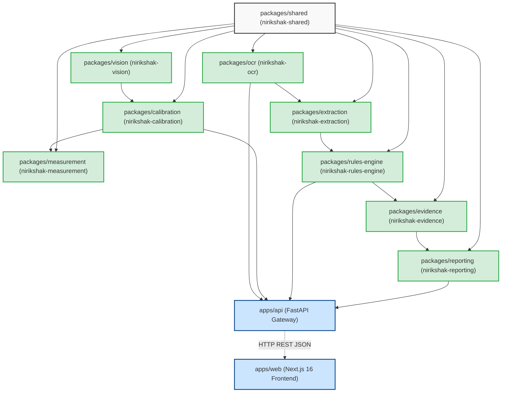

# Monorepo Dependency Graph & Topology

**Audit Date:** September 2026  
**Topology Type:** Monorepo Python (`packages/*`, `apps/api`) + TypeScript (`apps/web`)  

---

## 1. Package Dependency Hierarchy

---

## 2. Monorepo Package Table

| Package Name | PyPI / Editable Spec | Internal Dependencies | External Runtime Dependencies |
| :--- | :--- | :--- | :--- |
| `nirikshak-shared` | `packages/shared` | None | Pydantic v2 |
| `nirikshak-vision` | `packages/vision` | `shared` | OpenCV (`cv2`), NumPy, Pillow |
| `nirikshak-calibration` | `packages/calibration` | `shared`, `vision` | OpenCV, NumPy, SciPy |
| `nirikshak-measurement` | `packages/measurement` | `shared`, `calibration` | NumPy |
| `nirikshak-ocr` | `packages/ocr` | `shared` | `rapidocr-onnxruntime`, `onnxruntime` |
| `nirikshak-extraction` | `packages/extraction` | `shared`, `ocr` | Regular Expressions, Phonetic matchers |
| `nirikshak-rules-engine` | `packages/rules-engine` | `shared` | Pydantic v2 |
| `nirikshak-evidence` | `packages/evidence` | `shared` | Hashlib (SHA-256 standard library) |
| `nirikshak-reporting` | `packages/reporting` | `shared`, `evidence` | `reportlab`, `qrcode` |
| `apps/api` | `apps/api` | All packages above | FastAPI, Uvicorn, Python-Multipart |
| `apps/web` | `apps/web` | Independent TS | React 19, Next.js 16, Lucide React, Tailwind CSS |

---

## 3. Circular Dependency & Boundary Audit
- **Acyclic Verification:** Zero circular imports detected across Python packages.
- **Layer Isolation:** Domain packages (`rules-engine`, `ocr`, `calibration`) do NOT import FastAPI, Uvicorn, or web-specific dependencies.
- **Shared Invariants:** Common contracts reside in `nirikshak_shared.models.contracts` and are inherited cleanly.
