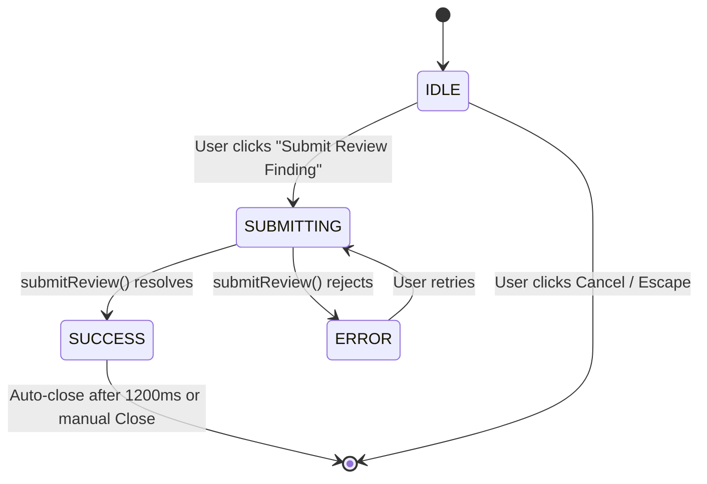

# METROLENS AI — MEMBER 5 (CHUNK M5-4)
## Inspector Review Workflow & State Machine

### 1. The Four Core Inspection Questions
The `InspectorReviewModal` strictly structures the officer's review around 4 essential statutory questions:
1. **What is being reviewed?**
   - Field name (e.g., Maximum Retail Price (MRP), Net Quantity).
   - Verbatim extracted text observed by the OCR engine.
   - Associated statutory clause under the Legal Metrology Rules, 2011.
2. **Why does it need review?**
   - Automated model confidence score (e.g., 89.1%).
   - Backend pipeline evaluation notes explaining discrepancies or low certainty.
3. **What evidence supports it?**
   - Linked bounding polygons on the packaging image.
   - Quick access to the canvas token view and two-point caliper tool.
4. **What action can the officer take?**
   - **Confirm Pass (`CONFIRMED`)**: Officer certifies that packaging complies with statutory formatting.
   - **Flag Deficit (`FLAGGED`)**: Officer marks statutory non-compliance or fraudulent declaration.

### 2. Review Modal State Machine

- **IDLE**: Notes bounded to 500 characters with live counter. Decision selectable via two radio-style cards.
- **SUBMITTING**: Buttons disabled; spinner displays "Recording Decision...". Duplicate clicks prevented.
- **SUCCESS**: Success alert confirms decision recorded in audit trail.
- **ERROR**: Actionable alert with remediation hints. In Live mode, clearly informs officer that Member 4 endpoint is pending.

### 3. State Isolation & Integrity
- Each declaration has independent review state.
- Unsaved notes are isolated per declaration review session.
- Submitting a review immutably updates `FrontendInspectionModel.declarations[fieldName].reviewStatus` in the parent workstation, immediately reflecting in the Declaration Table status column.
