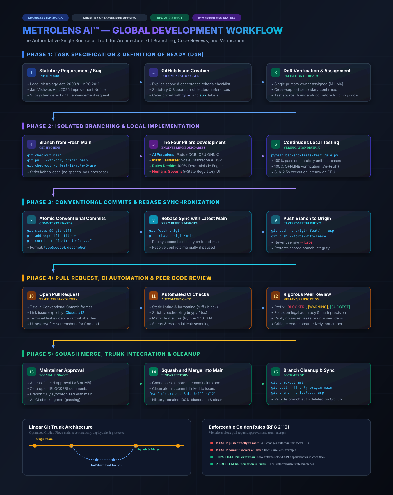

# GLOBAL TEAM DEVELOPMENT WORKFLOW
# MetroLens AI™ — Automated Legal Metrology Inspection & Compliance System
### Ministry of Consumer Affairs, Food & Public Distribution | Problem Statement: SIH26034
**Document Status:** Authoritative Single Source of Truth | **Target Audience:** All MetroLens Engineering Teammates  
**Standards Conformance:** RFC 2119 (MUST, SHOULD, MAY) | **Last Updated:** September 2026

---

> ### 💡 Quick Navigation
> "I am a new teammate. What exactly should I do from the moment I receive a task until that task is safely merged into the project?"  
> Jump straight to [Section 36: New Teammate Quick Start](#36-new-teammate-quick-start) for the 5-minute onboarding guide, then read through this complete document before submitting your first pull request.

---

<p align="center">
  
</p>

---

## Terminology Standard (RFC 2119)
To prevent ambiguity across the team, this document adheres strictly to industry standard RFC 2119 requirement levels:
* **MUST / SHALL / REQUIRED:** Absolute, non-negotiable requirement. Violating a MUST rule will block pull request approval and merge.
* **SHOULD / RECOMMENDED:** Strong best practice. Valid exceptions may exist, but must be justified and explicitly approved by a project lead.
* **MAY / OPTIONAL:** Permissible practice left to engineer discretion.

---

# 1. Project Workflow Overview

The MetroLens AI development lifecycle enforces a disciplined, traceable, and repeatable path from initial requirement to verified production merge. Every single change—whether a new computer vision algorithm, a statutory rule engine fix, or a UI button tweak—travels through the exact same 14-stage pipeline.

```text
┌─────────────────────────────────────────────────────────────────────────────┐
│                       METROLENS AI DEVELOPMENT LIFECYCLE                    │
└─────────────────────────────────────────────────────────────────────────────┘
  1. Requirement / Bug / Legal Update
         │
         ▼
  2. GitHub Issue Created (Documented with Scope & Acceptance Criteria)
         │
         ▼
  3. Assignment & Definition of Ready (DoR) Verification
         │
         ▼
  4. Local Branch Created (`git checkout -b <type>/<description>`)
         │
         ▼
  5. Local Implementation (Modular, Clean, Offline-Compatible)
         │
         ▼
  6. Local Quality Verification (Unit Tests, Lint, Type Check, Diffs)
         │
         ▼
  7. Conventional Atomic Commits (`type(scope): description`)
         │
         ▼
  8. Push Branch to Origin (`git push -u origin <branch-name>`)
         │
         ▼
  9. Open Pull Request (Using Official PR Template with Evidence)
         │
         ▼
 10. Automated Continuous Integration (Lint, Typecheck, Test Suites)
         │
         ▼
 11. Peer Code Review & Interactive Feedback Resolution
         │
         ▼
 12. Formal Maintainer Approval (At least 1 Senior Lead Approval)
         │
         ▼
 13. Squash and Merge into `main` (Clean, Bisectable Linear History)
         │
         ▼
 14. Post-Merge Synchronization & Automated Branch Deletion
```

### Explanation of Lifecycle Stages
1. **Requirement / Bug:** Work originates from statutory mandates (Legal Metrology Act, 2009; LMPC Rules, 2011; Jan Vishwas Act, 2026), UI enhancements, or identified defects.
2. **GitHub Issue:** No code is written without a corresponding GitHub Issue providing context, scope, and technical bounds.
3. **Assignment & DoR:** The developer verifies the issue is ready to start (clear requirements, test strategy understood) before accepting assignment.
4. **Local Branch:** Developer creates an isolated short-lived feature branch branched off latest `origin/main`.
5. **Local Implementation:** Code is developed incrementally following the Four Pillars (AI Perceives, Math Validates, Rules Decide, Humans Govern).
6. **Local Quality Verification:** Developer executes local test suites (`pytest`, `npm test`) and confirms offline execution.
7. **Conventional Commits:** Changes are committed in logical, descriptive chunks using standard conventional commit formatting.
8. **Push to Origin:** Branch is published to the remote GitHub repository.
9. **Open Pull Request:** Developer opens a PR, fills out the mandatory checklist, and links the issue (`Closes #12`).
10. **Automated CI:** Continuous Integration workflows automatically validate syntax, static typing, and unit test pass rates.
11. **Peer Code Review:** Designated reviewers review for correctness, security, mathematical precision, and code aesthetics.
12. **Formal Approval:** The PR receives explicit sign-off from the technical lead or designated code owner.
13. **Squash and Merge:** GitHub squashes the branch into a single atomic Conventional Commit on `main`.
14. **Post-Merge Sync:** The feature branch is automatically deleted on GitHub; the developer switches to `main` locally and runs `git pull`.

---

# 2. Team Roles and Responsibilities

MetroLens AI is built by a focused 6-member team (M1 through M6) operating under dual-project hackathon constraints. Every member owns a primary domain and provides secondary cross-functional support to maintain velocity without single points of failure.

| Role ID | Primary Role | Secondary Support | Core Responsibilities |
| :--- | :--- | :--- | :--- |
| **M1** | **AI & OCR Lead** | Backend API Support | Owns PaddleOCR v4 ONNX runtime, CPU int8 quantization, Devanagari translation mappings, and bounding box cropping. |
| **M2** | **Calibration & Geometry Lead** | Physical Data Collection | Owns optical metric scale recovery ($S = 27.0\text{mm} / d_{\text{major}}$), coin/card contour detection, right-cylinder invariance logic, and font stroke height measurement. |
| **M3** | **Backend & Rule Engine Lead** | Architecture Governance | Owns FastAPI server, Pydantic schemas, deterministic Legal Metrology state machine (Rules 6, 7, 8, 26), and Unit Sale Price (USP) arithmetic auditing. |
| **M4** | **Frontend & UX Lead** | Demo Stagecraft Support | Owns responsive Vite/React PWA, camera WebRTC viewfinder, 5-state compliance badges, evidence side-by-side viewer, and offline PWA caching. |
| **M5** | **Data & Benchmark Lead** | Calibration Support | Owns physical packaging dataset curation (35+ SKUs), 1200 DPI ground-truth optical flatbed scanning, automated CER/WER evaluation, and benchmark documentation. |
| **M6** | **Product, DevOps & Presentation Lead** | QA & Compliance Audit | Owns repository governance, GitHub CI/CD workflows, cryptographic SHA-256 PDF report generation, eMaap mock sync adapter, and presentation rehearsal. |

### Practical Governance Matrix
To eliminate bottlenecks and clarify authority:
* **Who can create issues?** Any team member, anytime.
* **Who assigns issues?** Project Lead (M6) or Architecture Lead (M3) during syncs; self-assignment is permitted for pre-approved roadmap items.
* **Who creates branches?** The assigned developer working on the issue.
* **Who reviews PRs?** Any teammate MAY review. At least one cross-support lead MUST review code touching their subsystem (e.g., M3 reviews M1's API integrations).
* **Who can merge PRs?** Only Repository Maintainers (M3, M6). Developers MUST NOT merge their own pull requests.
* **Who handles production/demo failures?** M6 (Stagecraft/DevOps) paired with the subsystem lead (M1-M4) whose module triggered the issue.
* **Who has final stability authority?** The Project Lead (M6) and Backend Lead (M3) have unilateral veto authority over any merge that compromises demo stability or offline operation.

---

# 3. GitHub Repository Rules

### Branching Strategy: Optimized GitHub Flow
After evaluating Git Flow vs. Trunk-Based vs. GitHub Flow for our 6-member team:
* **Selected Model:** **Optimized GitHub Flow with Short-Lived Feature Branches**.
* **Rationale:** Classic Git Flow (with `develop`, `release/*`, `hotfix/*`) introduces severe merge overhead and sync friction for a small team on a tight deadline. Pure trunk-based development carries too high a risk of broken builds. Optimized GitHub Flow provides the perfect balance: `main` is strictly protected and always production-ready, while all work happens in short-lived branches (lifetime $< 24$ hours) merged via Pull Requests.

```text
       [origin/main] ───────●─────────────────────────●──────────> (Always Deployable)
                             \                       /
                              \ [feat/usp-auditor]  / (Squash & Merge)
                               ●──────●──────●─────●
```

### Branch Rules
1. **`main` Branch (Protected):**
   * Represents the authoritative, stable, demo-ready release of MetroLens AI.
   * Direct pushes to `main` are **STRICTLY PROHIBITED** (`git push origin main` MUST fail).
   * Force pushes (`git push -f`) and branch deletions on `main` are permanently disabled.
   * Merges into `main` MUST only occur via approved Pull Requests with passing CI checks.
2. **Feature / Task Branches:**
   * MUST branch off the latest commit of `origin/main`.
   * MUST be short-lived (aim for 4 to 24 hours of active development).
   * MUST focus on a single conceptual task or issue.
   * MUST be deleted immediately upon successful merge into `main`.
3. **Experimental / Spike Branches:**
   * Used for quick architectural spikes (e.g., testing ONNX model speed vs. TorchScript).
   * Branch prefix: `spike/<description>` or `exp/<description>`.
   * Experimental code MUST NOT be merged directly into `main` without refactoring and full test coverage.

---

# 4. Branch Naming Convention

All branch names MUST be in English, strictly lowercase, hyphen-separated (kebab-case), and prefixed with an approved category.

### Syntax
```text
<category>/<issue-number>-<short-descriptive-slug>
```
*(If an issue number does not exist yet, `<category>/<short-descriptive-slug>` is acceptable).*

### Approved Branch Prefixes
* `feat/` — A new user-facing or backend capability (e.g., `feat/12-rule-6-11-usp-auditor`)
* `fix/` — A bug fix or defect correction (e.g., `fix/34-glare-filter-hsv-threshold`)
* `docs/` — Documentation, guides, or legal source updates (e.g., `docs/kunal-docs`, `docs/readme-setup`)
* `refactor/` — Code restructuring that does not alter external behavior (e.g., `refactor/pydantic-normalizer-v2`)
* `test/` — Adding or improving automated tests (e.g., `test/rule-engine-25-cases`)
* `chore/` — Tooling, dependency updates, or configuration (e.g., `chore/github-actions-ci`)
* `spike/` — Timeboxed research or feasibility validation (e.g., `spike/onnx-cpu-latency-check`)

### Naming Constraints
* **NO spaces:** `git check-ref-format` strictly forbids spaces (`kunal docs` is invalid; use `kunal-docs`).
* **NO uppercase characters:** Use `feat/scale-calibration`, NOT `feat/ScaleCalibration`.
* **NO underscores:** Use hyphens `-` instead of underscores `_`.
* **NO special characters:** Only `a-z`, `0-9`, `/`, and `-`.
* **Length:** Keep descriptions concise (2 to 5 words, $< 40$ characters after the prefix).

### Real MetroLens Examples
| Intent | Good Branch Name | Bad Branch Name (DO NOT USE) |
| :--- | :--- | :--- |
| Implement Unit Sale Price logic | `feat/14-usp-arithmetic-auditor` | `feat_usp`, `kunal/USP-Math`, `usp` |
| Fix coin detection at 15° tilt | `fix/22-coin-contour-tilt` | `fix_coin`, `bug`, `fix/CoinDetectionBroken` |
| Add Stage 1 Legal Source Pack | `docs/stage1-legal-sources` | `docs legal sources`, `update`, `kunal-docs` |
| Optimize PaddleOCR CPU threads | `refactor/ocr-cpu-threads` | `fast-ocr`, `M1-work`, `new-stuff` |

---

# 5. Issue / Task Workflow

Work is tracked visibly on the GitHub Issue Tracker. No work occurs in isolation or off-the-record.

```text
┌──────────────┐     ┌──────────────┐     ┌──────────────┐     ┌──────────────┐
│ 1. Created   │ ──> │ 2. Discussed │ ──> │ 3. Assigned   │ ──> │ 4. In Dev    │
└──────────────┘     └──────────────┘     └──────────────┘     └──────────────┘
                                                                       │
┌──────────────┐     ┌──────────────┐     ┌──────────────┐             │
│ 7. Closed    │ <── │ 6. Merged    │ <── │ 5. In Review │ <───────────┘
└──────────────┘     └──────────────┘     └──────────────┘
```

### Standard Issue Template
Every created issue SHOULD provide the following structure:
```markdown
### Summary
Brief description of the feature, bug, or research task.

### Technical Context & Scope
Which subsystem is affected? (`backend/modules/rules/`, `frontend/components/`, etc.)

### Statutory / Architectural Reference
Reference to Legal Metrology Rule, Master Blueprint v0.3, or ADR.

### Acceptance Criteria
- [ ] Criterion 1 (e.g., Handles missing Net Qty by returning POTENTIAL_NON_COMPLIANCE)
- [ ] Criterion 2 (e.g., Test suite passes with 100% coverage on new module)
- [ ] Criterion 3 (e.g., Executes in < 50ms on standard CPU)
```

### Issue Labels
Issues MUST be labeled with at least one Type and one Subsystem label:
* **Type:** `type:feat`, `type:bug`, `type:docs`, `type:refactor`, `type:test`, `type:chore`
* **Subsystem:** `sub:cv`, `sub:ocr`, `sub:rules`, `sub:frontend`, `sub:reporting`, `sub:data`
* **Priority:** `priority:P0-blocker`, `priority:P1-high`, `priority:P2-medium`, `priority:P3-low`

---

# 6. Starting Work on a Task

### A. First-Time Repository Setup (Once per Teammate)
Before touching any code, ensure your local workstation meets prerequisites:
* Python 3.10+ (Verified on Python 3.14 / 3.12 / 3.11)
* Node.js v20+ & npm 10+
* Git 2.40+
* Visual Studio Code (Recommended) with Python and ESLint extensions

```bash
# 1. Clone the repository
git clone https://github.com/kunal-raj-dev/MetroLens.git
cd MetroLens

# 2. Configure your Git identity globally or locally
git config user.name "Your Full Name"
git config user.email "your.email@example.com"

# 3. Verify clean status
git status
```

### B. Daily Development: Starting a New Task
Never start coding while sitting on a stale branch or directly on `main`. Follow this exact command sequence every single time:

```bash
# Step 1: Switch to local main
git checkout main

# Step 2: Fetch and fast-forward to latest remote state
git fetch origin
git pull --ff-only origin main

# Step 3: Create and switch to your new dedicated branch
git checkout -b feat/18-pdp-area-calculator

# Step 4: Verify you are on the new branch and working tree is clean
git status
```

### Why this sequence is mandatory:
1. `git checkout main` ensures you are not branching off an unmerged feature branch.
2. `git pull --ff-only origin main` ensures your starting point includes all recently merged work from teammates without creating messy local merge bubbles.
3. `git checkout -b <branch>` guarantees all subsequent commits belong exclusively to your isolated feature branch.

---

# 7. Keeping the Branch Synchronized

In a fast-moving team, teammates merge PRs into `main` while you are working on your branch. Your branch quickly falls behind.

```text
main:        ●───●───●───● (Teammate merges PR #15)
                      \
your-branch:           ●───● (Your new commits)
```

### The Synchronization Rule
* Teammates **MUST** synchronize their branch with `origin/main` at least once daily and immediately before opening or updating a Pull Request.
* **Preferred Method:** `git fetch` followed by `git rebase origin/main`.
* **Alternative Method (Beginners):** If you are uncomfortable with rebase conflict resolution, `git merge origin/main` is acceptable on personal feature branches.
* **GOLDEN RULE:** **NEVER rebase a public or shared branch.** Only rebase your own private feature branch before it is merged.

### Step-by-Step Rebase Sync Workflow
```bash
# 1. Save any uncommitted work
git add -A
git commit -m "wip: save progress before sync"
# (or use: git stash)

# 2. Fetch the latest remote changes without modifying your working tree
git fetch origin

# 3. Replay your branch commits on top of the latest main
git rebase origin/main

# 4. If conflicts occur, Git pauses and lets you fix them (see Section 13).
# Once resolved:
# git add <fixed-files>
# git rebase --continue

# 5. Push your updated branch to GitHub
# (Note: If you have already pushed earlier commits to origin, a rebase rewrites
# local commit hashes, so you must use --force-with-lease)
git push --force-with-lease origin feat/18-pdp-area-calculator
```

> **⚠️ WARNING on Force Push:**  
> NEVER use raw `git push --force`. Always use `git push --force-with-lease`. `--force-with-lease` guarantees that Git will refuse to overwrite remote commits if another teammate pushed to the branch in the meantime.

---

# 8. Development Workflow

Quality code is written systematically. Every task follows an 8-stage cycle:

```text
1. Understand Requirements & Statutory Bounds
   ↓
2. Review Existing Architecture & Code Patterns
   ↓
3. Incremental Implementation (Small, Focused Changes)
   ↓
4. Run Locally (FastAPI / Vite PWA)
   ↓
5. Run Automated Tests (`pytest`, `npm test`)
   ↓
6. Static Checks (Typecheck & Lint)
   ↓
7. Review Your Own Diff (`git diff`)
   ↓
8. Atomic Commit (`git commit`)
```

### Core Engineering Principles for MetroLens AI
1. **The Four Pillars Separation:**
   * **AI Perceives:** OCR and CV output bounding boxes and text. Never put legal decisions inside CV/OCR modules.
   * **Math Validates:** Scale factor calculations ($S = \text{diameter} / d$) and USP calculations ($\text{MRP} / \text{Qty}$) MUST be exact, IEEE-754 guarded, and deterministic.
   * **Rules Decide:** All legal compliance checks MUST live inside `backend/modules/rules/` as pure, testable Python functions. Zero probabilistic heuristics.
   * **Humans Govern:** Ambiguities drop into `MANUAL_REVIEW_REQUIRED` (Amber state). Never guess a violation.
2. **100% Offline Capability:**
   * No module may make outbound HTTP calls to external third-party APIs during core inspection.
   * All models (PaddleOCR ONNX, OpenCV contours) must execute on local CPU.
3. **No Unchecked Dependencies:**
   * Do NOT run `pip install <random-package>` or `npm install <random-package>` without consulting M3 or M6. Prefer the Python standard library and existing dependencies.
4. **Self-Diff Review:**
   * Before every `git commit`, run `git diff` and review every line you touched. Remove all debug `print()`, `console.log()`, temporary hardcoded paths, and unused imports.

---

# 9. Commit Convention

MetroLens AI follows the industry standard **Conventional Commits Specification (v1.0.0)**. Clean, standardized commit messages allow automated changelog generation, rapid code archeology, and instant context during code review.

### Syntax
```text
<type>(<scope>): <short imperative description>

[optional body providing technical context, rationale, and tradeoffs]

[optional footer referencing issues: Closes #12]
```

### Approved Types
* `feat`: A new feature or capability.
* `fix`: A bug fix or defect resolution.
* `docs`: Documentation updates, specs, or legal source additions.
* `refactor`: Code change that neither fixes a bug nor adds a feature.
* `test`: Adding missing tests, correcting tests, or adding benchmark datasets.
* `chore`: Build scripts, CI pipelines, tooling, or dependency version bumps.
* `perf`: Performance improvements (e.g., reducing OCR inference time).
* `style`: Formatting, whitespace, or lint fixes (no logic change).

### Approved Scopes
`cv`, `ocr`, `rules`, `normalizer`, `reporting`, `emaap`, `frontend`, `ui`, `benchmark`, `legal-pack`, `ci`, `deps`

### Formatting Rules
* The subject line MUST be lowercase, written in imperative present tense ("add", NOT "added" or "adds").
* Do NOT capitalize the first letter of the description.
* Do NOT end the subject line with a period `.`.
* Keep the subject line under 72 characters.
* If a body is included, separate it from the subject line with a blank line.

### Commit Examples: The Good vs. The Bad
| Example Type | Commit Message | Evaluation |
| :--- | :--- | :--- |
| **GOOD** | `feat(rules): implement Rule 6(11) USP arithmetic auditor` | Specific type, clear scope, concise imperative description. |
| **GOOD** | `fix(cv): correct ellipse minor axis scaling on tilted coins` | Pinpoints module and exact problem resolved. |
| **GOOD** | `docs(legal-pack): add 2026 Jan Vishwas amendment gazette` | Accurately documents content addition. |
| **BAD** | `fixed stuff` | Meaningless. What stuff? Which file? Why? |
| **BAD** | `WIP` | Work-in-progress commits must be squashed before PR review. |
| **BAD** | `Update main.py` | GitHub default text. Provides zero engineering value. |
| **BAD** | `feat: made OCR faster and also fixed UI button and updated readme` | Violates atomicity. Combines three completely unrelated changes. |

---

# 10. Pull Request Workflow

Pull Requests (PRs) are the sole mechanism for introducing code into `main`. A PR is not merely a code transfer; it is a permanent engineering record.

```text
┌─────────────────┐     ┌─────────────────┐     ┌─────────────────┐
│ 1. Push Branch  │ ──> │ 2. Open PR      │ ──> │ 3. Automated CI │
└─────────────────┘     └─────────────────┘     └─────────────────┘
                                                         │
┌─────────────────┐     ┌─────────────────┐              │
│ 6. Merge & Done │ <── │ 5. Approval     │ <── ┌────────┴────────┐
└─────────────────┘     └─────────────────┘     │ 4. Code Review  │
                                                └─────────────────┘
```

### PR Requirements
1. **Title:** Must follow Conventional Commits (e.g., `feat(rules): codify Rule 7 font height minimums (#24)`).
2. **Linked Issue:** Must link the tracked issue using GitHub keywords (`Closes #24`, `Fixes #31`).
3. **Evidence:**
   * For Backend/CV/Rules: Terminal test output showing passing tests (`pytest`).
   * For Frontend/UI: Screenshots or animated screen recording demonstrating the visual state.
4. **Scope:** Keep PRs small and focused. Aim for $< 300$ lines of diff whenever possible. A 200-line PR is reviewed in 15 minutes; a 1,500-line PR sits unreviewed for days and breeds bugs.

### Official MetroLens Pull Request Template
```markdown
## Summary of Changes
- Implemented deterministic evaluation of Rule 7 Table 1 font height against PDP area.
- Added lookup table for area brackets (≤ 50 cm², 50–200 cm², 200–500 cm², > 500 cm²).
- Added 12 unit test cases covering borderline font heights and edge brackets.

## Subsystems Affected
- [x] Backend Rule Engine (`backend/modules/rules/`)
- [ ] Computer Vision / Scale Calibration
- [ ] Multilingual OCR
- [ ] Frontend PWA / Viewfinder
- [ ] Documentation / Legal Pack

## Statutory & Architectural Reference
- Rule 7 & Second Schedule Table-I/II, Legal Metrology (PC) Rules, 2011.
- Master Product Blueprint v0.3 Section 9.

## Testing & Verification
- [x] All automated unit tests pass locally (`pytest backend/tests/test_rule_engine.py`)
- [x] 100% offline verification (executed with Wi-Fi disabled)
- [x] Edge cases tested (e.g., PDP area exactly 50.0 cm²)

## Verification Evidence
```text
backend/tests/test_rule_engine.py::test_rule_7_table_1_brackets PASSED   [100%]
12 passed in 0.08s
```

## Checklist
- [x] My branch is synchronized with `origin/main` (`git rebase origin/main`).
- [x] Code adheres to project formatting and linting rules.
- [x] No secrets, API keys, or `.env` files are committed.
- [x] No unrelated files or temporary scratch scripts are included.

Closes #24
```

---

# 11. Code Review Standards

Code reviews are a collaborative engineering discussion to protect software reliability, ensure statutory compliance, and share knowledge. They are never personal critiques.

### The Reviewer's Hierarchy of Concerns
Reviewers MUST evaluate submissions across these prioritized dimensions:
1. **Statutory & Mathematical Correctness:** Does the code strictly adhere to the Legal Metrology Rules and the Master Blueprint? Is floating-point division guarded against division-by-zero?
2. **Architecture & Boundaries:** Does this code respect the Four Pillars? (e.g., no hardcoded legal judgments inside OCR code).
3. **Security & Secrets:** Are there any hardcoded credentials, unchecked file reads, or injection vectors?
4. **Offline Capability & Performance:** Does the change introduce hidden internet calls? Does it cause latency spikes on CPU?
5. **Test Coverage:** Are happy paths, failure paths, and boundary conditions covered by automated tests?
6. **Code Cleanliness & Naming:** Are variable names intuitive and descriptive? Is typing complete?

### Standard Feedback Prefixes
To eliminate confusion over what must be changed vs. what is optional, reviewers SHOULD prefix comments:
* `[BLOCKER]`: Critical issue that must be fixed before merge (e.g., `[BLOCKER] Rule 6(11) arithmetic allows a 5% margin, but the Gazette permits only 1%`).
* `[WARNING]`: Important potential issue or edge case that warrants discussion or resolution.
* `[SUGGESTION]`: Recommended improvement for readability or performance (non-blocking).
* `[NITPICK]` or `[NIT]`: Minor styling or cosmetic note (non-blocking; author may address or ignore).
* `[PRAISE]`: Commendation for exceptional, clean, or clever implementation.

### Code Review Etiquette
* **Critique the code, never the developer.** Write *"This function does not handle negative MRP values"* instead of *"You forgot to check for negative numbers"*.
* **Explain the rationale.** Always state *why* a change is needed (link to Gazette rule, memory constraint, or standard).
* **Acknowledge good solutions.** Point out elegant tests, thorough documentation, and clean algorithms.

---

# 12. Merge Rules

Merging code into `main` is a high-stakes action that modifies the team's shared baseline.

### Mandatory Pre-Merge Checklist
A Pull Request MUST NOT be merged unless ALL of the following criteria are satisfied:
- [ ] At least **one approving review** from a designated subsystem maintainer or technical lead.
- [ ] All automated CI checks (lint, static typing, unit tests) are **passing (green)**.
- [ ] **Zero unresolved `[BLOCKER]` comments.**
- [ ] Branch is **up to date with `main`** with zero merge conflicts.
- [ ] PR description is fully filled out with linked issue and verification evidence.

### Merge Strategy: Squash and Merge
* **Selected GitHub Strategy:** **Squash and Merge**.
* **Why Squash and Merge?**
  * During local development, developers naturally make iterative commits (`wip`, `fix typo`, `debug test`).
  * If merged via merge commits, all these low-value micro-commits pollute the history of `main`.
  * Squash and Merge condenses the entire branch into **one single, high-quality, atomic Conventional Commit** on `main`.
  * This keeps `main` completely linear, easy to read, simple to bisect (`git bisect`), and trivially safe to revert (`git revert <single-commit-hash>`).
* **Squash Commit Format:**
  ```text
  feat(rules): implement Rule 6(11) USP deterministic auditor (#12)
  ```

### Post-Merge Protocol
Immediately after the PR is merged on GitHub:
1. Delete the remote feature branch (GitHub can do this automatically via repository settings).
2. The developer switches back to `main` locally:
   ```bash
   git checkout main
   git fetch -p origin
   git pull --ff-only origin main
   git branch -d feat/18-pdp-area-calculator
   ```

---

# 13. Merge Conflict Workflow

Merge conflicts are not catastrophes; they are a standard, expected part of collaborative software engineering. They occur when two developers modify the exact same lines of code in a file, and Git asks a human to decide what to keep.

```text
┌──────────────────┐     ┌──────────────────┐     ┌──────────────────┐
│ Conflict Occurs  │ ──> │ Stay Calm & Read │ ──> │ Fetch Latest     │
└──────────────────┘     └──────────────────┘     └──────────────────┘
                                                           │
┌──────────────────┐     ┌──────────────────┐              │
│ Resolve in Editor│ <── │ Inspect Markers  │ <────────────┘
└──────────────────┘
         │
         ▼
┌──────────────────┐     ┌──────────────────┐     ┌──────────────────┐
│ Run Unit Tests   │ ──> │ Commit & Push    │ ──> │ Continue PR      │
└──────────────────┘     └──────────────────┘     └──────────────────┘
```

### The Conflict Anatomy
When Git cannot automatically merge, it inserts conflict markers into the file:
```text
<<<<<<< HEAD (Current local change on your branch)
declared_usp = net_quantity / mrp
=======
declared_usp = mrp / net_quantity  # Correct legal formula: Price per unit
>>>>>>> origin/main (Incoming change from main)
```

### Step-by-Step Conflict Resolution Procedure
1. **Do NOT panic and do NOT delete files.**
2. Fetch the latest changes and start the sync:
   ```bash
   git fetch origin
   git rebase origin/main
   ```
3. Git will pause and output the conflicting files:
   ```text
   CONFLICT (content): Merge conflict in backend/modules/rules/rule_6_11_usp.py
   ```
4. Open the conflicting files in VS Code. VS Code will highlight the conflict blocks with interactive buttons:
   * *Accept Current Change*
   * *Accept Incoming Change*
   * *Accept Both Changes*
5. **Decide the correct outcome:** Understand the architectural intent of both changes. Never blindly click "Accept Current" or "Accept Incoming". If unsure, ask the author of the conflicting commit!
6. Remove all conflict markers (`<<<<<<<`, `=======`, `>>>>>>>`).
7. **Run the local test suite immediately** to verify your resolution didn't break functionality:
   ```bash
   pytest backend/tests/
   ```
8. Stage the resolved files and continue the rebase:
   ```bash
   git add backend/modules/rules/rule_6_11_usp.py
   git rebase --continue
   ```
9. Once the rebase is finished, push with safety lease:
   ```bash
   git push --force-with-lease origin <your-branch-name>
   ```

> **🛑 Panic Button (Abort):** If you make an error or get tangled during a rebase, you can return to your exact starting state at any time by running:
> ```bash
> git rebase --abort
> ```

---

# 14. Testing Workflow

MetroLens AI operates in the regulatory legal compliance space. An erroneous violation flag can harass an honest small retailer; an erroneous pass can let deceptive packaging slide. Rigorous automated testing is mandatory.

```text
┌─────────────────────────────────────────────────────────────────────────────┐
│                           METROLENS TEST PYRAMID                            │
├─────────────────────────────────────────────────────────────────────────────┤
│  [E2E Pipeline Tests]   (Headless Image-to-Report Verification)             │
│  [Integration Tests]    (FastAPI Endpoints + Mock eMaap Adapter)            │
│  [Algorithmic Tests]    (Scale Calibration, HSV Glare, Cylinder Generator) │
│  [Statutory Unit Tests] (100% Coverage across Rules 6, 7, 8, 26 & USP Math) │
└─────────────────────────────────────────────────────────────────────────────┘
```

### 1. Statutory Unit Tests (`backend/tests/test_rule_engine.py`)
* Every statutory clause MUST have dedicated positive, negative, and boundary unit test cases.
* **USP Arithmetic:** Tests MUST verify standard unit denominations (per g, per kg, per ml, per l) and enforce the $\pm 1\%$ statutory rounding margin.
* **Rule 7 Font Height:** Tests MUST check exact area thresholds ($\le 50\text{ cm}^2$, $50\text{--}200\text{ cm}^2$, etc.) and verify that borderline values correctly trigger `MANUAL_REVIEW_REQUIRED`.
* **Rule 26 Exemptions:** Tests MUST confirm that packages $\le 10\text{g}$ (non-tobacco) and $> 25\text{kg}$ trigger `STATUTORY_EXEMPTION_APPLIED`.

### 2. Algorithmic & Geometry Tests (`backend/tests/test_scale_calibration.py`)
* Synthetic image tests verifying contour detection of 10-Rupee coins ($27.0\text{mm}$).
* Perspective tilt invariance tests ($0^\circ, 10^\circ, 15^\circ$) verifying scale factor error remains $< 5.0\%$.

### 3. Execution Verification Protocol
Every developer MUST execute tests at three distinct milestones:

| Phase | What to Run | Pass Condition |
| :--- | :--- | :--- |
| **Before Commit** | `pytest backend/tests/` (or target test file) | 100% tests in modified subsystem pass. |
| **Before Opening PR** | Full test suite + linter (`ruff` / `flake8`) | Entire project test suite passes in $< 10$ seconds. |
| **Before Merge (CI)** | Automated GitHub Actions CI pipeline | All matrix jobs pass (Python 3.10, 3.11, 3.12, Node 20). |

---

# 15. CI/CD Workflow

Continuous Integration (CI) guarantees that every pull request is validated independently in a clean, reproducible containerized environment before reaching `main`.

### The CI Pipeline Architecture (GitHub Actions)
```text
Pull Request Opened / Synchronized
   ├── Job 1: Backend Lint & Typecheck (ruff, mypy)
   ├── Job 2: Backend Unit & Integration Tests (pytest)
   ├── Job 3: Frontend Lint & Build Check (tsc, vite build)
   └── Job 4: Security & Secret Scan (gitleaks)
```

### Pipeline Triggers
* **On Pull Request:** Triggers on any PR targeting `main` touching `backend/**`, `frontend/**`, or `docs/**`.
* **On Push to `main`:** Runs full regression suite and builds production artifacts.

### Handling CI Failures
If CI turns red (fails) on your pull request:
1. Click the failed job details in GitHub to inspect the exact trace.
2. Reproduce the failure locally on your workstation using the exact test command reported in the CI log.
3. Fix the issue locally, commit, and push to your branch. GitHub Actions will automatically re-run.
4. **NEVER ask a maintainer to merge a PR with failing CI checks.**

---

# 16. Environment and Secrets Management

MetroLens AI is designed to operate 100% offline on edge hardware without external cloud databases or third-party paid APIs. However, developers may configure local environment parameters (ports, log levels, mock adapter URLs).

### THE ZERO-LEAK RULE
> **🚨 STRICTLY PROHIBITED:**  
> NEVER commit `.env`, `.env.local`, `.env.production`, private keys, passwords, bearer tokens, or API credentials into the Git repository.

### Rules for Environment Configuration
1. **`.gitignore` Enforcement:**
   * The repository `.gitignore` MUST unconditionally ignore `.env`, `.env.*`, and `*.pem` while explicitly allowing `!.env.example`.
2. **The `.env.example` Pattern:**
   * Any configuration parameter needed by the application MUST be documented in `.env.example` with harmless dummy/placeholder values.
   * When a developer introduces a new configuration variable, they MUST update `.env.example` in the same pull request.
3. **Local Setup:**
   ```bash
   # Copy template to local environment
   cp .env.example .env
   # Edit .env for your local machine
   ```

### Standard MetroLens `.env.example`
```bash
# MetroLens AI Environment Configuration
METROLENS_ENV=development
METROLENS_HOST=127.0.0.1
METROLENS_PORT=8000
METROLENS_LOG_LEVEL=INFO

# Optical & Calibration Parameters
METROLENS_COIN_DIAMETER_MM=27.0
METROLENS_MAX_TILT_DEGREES=10.0
METROLENS_BORDERLINE_FONT_BUFFER_MM=0.10

# eMaap Mock Adapter Settings
EMAAP_MOCK_SYNC_ENABLED=true
EMAAP_MOCK_WEBHOOK_URL=http://127.0.0.1:8000/api/v1/emaap/mock-sync
```

---

# 17. Database and Migration Workflow

### Edge-Native Data Architecture
In accordance with Master Product Blueprint v0.3:
* MetroLens AI is an **edge-native inspection tool**. It does NOT require a heavy external relational database (PostgreSQL/MySQL) or cloud database (Firebase/Supabase) to run inspections.
* Local persistent state (inspection history, device telemetry, cryptographic hashes) is stored locally in lightweight, serverless storage:
  * **Development / Edge Storage:** Local SQLite database (`backend/data/metrolens_edge.db`) or structured append-only JSON records.
  * **Static Ground Truth:** Read-only JSON datasets (`data/ground_truth_benchmark.json`).

### Database Rules for Developers
1. **No External Database Dependencies in Core Path:**
   * Never write code that requires an external cloud database connection to perform an optical inspection or generate a compliance report.
2. **SQLite Schema Migrations:**
   * If modifying local database tables in `metrolens_edge.db`, write deterministic Python migration functions or Alembic migration scripts.
   * Never perform manual out-of-band modifications to local test databases that cannot be reproduced by your teammates.
3. **Seeding & Benchmarks:**
   * Benchmark datasets (`data/ground_truth_benchmark.json`) MUST be committed directly to version control with their ground-truth physical caliper measurements.

---

# 18. API / Backend Change Workflow

The MetroLens backend is built on **FastAPI** to deliver asynchronous, low-latency, self-documenting REST endpoints.

### API Rules & Guidelines
1. **Contract-First Design:**
   * All request payloads and response bodies MUST be defined using **Pydantic v2 schemas** located in `backend/modules/normalizer/schemas.py`.
   * Never return raw, unvalidated Python dictionaries from FastAPI endpoints.
2. **Deterministic Response Structure:**
   * The primary inspection endpoint (`POST /api/v1/inspect`) MUST return the canonical `ComplianceReportResponse` containing:
     * `inspection_id`: Unique UUID string
     * `timestamp`: ISO-8601 UTC string
     * `declarations`: Canonical key-value entity map
     * `status`: Exactly one of the 5 compliance states
     * `rule_evaluations`: List of individual rule findings (Rule 6, 7, 8, 26)
     * `cryptographic_seal`: SHA-256 integrity hash
3. **Backward Compatibility:**
   * Do NOT arbitrarily rename fields in Pydantic schemas. If a field name change is necessary, notify the Frontend Lead (M4) before merging to prevent breaking the PWA viewfinder interface.
4. **Interactive Documentation:**
   * Keep Swagger/OpenAPI docs clean by providing `description`, `example`, and `Field` constraints on all Pydantic models.

---

# 19. Frontend Workflow

The MetroLens frontend is a responsive, mobile-first **Progressive Web App (PWA)** built with **Vite, React, and TypeScript**.

### Frontend Rules & Guidelines
1. **Mobile-First Touch Ergonomics:**
   * Inspecting officers operate smartphones with one hand while holding a packaging sample with the other.
   * Primary action buttons (Capture, Confirm, Reject) MUST be placed in the bottom thumb zone with large touch targets ($\ge 48\times 48\text{px}$).
2. **Visual Hierarchy & The 5 States:**
   * UI components MUST strictly adhere to the 5-State Color Language:
     * `NO_IMAGE_VERIFIABLE_VIOLATION_DETECTED` $\rightarrow$ Emerald Green
     * `POTENTIAL_NON_COMPLIANCE` $\rightarrow$ Crimson Red
     * `MANUAL_REVIEW_REQUIRED` $\rightarrow$ Amber Yellow
     * `STATUTORY_EXEMPTION_APPLIED` $\rightarrow$ Steel Blue
     * `NOT_IMAGE_VERIFIABLE` $\rightarrow$ Slate Gray
3. **Zero UI Placeholders:**
   * Never leave broken image links, placeholder text ("Lorem ipsum"), or non-functional mock buttons in merged code.
4. **Viewfinder Calibration Overlay:**
   * The camera viewfinder MUST render the circular 10-Rupee coin reticle and tilt warning indicator cleanly across responsive mobile aspect ratios (16:9, 19.5:9).

---

# 20. Dependency Management

Dependency bloat causes installation failures, bloated bundle sizes, security vulnerabilities, and reproducibility issues during live hackathon demos.

### The Dependency Decision Filter
Before adding any new external library or package, the developer MUST ask:
1. *Can this be implemented cleanly in $\le 50$ lines of standard library code?*
2. *Does this package require internet access to function? (If yes $\rightarrow$ REJECT).*
3. *Does this package compile native C extensions that break cross-platform (Windows vs. Linux)?*
4. *Has this addition been approved by the Subsystem Lead?*

### Package Addition Protocol
* **Python Backend:**
  * Add the dependency with exact version pinning to `backend/requirements.txt`:
    ```text
    pydantic==2.8.2
    opencv-python-headless==4.10.0.84
    ```
  * Always use `opencv-python-headless` instead of full `opencv-python` to avoid missing X11/GUI library crashes in headless environments.
* **Frontend:**
  * Use `npm install --save-exact <package-name>` to pin exact versions.
  * Never commit `node_modules/`.
  * **ALWAYS commit `package-lock.json`.**

---

# 21. Documentation Workflow

In MetroLens AI, documentation is treated as production software. Outdated documentation leads to legal inaccuracies, failed jury questions, and wasted engineering hours.

### When Documentation MUST Be Updated
A Pull Request MUST include documentation updates whenever:
* A legal rule or statutory exemption is added or modified $\rightarrow$ Update [`docs/LEGAL_RULE_MATRIX.md`](file:///c:/Users/kunal/Desktop/MetroLens/docs/LEGAL_RULE_MATRIX.md).
* An architectural decision, library selection, or tradeoff is made $\rightarrow$ Update [`docs/TECHNICAL_DECISIONS.md`](file:///c:/Users/kunal/Desktop/MetroLens/docs/TECHNICAL_DECISIONS.md) or [`docs/DECISION_LOG.md`](file:///c:/Users/kunal/Desktop/MetroLens/docs/DECISION_LOG.md).
* A new environment variable, port, or setup step is introduced $\rightarrow$ Update [`GLOBAL_TEAM_WORKFLOW.md`](file:///c:/Users/kunal/Desktop/MetroLens/GLOBAL_TEAM_WORKFLOW.md) and `.env.example`.
* A new official gazette or ministry notification is added $\rightarrow$ Update [`METROLENS_LEGAL_SOURCE_PACK/00_SOURCE_INDEX/`](file:///c:/Users/kunal/Desktop/MetroLens/METROLENS_LEGAL_SOURCE_PACK/00_SOURCE_INDEX/).

### Documentation Style Guide
* Write in clear, active voice.
* Use GitHub Flavored Markdown (tables, alert callouts `> [!NOTE]`, `> [!WARNING]`).
* Provide clickable relative file links (e.g., `[Rule Engine](backend/modules/rules/)`).
* Keep formatting consistent across all `.md` files in `docs/`.

---

# 22. Communication Workflow

Transparent, searchable communication prevents redundant work, siloed decisions, and misunderstandings.

```text
┌───────────────────────────────┬─────────────────────────────────────────────┐
│ Nature of Topic               │ Official Communication Channel              │
├───────────────────────────────┼─────────────────────────────────────────────┤
│ Task Assignment & Status      │ GitHub Issue Tracker & Project Board        │
│ Code Implementation Feedback  │ GitHub Pull Request In-Line Comments        │
│ Bug Reports & Defects         │ GitHub Issue with `type:bug`                │
│ Architectural Decisions       │ Architecture Review / Decision Log in docs/ │
│ Urgent Blocker (< 2 Hours)    │ Direct Verbal / Team Discord / WhatsApp     │
└───────────────────────────────┴─────────────────────────────────────────────┘
```

### The "No Hidden Decisions" Rule
Technical and architectural decisions MUST NOT remain trapped in private WhatsApp or Discord chat threads. If an important design decision is reached verbally or via chat:
* The lead who made the decision MUST post a concise summary comment on the corresponding GitHub Issue or record it in `docs/DECISION_LOG.md`.

---

# 23. Emergency / Hotfix Workflow

During live hackathon evaluations, pitch rehearsals, or system demonstrations, critical bugs may occur that require immediate resolution.

```text
🚨 Critical Production / Demo Blocker Identified
   ↓
1. Freeze all other branch merges immediately
   ↓
2. Create dedicated hotfix branch off `main`: `hotfix/<issue-description>`
   ↓
3. Implement minimal surgical fix (Zero scope creep, no refactoring)
   ↓
4. Run localized test suite + offline verification
   ↓
5. Open Emergency PR with label `priority:P0-blocker`
   ↓
6. Lead Engineer reviews and approves immediately
   ↓
7. Squash and Merge into `main`
   ↓
8. All teammates pull `main` immediately
```

### Hotfix Rules
* Hotfixes are strictly for **P0 show-stopping defects** (application crashes on launch, demo package causes 500 error, PDF generation failure).
* Never introduce new features or cosmetic changes inside a hotfix branch.
* If a bug cannot be resolved within 30 minutes during a live evaluation, trigger the **Layer 2 Demo Fallback** (pre-captured packaging suite) as defined in `docs/DEMO_PLAN.md`.

---

# 24. Security Workflow

Even as an edge-native inspection tool, MetroLens AI must handle data with high evidentiary and legal integrity.

### Core Security Mandates
1. **Input Sanitization & Injection Defense:**
   * All image uploads MUST be validated for valid magic bytes (`JPEG`, `PNG`). Reject unverified binary formats immediately.
   * File paths for temporary crops and PDF reports MUST use cryptographically random UUIDs to prevent path traversal attacks (`../`).
2. **Tamper-Evident Hashing:**
   * Every compliance report MUST compute and embed the SHA-256 hash of the raw input image, the rectified crop, and the composite JSON evaluation payload.
3. **Vulnerability Scanning:**
   * Regularly audit dependencies for known CVEs:
     ```bash
     pip audit   # Python dependencies
     npm audit   # Frontend dependencies
     ```
4. **Private Security Disclosure:**
   * If a security flaw or secret leak is discovered, do NOT post details in public GitHub issues. Contact M6 directly to coordinate an immediate credential rotation and Git history purge.

---

# 25. Release Workflow

MetroLens AI follows a simplified **Semantic Versioning (SemVer 2.0.0)** scheme adapted for hackathon milestones:

```text
vMAJOR.MINOR.PATCH (e.g., v0.3.1)
```
* **MAJOR (v1.0.0):** Complete, jury-ready, end-to-end system with live camera scanning, deterministic rule engine, and PDF generation.
* **MINOR (v0.3.0):** Subsystem completion (e.g., v0.1 = Legal Pack, v0.2 = Rule Engine, v0.3 = CV Scale Calibration).
* **PATCH (v0.3.1):** Bug fixes, parameter tuning, or documentation updates.

### Release Checklist
```text
1. All planned milestone PRs merged into `main`
2. Full automated test suite passes on `main`
3. 100% offline functionality verified with network interfaces disabled
4. Version number updated in backend and frontend package metadata
5. Git tag created and pushed:
   git tag -a v0.3.0 -m "Release v0.3.0: Complete Stage 1 Legal Pack and Rule Engine"
   git push origin v0.3.0
6. Release notes published on GitHub Releases
```

---

# 26. Definition of Ready (DoR)

A task or GitHub Issue is **Ready to Start** ONLY when the assigned engineer can check off every item:

- [ ] **Clear Objective:** The desired outcome is unambiguously stated in 1–2 sentences.
- [ ] **Statutory / Architectural Anchor:** Relevant clauses of LMPC Rules, 2011 or Master Blueprint sections are linked.
- [ ] **Acceptance Criteria Defined:** Specific, testable pass/fail conditions are documented.
- [ ] **Scope Boundary Understood:** The developer knows what is in-scope and explicitly what is out-of-scope.
- [ ] **Dependencies Identified:** Any prerequisite PRs or modules are already merged into `main`.
- [ ] **Assignee Confirmed:** Exactly one primary owner is assigned.

---

# 27. Definition of Done (DoD)

A task, branch, or pull request is **Done** ONLY when every condition below is fulfilled:

- [ ] **Implementation Complete:** Code satisfies all acceptance criteria defined in the issue.
- [ ] **Static Quality:** Clean code with strict type annotations; zero lint warnings.
- [ ] **Automated Tests:** Unit tests added or updated; 100% of test suite passes locally.
- [ ] **Offline Verified:** Code runs without internet access.
- [ ] **Self-Review Completed:** Developer reviewed their own diff (`git diff`) and purged debug artifacts.
- [ ] **Documentation Updated:** Relevant `.md` files, docstrings, and schemas updated.
- [ ] **Pull Request Approved:** Formal review completed with zero open `[BLOCKER]` comments.
- [ ] **CI Green:** All automated GitHub Actions checks pass.
- [ ] **Merged into `main`:** Squashed and merged; feature branch deleted.

---

# 28. Daily Developer Workflow

For peak velocity, teammates SHOULD follow this 10-step daily routine:

```text
Morning / Shift Start
  1. Sync local workstation: `git checkout main && git pull --ff-only`
  2. Review team issue board & assigned priority tasks
  3. Verify Definition of Ready (DoR) on your next task

Active Development
  4. Create dedicated branch: `git checkout -b <type>/<description>`
  5. Implement incrementally in small, focused chunks
  6. Test continuously (`pytest` after every meaningful change)
  7. Commit atomically using Conventional Commits

Wrap-up / PR Stage
  8. Synchronize with latest main: `git fetch && git rebase origin/main`
  9. Push branch and open Pull Request with template filled
 10. Review at least one pending PR from a teammate
```

---

# 29. Common Mistakes

## 🛑 DO NOT DO THIS!

| Common Beginner Mistake | Why It Breaks the Project | The Professional Safe Alternative |
| :--- | :--- | :--- |
| **Working directly on `main`** | Causes merge collisions, unreviewed bugs, and broken demo states. | Always create a dedicated branch (`git checkout -b feat/...`). |
| **`git add .` or `git add -A` blindly** | Accidental commit of `.env`, `.pyc`, cache folders, and temp scratch files. | Run `git status` first, inspect diffs, then stage intended files explicitly (`git add path/to/file`). |
| **Pushing secrets or `.env` files** | Exposes private keys, tokens, and compromises repository integrity. | Ensure `.env` is inside `.gitignore`; only commit `.env.example`. |
| **Vague commit messages ("fixed", "wip")** | Destroys git history, making debugging and bisecting impossible. | Follow Conventional Commits: `type(scope): description`. |
| **Giant 2,000-line Pull Requests** | Impossible to review effectively; hides bugs and delays team progress. | Break work into small, digestible PRs under 300 lines. |
| **Ignoring local test failures** | Pushing broken code wastes CI minutes and teammate review time. | Never push until `pytest` and `npm test` pass locally. |
| **Blindly accepting merge conflicts** | Choosing "ours" or "theirs" without reading breaks teammate functionality. | Open files, read both sides, resolve manually, and run tests. |
| **Force pushing shared branches (`git push -f`)** | Overwrites and erases your teammates' commits. | Never force push to shared branches; use `--force-with-lease` only on private branches. |
| **Adding random npm/pip dependencies** | Introduces bloat, security risks, and cross-platform installation bugs. | Consult Subsystem Lead; verify offline compatibility first. |
| **Leaving stale branches on GitHub** | Clutters the remote repository with dozens of dead branches. | Delete feature branches immediately after merging PR. |

---

# 30. Git Command Cheat Sheet

A practical quick-reference of commands you will actually use on MetroLens AI.

### Inspecting State
```bash
# Check current branch and staged/unstaged changes
git status

# View recent commits in clean one-line format
git log --oneline -n 10

# View unstaged line-by-line differences
git diff

# View differences already staged for commit
git diff --staged
```

### Branch Management
```bash
# List all local branches
git branch

# Create and switch to a new branch
git checkout -b feat/my-new-feature
# (Modern alternative: git switch -c feat/my-new-feature)

# Switch to an existing branch
git checkout main
# (Modern alternative: git switch main)

# Delete a merged local branch
git branch -d feat/my-old-feature

# Delete a local branch forcefully (unmerged)
git branch -D feat/abandoned-experiment
```

### Staging & Committing
```bash
# Stage specific files
git add backend/modules/rules/rule_6_11_usp.py

# Stage all modified tracked files (caution: check git status first!)
git add -u

# Commit staged changes with Conventional Commit message
git commit -m "feat(rules): add Rule 6(11) rounding margin validation"

# Amend the most recent commit (DO NOT use if already pushed!)
git commit --amend
```

### Synchronizing & Remote
```bash
# Fetch all remote updates without merging
git fetch origin

# Fast-forward local main to remote main
git checkout main
git pull --ff-only origin main

# Push a new branch to GitHub and set upstream tracking
git push -u origin feat/my-new-feature

# Push updates after local rebase (SAFE force push)
git push --force-with-lease origin feat/my-new-feature
```

### Stashing & Undoing
```bash
# Temporarily stash uncommitted working changes
git stash

# Restore stashed changes
git stash pop

# Discard unstaged changes in a specific file
git restore path/to/file.py

# Unstage a file without losing its changes
git restore --staged path/to/file.py
```

### Dangerous Commands (USE WITH EXTREME CAUTION)
* `git push --force` $\rightarrow$ **DANGEROUS.** Overwrites remote history unconditionally. Use `--force-with-lease` instead.
* `git reset --hard` $\rightarrow$ **DESTRUCTIVE.** Permanently deletes all uncommitted local code.
* `git clean -fd` $\rightarrow$ **DESTRUCTIVE.** Deletes all untracked files and directories permanently.

---

# 31. Beginner Troubleshooting

### Scenario 1: "I accidentally committed code directly to `main` locally!"
**Safe Fix (Before Pushing):**
```bash
# 1. Create a new branch carrying your commits
git branch feat/my-rescued-work

# 2. Reset your local main back to the remote origin/main
git reset --hard origin/main

# 3. Switch to your new branch where your commits are safe
git checkout feat/my-rescued-work
```

### Scenario 2: "I committed a secret or `.env` file!"
**Safe Fix (Before Pushing):**
```bash
# 1. Undo the commit but keep all modified code in your working directory
git reset --soft HEAD~1

# 2. Unstage the secret file
git restore --staged .env

# 3. Add .env to .gitignore if not already present
echo ".env" >> .gitignore

# 4. Re-commit only the intended files
git add -A
git commit -m "chore: save changes without sensitive files"
```
*(If the secret was already pushed to GitHub, notify M6 immediately to rotate the secret and run `git-filter-repo` / BFG Repo Cleaner).*

### Scenario 3: "My branch is behind `main` and has merge conflicts"
**Safe Fix:**
```bash
# 1. Fetch latest main
git fetch origin

# 2. Rebase onto latest main
git rebase origin/main

# 3. Open VS Code, resolve conflict markers in each file, save
# 4. Stage resolved files
git add path/to/resolved_file.py

# 5. Continue rebase
git rebase --continue

# 6. Push safely
git push --force-with-lease origin <your-branch-name>
```

### Scenario 4: "I want to undo my last commit but keep my code changes"
**Safe Fix:**
```bash
git reset --soft HEAD~1
```

### Scenario 5: "My local environment is completely tangled and broken"
**Safe Fix:**
```bash
# 1. Stash any code you care about to a backup stash
git stash save "emergency-backup"

# 2. Switch to main and reset to exact remote state
git checkout main
git fetch origin
git reset --hard origin/main

# 3. Delete tangled local branch
git branch -D tangled-branch

# 4. Create fresh branch from clean main
git checkout -b feat/fresh-start
```

---

# 32. Team Governance

The rules in this document exist to protect team velocity and project stability. They must not be changed arbitrarily.

### How Workflow Changes Are Proposed and Approved
1. **Proposal:** Any teammate MAY propose an improvement or adjustment to the workflow by opening a GitHub Issue with the label `type:workflow`.
2. **Discussion:** The team reviews the proposal during daily standup or via issue comments.
3. **Approval:** A workflow change requires agreement from at least two leads (including M3 or M6).
4. **Document Update:** Once approved, the changes are committed directly to `GLOBAL_TEAM_WORKFLOW.md` via a standard Pull Request.

---

# 33. Project-Specific Rules

### 1. Monorepo Structure & Separation of Concerns
MetroLens AI is structured as a lightweight monorepo containing:
* `backend/` — Python FastAPI, OpenCV, PaddleOCR ONNX, Pydantic, Rule Engine.
* `frontend/` — Vite + React + TypeScript PWA.
* `data/` — 35-SKU ground-truth benchmark and sample demo images.
* `docs/` — Architectural documentation suite and Master Blueprint.
* `METROLENS_LEGAL_SOURCE_PACK/` — Authentic Gazette of India & DoCA legal sources.
* `tools/` — Operational automation scripts (source scraping, validation).

**Rule:** Never mix backend Python dependencies into `frontend/`, and never place frontend components inside `backend/`.

### 2. Legal Source Integrity (`METROLENS_LEGAL_SOURCE_PACK/`)
* Files inside `METROLENS_LEGAL_SOURCE_PACK/` are official Government of India gazette notifications, primary acts, and judicial precedents.
* **NEVER manually edit, modify, or truncate PDF files inside this directory.**
* Any addition MUST be registered in [`CHECKSUM_MANIFEST.csv`](file:///c:/Users/kunal/Desktop/MetroLens/METROLENS_LEGAL_SOURCE_PACK/00_SOURCE_INDEX/CHECKSUM_MANIFEST.csv) with its SHA-256 hash.

### 3. Edge-Native & Offline Constraint
* The core inspection flow (`/api/v1/inspect`) MUST operate with zero outbound network access.
* Any feature requiring cloud calls (e.g., secondary LLM enrichment) MUST be strictly optional, asynchronous, and degrade gracefully when offline.

### 4. Deterministic Statutory Rule Engine
* All legal metrology evaluations MUST live in `backend/modules/rules/`.
* Compliance outcomes MUST be computed via pure deterministic code (lookup tables, arithmetic comparisons).
* AI / LLMs are strictly forbidden from deciding whether a package violates the law.

---

# 34. Recommended GitHub Configuration

### Status Audit: Current vs. Recommended

| Configuration Item | Current Repository Status | Recommended Action |
| :--- | :--- | :--- |
| **Default Branch** | `main` (Active) | Maintain `main` as default. |
| **Branch Protection on `main`** | Not enabled | **MUST Enable:** Require PR, require 1 approval, require status checks to pass, dismiss stale reviews. |
| **GitHub Actions CI** | None in repo | **MUST Create:** `.github/workflows/ci.yml` running pytest and tsc build. |
| **Issue Templates** | None in repo | **SHOULD Create:** `.github/ISSUE_TEMPLATE/` (Feature, Bug, Spike). |
| **Pull Request Template** | None in repo | **SHOULD Create:** `.github/PULL_REQUEST_TEMPLATE.md` with official template. |
| **CODEOWNERS** | None in repo | **SHOULD Create:** `.github/CODEOWNERS` mapping subsystems to leads (M1-M6). |
| **Automatically Delete Head Branches** | Disabled (default) | **SHOULD Enable:** Under Repository Settings $\rightarrow$ Automatically delete head branches. |
| **Secret Scanning & Dependabot** | GitHub Default | **SHOULD Enable:** Dependabot alerts and version updates. |

---

# 35. Visual Workflow Diagrams

### 1. End-to-End Task Lifecycle
```text
  [Requirement / Idea]
          │
          ▼
   [GitHub Issue]  <── (Scope, Context, Acceptance Criteria)
          │
          ▼
   [Local Branch]  <── (`git checkout -b feat/...`)
          │
          ▼
   [Development]   <── (Four Pillars, Offline First, Type Annotations)
          │
          ▼
   [Local Tests]   <── (`pytest`, `npm test` passing 100%)
          │
          ▼
   [Commit & Push] <── (Conventional Commits, `git push -u origin`)
          │
          ▼
   [Pull Request]  <── (Linked Issue, Verification Evidence)
          │
          ├──> [Automated CI Checks] (Lint, Build, Tests)
          └──> [Peer Code Review]    (Correctness, Security, Architecture)
          │
          ▼
   [Lead Approval] <── (At least 1 formal sign-off)
          │
          ▼
   [Squash & Merge]<── (Single clean commit on `main`)
          │
          ▼
   [Branch Deleted]<── (Keeps repository tidy)
```

### 2. Linear Git History Architecture
```text
origin/main:   ●──────────●─────────────────────────●──────────> (Linear, Clean)
                           \                       /
                            \ [feat/usp-auditor]  / (Squash & Merge)
                             ●──────●──────●─────●
```

### 3. Conflict Resolution Decision Tree
```text
                  [Merge Conflict Detected]
                              │
                              ▼
                 [Run: `git rebase origin/main`]
                              │
                              ▼
               [Open Conflicted File in VS Code]
                              │
                              ▼
            ┌─────────────────┴─────────────────┐
            ▼                                   ▼
   [Understand Local]                  [Understand Incoming]
   (Why was this written?)             (Why was this written?)
            └─────────────────┬─────────────────┘
                              ▼
            [Synthesize Correct Combined Logic]
                              │
                              ▼
                 [Remove Conflict Markers]
                              │
                              ▼
                   [Run: `pytest backend/`]
                              │
               ┌──────────────┴──────────────┐
               ▼                             ▼
           [Tests Fail]                 [Tests Pass]
         (Fix logic again)                   │
                                             ▼
                                 [Run: `git add <file>`]
                                             │
                                             ▼
                             [Run: `git rebase --continue`]
                                             │
                                             ▼
                       [Run: `git push --force-with-lease`]
```

---

# 36. New Teammate Quick Start

Welcome to the MetroLens AI engineering team! Follow this 5-minute guide to set up your environment, pick up a task, and submit your first verified contribution.

```bash
# ==============================================================================
# 1. CLONE & CONFIGURE (First Day Only)
# ==============================================================================
git clone https://github.com/kunal-raj-dev/MetroLens.git
cd MetroLens

# Configure your Git identity
git config user.name "Your Name"
git config user.email "your.email@example.com"

# ==============================================================================
# 2. STARTING WORK ON A TASK
# ==============================================================================
# Always start from fresh, updated main
git checkout main
git fetch origin
git pull --ff-only origin main

# Create your feature branch (lowercase, kebab-case, prefixed)
git checkout -b feat/my-task-description

# ==============================================================================
# 3. DEVELOPMENT & TESTING
# ==============================================================================
# Write clean, modular code following the Four Pillars.
# Run automated tests frequently:
pytest backend/tests/

# Review your own changes before staging:
git status
git diff

# ==============================================================================
# 4. COMMITTING & PUSHING
# ==============================================================================
# Stage only the files you intentionally modified:
git add backend/modules/rules/my_rule.py backend/tests/test_my_rule.py

# Commit using Conventional Commits:
git commit -m "feat(rules): implement specific statutory verification check"

# Push your branch to GitHub:
git push -u origin feat/my-task-description

# ==============================================================================
# 5. PULL REQUEST & MERGE
# ==============================================================================
# 1. Go to https://github.com/kunal-raj-dev/MetroLens
# 2. Click "Compare & pull request"
# 3. Fill in the PR template, link the issue (e.g., Closes #14), and paste test evidence.
# 4. Wait for CI checks to pass and request review from your subsystem lead.
# 5. Once approved, the maintainer will Squash & Merge your PR.
# 6. Switch back to main and clean up:
git checkout main
git pull --ff-only origin main
git branch -d feat/my-task-description
```

---
*For questions, architectural guidance, or help resolving conflicts, consult the [Subsystem Leads](#2-team-roles-and-responsibilities) or open an issue.*
