# MEMBER 6 — FORENSIC AUDIT PLAN & RELEASE GOVERNANCE SPECIFICATION
**Project:** MetroLens AI / Nirikshak AI — SIH 2026 Problem Statement 26034  
**Subsystem:** Member 6 — Product Integration, Quality Assurance, Benchmark Verification & Release Governance  
**Auditor:** Member 6 Lead Engineer  
**Timestamp:** 2026-09-08T05:05:00+05:30  
**Current Git SHA:** `a06872f` (Branch: `main`, clean working tree)  

---

## 1. Executive Mission & Forensic Objectives

Member 6 is the final quality, benchmark, and release-gate authority for MetroLens AI.  
Our mission is **NOT** to develop new features or modify the frozen architecture of Members 1–5, but to establish whether the integrated system can be:
1. **Reproducibly tested** across the entire stack (unit, integration, API, rules, frontend, E2E).
2. **Empirically benchmarked** against rigorous, unvarnished physical and synthetic ground truth.
3. **Hardened and containerized** for zero-configuration, non-root local deployment.
4. **Operated completely offline** without external telemetry, CDNs, or remote API dependencies.
5. **Demonstrated reliably** through a 5-layer failover mechanism under hostile judge scrutiny.
6. **Released honestly**, eliminating all unverified marketing language, fabricated metrology claims, and statutory over-reach.

### Primary Rule of Evidence
**Never invent benchmark metrics, accuracy percentages, latency numbers, ground-truth values, dataset counts, physical measurements, or test results.** If physical ground truth is missing or cannot be empirically verified, the status is strictly and permanently marked:
$$\text{BENCHMARK\_BLOCKED}$$

---

## 2. Discovered System Architecture (Members 1–5)

The repository implements a 7-stage end-to-end statutory compliance pipeline orchestrated by FastAPI and consumed by a Next.js 14 web client:

```mermaid
flowchart TD
    subgraph Ingestion ["Stage 0: Ingestion & Preflight"]
        A["Image Input\n(Raw Multipart / Camera)"] --> B["Ingestion Security Gate\n- Magic bytes sniffing (JPEG/PNG/WebP)\n- 64MP / 15MB dimension & memory cap\n- EXIF sanitization\n- SHA-256 asset digestion"]
    end

    subgraph Member2Vision ["Member 2: Vision & Metrology"]
        B --> C["Stage 1: Optical Quality Gate\n- Laplacian blur variance (threshold: 100.0)\n- Specular glare detection (threshold: 15%)\n- Exposure histogram gating"]
        C -->|Quality Pass / Fail Logged| D["Stage 2: Metric Calibration\n- Fiducial Anchor Detection (₹10 Coin: 27mm, ID-1 Card)\n- Algebraic ellipse fitting & residual scoring\n- Homography perspective rectification\n- Scale factor S (mm/px) or NULL"]
    end

    subgraph Member1OCR ["Member 1: Multilingual OCR"]
        D --> E["Stage 3: OCR Perception\n- PaddleOCRv3 ONNX Detection (DBNet++)\n- Latin Recognition (SVTR-LCNet)\n- Devanagari Hindi Recognition (SVTR 167-char dict)\n- 4-point quadrilateral polygons & bboxes"]
    end

    subgraph Member3Rules ["Member 3: Normalization & Rules"]
        E --> F["Stage 4: Entity Normalization\n- Deterministic regex & CTC correction\n- SI unit standardization (g, kg, ml, l)\n- CanonicalDeclaration schema"]
        D -. Scale S .-> G["Stage 5: Font Height Metrology\n- Numeral ink bounding box measurement\n- Physical dimension: h_mm = h_px * S"]
        F --> H["Stage 6: Statutory Rules Engine\n- Rule 6(1): Mandatory declarations\n- Rule 6(11): USP arithmetic validation\n- Rule 7 & Table-I/II: Font height vs PDP area\n- Rule 26/3: Statutory exemptions\n- Jan Vishwas Act 2026: S.36(1) Notice Builder"]
        G --> H
    end

    subgraph Member4Backend ["Member 4: Forensics & Orchestration"]
        H --> I["Stage 7: Forensic Evidentiary Packaging\n- PIL spatial crops of declarations\n- Cryptographic Merkle audit log\n- Section 36(1) Improvement Notice generation\n- ReportLab Court-Admissible PDF compilation"]
    end

    subgraph Member5Web ["Member 5: Frontend & Verification"]
        I --> J["FastAPI REST Endpoint\n(POST /api/v1/inspect)"]
        J --> K["Response Normalizer\n(apps/web/src/services/adapters/responseNormalizer.ts)\n- Millinorm to CSS % / px coordinates\n- Decoupled 3-tier canonical state mapping"]
        K --> L["Next.js Web Workstation\n- Interactive Evidence Canvas\n- 5-State Statutory Badges\n- Manual 2-Point Caliper Fallback\n- 8 Synthetic Demo Specimens"]
    end
```



---

## 3. Current Subsystem State & Freeze Audits

| Subsystem | Lead | Directory / Packages | Status | Test Health | Key Architectural Invariants |
|---|---|---|---|---|---|
| **Multilingual OCR** | Member 1 | `packages/ocr/` (`nirikshak_ocr`) | **FROZEN** | 33 / 33 passed | All 3 PaddleOCR ONNX models on disk in `models/weights/ocr/` with SHA-256 verified in `models/manifest.yaml`. Emits clockwise 4-point quadrilateral polygons. |
| **Vision & Calibration** | Member 2 | `packages/calibration/`, `packages/vision/` | **FROZEN** | 94 / 94 passed | **Zero Scale Fabrication Guarantee:** If anchor is missing or ambiguous, `scale = None`. Pixels are never converted to mm without calibration. |
| **Statutory Rules Engine** | Member 3 | `packages/rules-engine/` | **FROZEN** | 122 / 122 passed | Strict compliance with Jan Vishwas Act, 2026 (effective May 1, 2026): First offence = Improvement Notice (no fine, reasonable cure / 15-day demo default); second offence = up to ₹5L; third = ₹25L–₹50L. Zero obsolete criminal penalties or legacy fines. |
| **API Gateway & Evidentiary Reporting** | Member 4 | `apps/api/`, `apps/worker/`, `packages/reporting/`, `packages/evidence/` | **FROZEN** | 280 / 280 passed (117 API + 163 unit) | Conforms strictly to OpenAPI 3.1 & `docs/API_CONTRACT.md`. Generates ReportLab court-admissible PDF dossier and cryptographically signed Merkle audit hashes. |
| **Web Frontend & Integration** | Member 5 | `apps/web/` | **FROZEN** | 307 / 307 passed, 3 / 3 E2E passed, Build: Exit 0 | Next.js 14, strict 3-tier decoupled canonical state semantics (`NON_COMPLIANT` vs `POTENTIAL_NON_COMPLIANCE` preserved). Safe fallback for null/unknown. 8 synthetic fixtures clearly labeled. |

---

## 4. Current Test Baseline Audit

A comprehensive collection across the repository yields:

### Backend Test Suite (Python 3.12 / `pytest`)
- **Total Tests Collected:** **811**
- **Test Locations:**
  - `packages/shared/tests/`: 5 contract tests
  - `packages/vision/tests/`: 41 quality gate and blur/glare tests
  - `packages/calibration/tests/`: 53 optical calibration, ellipse, homography, and cylinder tests
  - `packages/ocr/tests/`: 1 smoke test
  - `packages/extraction/tests/`: 1 smoke test
  - `packages/measurement/tests/`: 3 smoke tests
  - `packages/rules-engine/tests/`: 2 smoke tests
  - `packages/evidence/tests/`: 2 smoke tests
  - `packages/reporting/tests/`: 1 smoke test
  - `apps/api/tests/`: 4 smoke tests
  - `apps/worker/tests/`: 2 smoke tests
  - `tests/unit/`: 163 unit tests
  - `tests/integration/`: 117 integration tests
  - `tests/rules/`: 122 statutory rule tests
  - `tests/scenarios/`: 15 scenario tests
  - `tests/security/`: 20 security tests
  - `tests/fixtures/`: 11 fixture tests
  - `tests/contracts/`: 15 contract validation tests
  - `tests/vision/`: 13 vision tests
  - `tests/e2e/test_browser_workflow.py`: 3 Playwright browser E2E tests
- **Previous Known Frozen Baseline:** 781 tests
- **Current Baseline:** 811 tests (All passing when live servers are active; unit + package subset: 526 tests in isolation).

### Frontend Test Suite (Node.js 20 / Vitest)
- **Total Frontend Tests:** **307**
- **Test Suites:**
  1. `m5_6_canonical_semantics.test.ts`: 85 tests (Canonical state decoupling, unknown safety)
  2. `m5_5_verification.test.ts`: 92 tests (Sample fixtures, PDF header sniffing)
  3. `m5_4_declaration_review.test.ts`: 31 tests (Rule 6 declarations, caliper fallback)
  4. `m5_3_integration.test.ts`: 45 tests (OCR token normalization, Devanagari preservation)
  5. `m5_2_verification.test.ts`: 34 tests (File validation, magic bytes, mock adapter)
  6. `canvas_transform.test.ts`: 20 tests (Affine transforms, hit testing)
- **Result:** **307 / 307 PASSED (100% GREEN, 0 Failures)**.

### Static Analysis & Builds
- **TypeScript:** `npx tsc --noEmit` -> **0 errors (Exit code 0)**.
- **Next.js Production Build:** `npm run build` -> **Exit code 0 (4/4 static routes generated)**.
- **Git Diff & Whitespace:** `git diff --check` -> **0 errors**.

---

## 5. Dataset Inventory & Ground-Truth Forensic Audit

### Canonical Target vs Actual Inventory
The project blueprint and work plan targeted a benchmark dataset of **35 authentic physical retail SKUs** (25 development / 10 holdout).

Forensic directory inspection confirms:
1. `data/raw/`: Contains **0 authentic packaging images** (`.gitkeep` only).
2. `data/manifests/real_packaging_manifest.json`:
   - `status`: `"BLOCKED_AWAITING_PHYSICAL_DATA_COLLECTION"`
   - `disk_images_present`: `0`
   - `records`: `[]` (Empty array)
3. `data/manifests/ground_truth_benchmark.json`:
   - `status`: `"BLOCKED_AWAITING_PHYSICAL_DATA_COLLECTION"`
   - `benchmark_entries`: `[]` (Empty array)
4. `data/manifests/manifest.yaml`:
   - `DS-RETAIL-PILOT-001`: `artifact_status: "DECLARED_BUT_MISSING"` ("0 images, 0 annotation files, and 0 physical measurement sheets exist on disk").
5. Real Packaging Specimen (`data/real_world/dairy_milk_bubbly`):
   - Contains 6 core images (`front_near_01.jpg`, etc.) and 4 excluded edge-case images.
   - `dataset_manifest.json` explicitly states:
     ```json
     "metrological_status": {
       "physical_ground_truth_available": false,
       "benchmark_status": "BENCHMARK_BLOCKED",
       "rationale": "Calibrated vernier caliper measurements and 1200 DPI flatbed optical comparator scans for physical text/package dimensions are not yet recorded on disk."
     }
     ```
6. Synthetic Specimens (`data/synthetic/regression/` and `apps/web/public/fixtures/`):
   - Exactly **8 synthetic specimens** (`SYNTH-01` through `SYNTH-08`).
   - Every fixture has explicit ground truth (`manifest.json`) and a prominent disclaimer: `"SYNTHETIC TEST — NOT REAL PACKAGING"`.

### Dataset Verdict: `BENCHMARK_BLOCKED`
Physical ground truth does not exist in the repository. We **MUST NOT** fabricate vernier caliper readings or 1200 DPI scan metadata. The physical benchmark gate remains honestly and transparently:
$$\text{PHYSICAL\_DATASET\_STATUS} = \text{BENCHMARK\_BLOCKED}$$

---

## 6. DPI Mathematics & Metrology Audit

The blueprint references optical comparator conversion:
$$\text{Conversion Factor} = \frac{25.4\text{ mm}}{1200\text{ DPI}} \approx 0.0211667\text{ mm/pixel}$$

### Mathematical & Metrological Verification
1. **Flatbed Scanner Ground Truth:** At a true optical resolution of 1200 DPI, each scanned pixel represents exactly $0.0211667\text{ mm}$. This factor is theoretically sound *only* for flatbed scanner files whose EXIF/JFIF headers confirm 1200 DPI density.
2. **Smartphone / Handheld Camera Images:** A camera image does **NOT** possess a constant or known DPI. Distance to object, focal length, sensor crop, and perspective angle alter the spatial resolution across the image plane.
3. **Architectural Guardrail:** The 1200 DPI conversion factor must **NEVER** be applied to camera images to fabricate scale. Scale for camera imagery must come strictly from Member 2's optical calibration anchor (`compute_scale_factor`) or Member 5's manual 2-point caliper override.

---

## 7. Current Infrastructure & Container Status

1. `docker-compose.yml`:
   - Defines 3 services: `db` (Postgres 16-alpine), `api`, and `web`.
   - `api` depends on `db: condition: service_healthy`.
2. `infra/docker/Dockerfile.api`:
   - Base image: `python:3.12-slim`.
   - Installs `build-essential`, `libgl1`, `libglib2.0-0`.
   - **Audit Finding (Defect):** Runs as default `root`. Missing non-root user (e.g. `appuser:10001`).
3. `infra/docker/Dockerfile.web`:
   - Base image: `node:20-alpine`.
   - **Audit Finding (Defect):** Executes `npm run dev` in a development scaffold rather than a multi-stage production standalone build (`npm run build` -> `node server.js`).
4. **Offline Capability Assessment:**
   - PaddleOCR models are stored locally (`models/weights/ocr/`).
   - Pip packages and node modules must be pre-installed during image build.
   - Container startup performance (< 10s) must be measured empirically.

---

## 8. Current CI/CD Status

- **Directory:** `.github/`
- **Workflows Present:** **NONE** (Directory `.github/workflows` does not exist; only `.github/ISSUE_TEMPLATE` exists).
- **Audit Finding:** A comprehensive, non-invasive GitHub Actions workflow `.github/workflows/ci.yml` must be constructed to execute:
  1. Python syntax & linting verification (`ruff`).
  2. Python backend tests (`pytest`).
  3. Frontend type checking (`npx tsc --noEmit`).
  4. Frontend unit/integration tests (`npm test`).
  5. Frontend production build (`npm run build`).
  6. Dataset manifest and claims verification scripts.

---

## 9. Current Demo & Failover Architecture

The system blueprint specifies a **5-Layer Demo Failover Architecture**:
- **Layer 1 (Primary Live):** Localhost FastAPI + Next.js with camera/file upload, running 100% offline (network disconnected).
- **Layer 2 (Preloaded Synthetic Fixtures):** 8 preloaded synthetic packages with known statutory outcomes (compliant, non-compliant, review, micro-font).
- **Layer 3 (Manual Caliper Fallback):** Interactive 2-point caliper modal allowing an inspector to click 2 reference points and enter known mm to re-establish metric scale if automatic fiducial detection fails.
- **Layer 4 (Canned Static Dashboard):** Client-side mock adapter executing locally without backend dependencies.
- **Layer 5 (Pre-Recorded Dossier / Video):** Backup recording demonstrating live execution.

All 5 layers are implemented in code, but require a formalized rehearsal and offline drill script.

---

## 10. Identified Blockers & Hard Invariants

| Item | Status | Nature of Blocker | Resolution / Governance Policy |
|---|:---:|---|---|
| **35 Physical SKU Dataset** | `BENCHMARK_BLOCKED` | Physical retail packages and vernier caliper measurement sheets are absent from disk. | **Do not fabricate.** Formally mark `BENCHMARK_BLOCKED`. Document missing provenance in release reports. |
| **Optical Benchmarking** | `BENCHMARK_BLOCKED` | Real-world CER/WER and physical font MAE cannot be computed without physical ground truth. | Implement benchmark harness that reports `BENCHMARK_BLOCKED` for missing physical datasets while executing on available synthetic regression sets. |
| **CI Workflow Missing** | `ACTION_REQUIRED` | `.github/workflows/` directory does not exist. | Create `.github/workflows/ci.yml` following existing repo conventions (`pytest`, `npm test`, `tsc`, `verify_*.py`). |
| **Docker Non-Root Hardening** | `ACTION_REQUIRED` | `Dockerfile.api` runs as root; `Dockerfile.web` uses dev server. | Harden Dockerfiles with `appuser:10001` and multi-stage production builds in `infra/docker/`. |
| **Demo Plan Documentation** | `ACTION_REQUIRED` | Comprehensive step-by-step judge demonstration guide missing. | Create `docs/DEMO_PLAN.md` with explicit failover procedures and safe jury wording. |

---

## 11. Proposed Member 6 Execution Sequence

Execution will strictly follow the 14 phases outlined in the Member 6 mandate:

```
[PHASE 0] Repository Forensic Audit (COMPLETED -> MEMBER_6_AUDIT_PLAN.md)
   ↓
[PHASE 1] Current-State & Cross-Member Contract Verification
   ↓
[PHASE 2] CI/CD Workflow Implementation (.github/workflows/ci.yml)
   ↓
[PHASE 3] Dataset Inventory & Manifest Verification (scripts/verification/)
   ↓
[PHASE 4] Ground-Truth Manifest Validator Enhancement
   ↓
[PHASE 5] Benchmark Harness Construction (tests/benchmarks/test_benchmark_suite.py)
   ↓
[PHASE 6] Benchmark Execution & Honest Result Locking (benchmarks/results/summary.json)
   ↓
[PHASE 7] Container Hardening & Dockerfile Optimization (infra/docker/)
   ↓
[PHASE 8] 100% Offline Rehearsal & External Dependency Audit
   ↓
[PHASE 9] Security Regression Suite Execution (tests/security/)
   ↓
[PHASE 10] Full Repository Regression Execution (811 pytest + 307 frontend)
   ↓
[PHASE 11] 5-Layer Demo Failover Drill & Manual Caliper Audit
   ↓
[PHASE 12] Demo & Release Documentation (docs/DEMO_PLAN.md)
   ↓
[PHASE 13] Final State Report & Release-Gate Sign-Off (CURRENT_STATE/MEMBER_6_PRODUCT_QA_RELEASE_STATE.md)
```

---

## 12. Verification and Integrity Commitments
- **No Git Commit / No Git Push:** All modifications will remain staged/unstaged in the working tree for team review.
- **Zero Backend Code Alterations:** No edits to `packages/*`, `apps/api/*`, `apps/worker/*`.
- **Zero Metric Fabrication:** All metrics will stem directly from executed commands and genuine test runs.
