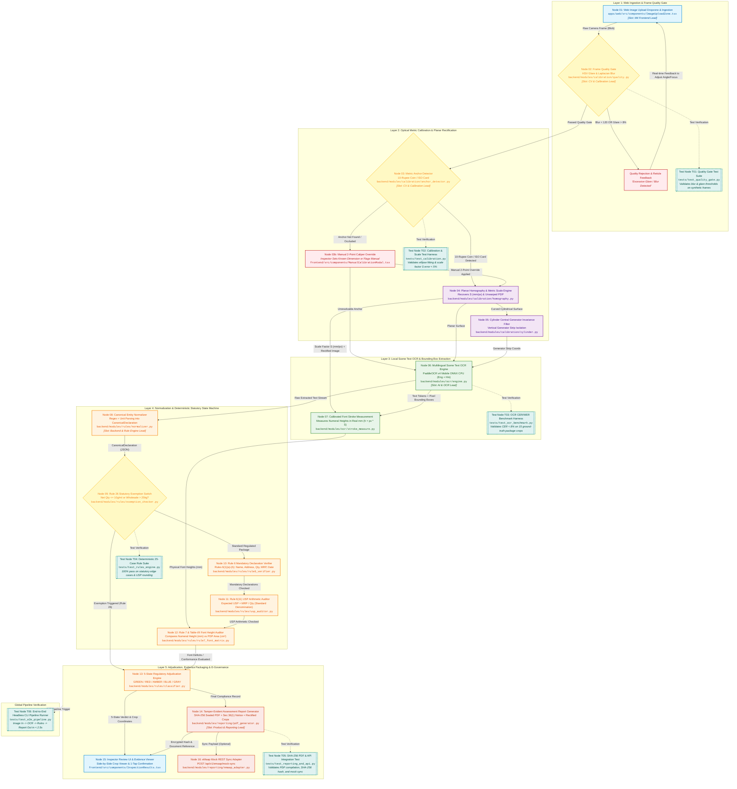

# Master MVP Unified Workflow Graph & Node Architecture Specification
## MetroLens AI™ — Automated Legal Metrology Inspection & Compliance System
### Sponsoring Ministry: Ministry of Consumer Affairs, Food & Public Distribution | Problem Statement: SIH26034
**Document Status:** Authoritative Team Architecture Reference | **Target Environment:** Online Web Application (FastAPI + React Web)

---

## 1. Executive Summary & Architectural Purpose

This document serves as the **master architectural blueprint and operational execution contract** for the 6-member engineering team developing MetroLens AI for Smart India Hackathon (SIH26034).

Under the official problem statement, MetroLens AI transforms a manual 20-minute ruler-and-magnifier inspection by District Legal Metrology Officers (LMOs) into an automated, mathematically verified, tamper-evident inspection completed in $< 2.5\text{s}$ on standard consumer hardware.

To accommodate different team working dynamics, this architecture supports **two complementary execution models**:
1. **Model A (Layer-by-Layer Sequential Convergence):** The entire team concentrates on completing and verifying one layer at a time, validating each layer against dedicated **Test Nodes** before advancing to the next.
2. **Model B (Simultaneous Parallel Multi-Track Sprints):** All team members work concurrently from Day 1 on decoupled tracks, utilizing pre-defined **Mock Fixture Contracts** (`tests/fixtures/`) so downstream developers never wait for upstream nodes to be completed.

### 📱 Platform Execution Strategy: Web-First Architecture
> [!IMPORTANT]
> **Definitive Delivery Sequence:**
> * **Phase 1 (Active MVP Milestone): Complete Responsive Web Platform First.**  
>   All frontend engineering is strictly dedicated to the Responsive Web Application (`React + Vite + Tailwind`, modern Image Upload Dropzone with optional camera capture). It runs seamlessly across mobile browsers (Chrome/Safari on smartphones) and desktop/laptop browsers.
> * **Phase 2 (Post-Web Milestone): Native Mobile App & Catalog Scraper.**  
>   Development of native Android/iOS applications and marketplace catalog batch scrapers will commence **strictly after** the Web platform is 100% feature-complete, tested, and validated.

---

## 2. Master Unified MVP Workflow Graph



---

## 3. Dual Execution Playbooks: How the Team Can Execute

The project is architected so the team can execute using **either of two strategic models** depending on your team preference:

### Playbook A: Layer-by-Layer Convergence (Sequential Sprints)
*Best if the team wants to learn together, avoid integration surprises, and build solid foundations stage by stage.*

```text
┌─────────────────────────────────────────────────────────────────────────────────┐
│ STAGE 1: INGESTION & QUALITY GATE (All members swarm on Layer 1)                │
│ • Deliverable: Working Camera Viewfinder (N01) + Blur/Glare Gate (N02).         │
│ • Exit Gate: Test Node T01 passes with 100% on blurred and glare-heavy images.  │
├─────────────────────────────────────────────────────────────────────────────────┤
│ STAGE 2: METRIC CALIBRATION & GEOMETRY (Layer 2)                                │
│ • Deliverable: ₹10 coin ellipse detector (N03), Homography unwarping (N04).     │
│ • Exit Gate: Test Node T02 passes with Scale Factor S error < 5% on planar box. │
├─────────────────────────────────────────────────────────────────────────────────┤
│ STAGE 3: MULTILINGUAL OCR & STROKE MEASUREMENT (Layer 3)                        │
│ • Deliverable: PaddleOCR v4 ONNX CPU pipeline (N06) + Stroke measurer (N07).    │
│ • Exit Gate: Test Node T03 passes with CER < 8% and latency < 1,200ms.          │
├─────────────────────────────────────────────────────────────────────────────────┤
│ STAGE 4: STATUTORY RULE ENGINE & USP AUDITOR (Layer 4)                          │
│ • Deliverable: Normalizer (N08), Rules 6, 7 Table-I/II, 26, and USP Math (N11). │
│ • Exit Gate: Test Node T04 passes 100% on 25 synthetic statutory test cases.   │
├─────────────────────────────────────────────────────────────────────────────────┤
│ STAGE 5: ADJUDICATION, EVIDENCE & REPORTING (Layer 5)                           │
│ • Deliverable: 5-State UI Dashboard (N15) + SHA-256 PDF report (N14) + eMaap.  │
│ • Exit Gate: Test Node T05 & T06 pass end-to-end in < 2.5s on localhost.       │
└─────────────────────────────────────────────────────────────────────────────────┘
```

---

### Playbook B: Simultaneous Parallel Multi-Track Sprints (Decoupled with Mock Fixtures)
*Best for maximum engineering velocity: all 6 members start coding on Day 1 without waiting for anyone else.*

Each track relies on pre-defined **Mock Test Fixtures** stored in `tests/fixtures/`:

```
┌────────────────────────────────────────────────────────────────────────────────────────┐
│ TRACK 1: FRONTEND & UX (Viewfinder + 5-State Inspector UI)                             │
│ • Consumes: tests/fixtures/mock_adjudication_result.json                               │
│ • Delivers: Node N01 (Camera capture) & Node N15 (Interactive result cards & crops)    │
├────────────────────────────────────────────────────────────────────────────────────────┤
│ TRACK 2: CALIBRATION & GEOMETRY (Metric Scale & Perspective)                           │
│ • Consumes: tests/fixtures/sample_packages/*.jpg (static raw package images)           │
│ • Delivers: Node N02 (Quality Gate), Node N03/N04 (Scale S & Homography), Node N05     │
├────────────────────────────────────────────────────────────────────────────────────────┤
│ TRACK 3: AI & MULTILINGUAL OCR (Scene Text Extraction)                                 │
│ • Consumes: tests/fixtures/rectified_panels/*.png (pre-rectified panel crops)          │
│ • Delivers: Node N06 (PaddleOCR ONNX CPU) & Node N07 (Stroke numeral measurement)      │
├────────────────────────────────────────────────────────────────────────────────────────┤
│ TRACK 4: STATUTORY RULE ENGINE & USP AUDITOR (Pure Python Logic)                       │
│ • Consumes: tests/fixtures/mock_canonical_declarations.json                            │
│ • Delivers: Node N08 (Normalizer), N09 (Exemption), N10 (Rule 6), N11 (USP), N12 (Font)│
├────────────────────────────────────────────────────────────────────────────────────────┤
│ TRACK 5: EVIDENTIARY REPORTING & E-GOVERNANCE (PDF & eMaap)                            │
│ • Consumes: tests/fixtures/mock_compliance_evaluation.json                             │
│ • Delivers: Node N14 (Cryptographic SHA-256 PDF generator) & Node N16 (eMaap adapter)  │
├────────────────────────────────────────────────────────────────────────────────────────┤
│ TRACK 6: BENCHMARKS, DATASET & INTEGRATION (Quality Assurance)                         │
│ • Consumes: 35 physical SKU packages + ground truth flatbed scans                     │
│ • Delivers: Automated Test Nodes T01 to T06 + CER/WER benchmarking scripts              │
└────────────────────────────────────────────────────────────────────────────────────────┘
```

---

## 4. Comprehensive Node Directory & Architecture Links (N01–N16)

| Node ID | Node Name | Subsystem | Assigned Lead | Target File Path | Primary Algorithm / Library | Relevant Spec & Legal Documentation |
| :---: | :--- | :--- | :---: | :--- | :--- | :--- |
| **N01** | Web Image Upload Dropzone | Frontend | **M4 (Frontend Lead)** | `apps/web/src/components/ImageUploadZone.tsx` | Drag & Drop API, FilePicker, HTML5 Canvas / Camera | [`docs/PRODUCT_BLUEPRINT.md §6`](docs/PRODUCT_BLUEPRINT.md) |
| **N02** | Frame Quality Gate | Calibration | **M2 (CV Lead)** | `backend/modules/calibration/quality.py` | Laplacian variance (blur), HSV $V \ge 250, S \le 25$ (glare) | [`docs/PRODUCT_BLUEPRINT.md §8`](docs/PRODUCT_BLUEPRINT.md) |
| **N03** | Metric Anchor Detector | Calibration | **M2 (CV Lead)** | `backend/modules/calibration/anchor_detector.py` | OpenCV `findContours`, ellipse fitting ($27.0\text{mm}$ ₹10 coin), ArUco | [`docs/PRODUCT_BLUEPRINT.md §8`](docs/PRODUCT_BLUEPRINT.md) |
| **N03b**| Manual Scale Override Fallback | Frontend/CV | **M4 & M2** | `apps/web/src/components/ManualCalibrationModal.tsx` | Two-point caliper line selection on canvas | [`docs/TECHNICAL_DECISIONS.md ADR-003`](docs/TECHNICAL_DECISIONS.md) |
| **N04** | Planar Homography & Metric Scale Engine | Calibration | **M2 (CV Lead)** | `backend/modules/calibration/homography.py` | OpenCV `getPerspectiveTransform`, `warpPerspective`, $S = 27.0 / d_{\text{major}}$ | [`docs/PRODUCT_BLUEPRINT.md §8`](docs/PRODUCT_BLUEPRINT.md) |
| **N05** | Cylinder Central Generator Invariance Filter | Calibration | **M2 (CV Lead)** | `backend/modules/calibration/cylinder.py` | Central $40^\circ$ vertical generator strip masking ($\cos\phi \ge 0.94$) | [`docs/PRODUCT_BLUEPRINT.md §8`](docs/PRODUCT_BLUEPRINT.md) |
| **N06** | Multilingual Scene Text OCR Engine | OCR / AI | **M1 (AI/OCR Lead)** | `backend/modules/ocr/engine.py` | PaddleOCR v4 Mobile ONNX int8 (`DBNet++`, `SVTR`) on CPU | [`docs/TECHNICAL_DECISIONS.md ADR-001`](docs/TECHNICAL_DECISIONS.md) |
| **N07** | Calibrated Font Stroke Measurement | OCR / CV | **M1 & M2** | `backend/modules/ocr/stroke_measure.py` | Vertical bounding box projection: $h_{\text{mm}} = h_{\text{px}} \times S$ | [`docs/PRODUCT_BLUEPRINT.md §8`](docs/PRODUCT_BLUEPRINT.md) |
| **N08** | Canonical Entity Normalizer | Rules | **M3 (Backend Lead)** | `backend/modules/rules/normalizer.py` | Deterministic regex token extractors, Pydantic data model | [`docs/PRODUCT_BLUEPRINT.md §9`](docs/PRODUCT_BLUEPRINT.md) |
| **N09** | Rule 26 Statutory Exemption Switch | Rules | **M3 (Backend Lead)** | `backend/modules/rules/exemption_checker.py` | Boolean gating: net quantity $\le 10\text{g}/\text{ml}$, wholesale $> 25\text{kg}$ | [`docs/LEGAL_RULE_MATRIX.md §6`](docs/LEGAL_RULE_MATRIX.md) |
| **N10** | Rule 6 Mandatory Declaration Verifier | Rules | **M3 (Backend Lead)** | `backend/modules/rules/rule6_verifier.py` | Verification of 8 statutory clauses: 6(1)(a) through 6(1)(h) | [`docs/LEGAL_RULE_MATRIX.md §3`](docs/LEGAL_RULE_MATRIX.md) |
| **N11** | Rule 6(11) USP Arithmetic Auditor | Rules | **M3 (Backend Lead)** | `backend/modules/rules/usp_auditor.py` | IEEE 754 math: $\text{Expected USP} = \text{MRP} / \text{NetQty}$, tolerance $\le 1.0\%$ | [`docs/LEGAL_RULE_MATRIX.md §4`](docs/LEGAL_RULE_MATRIX.md) |
| **N12** | Rule 7 & Table-I/II Font Height Auditor | Rules | **M3 (Backend Lead)** | `backend/modules/rules/rule7_font_matrix.py` | Area-bracket indexing ($\le 50\text{cm}^2, 50\text{--}100, 100\text{--}500, 500\text{--}2500, >2500$) | [`docs/LEGAL_RULE_MATRIX.md §5`](docs/LEGAL_RULE_MATRIX.md) |
| **N13** | 5-State Regulatory Adjudication Engine | Rules/QA | **M3 (Backend Lead)** | `backend/modules/rules/classifier.py` | Statutory state machine: GREEN, RED, AMBER, BLUE, GRAY | [`docs/PRODUCT_BLUEPRINT.md §8`](docs/PRODUCT_BLUEPRINT.md) |
| **N14** | Tamper-Evident Report Generator | Reporting | **M6 (DevOps/Reporting)** | `backend/modules/reporting/pdf_generator.py` | ReportLab / Weasyprint, SHA-256 digest, Section 36(1) notice | [`METROLENS_LEGAL_SOURCE_PACK/`](METROLENS_LEGAL_SOURCE_PACK/) |
| **N15** | Inspector Review UI & Evidence Viewer | Frontend | **M4 (Frontend Lead)** | `apps/web/src/components/InspectionResults.tsx` | React 5-state badge UI, side-by-side cropped declaration viewer | [`docs/PRODUCT_BLUEPRINT.md §8`](docs/PRODUCT_BLUEPRINT.md) |
| **N16** | eMaap Mock REST Sync Adapter | Reporting | **M6 (DevOps/Reporting)** | `backend/modules/reporting/emaap_adapter.py` | FastAPI endpoint: `POST /api/v1/emaap/mock-sync` mock receiver | [`docs/PRODUCT_BLUEPRINT.md §6`](docs/PRODUCT_BLUEPRINT.md) |

---

## 5. Automated Verification & Test Nodes Directory (T01–T06)

To guarantee that any layer or track can be independently tested and certified, the following **Test Nodes** run automated test suites:

| Test Node ID | Test Scope & Purpose | Execution Command | Target Test File | Success Criteria (Pass Threshold) | Reference Roadmap / Plan |
| :---: | :--- | :--- | :--- | :--- | :--- |
| **T01** | **Quality Gate Unit Tests**<br/>Tests blur and glare thresholds on sharp, blurred, and overexposed images. | `pytest tests/test_quality_gate.py` | `tests/test_quality_gate.py` | 100% pass on 20 synthetic test frames. Correctly rejects $\sigma^2 < 120$ and glare $> 8\%$. | [`docs/IMPLEMENTATION_PLAN.md §3`](docs/IMPLEMENTATION_PLAN.md#3-mandatory-first-24-hour-technical-validation-spike-hours-0-to-24) |
| **T02** | **Calibration & Scale Test Harness**<br/>Tests ₹10 coin ellipse detection, homography, and scale recovery. | `pytest tests/test_calibration.py` | `tests/test_calibration.py` | Scale error $< 5\%$ on planar boxes at $\le 15^\circ$ tilt. Fallback triggers if coin is occluded. | [`docs/IMPLEMENTATION_PLAN.md §3 Spike B`](docs/IMPLEMENTATION_PLAN.md#3-mandatory-first-24-hour-technical-validation-spike-hours-0-to-24) |
| **T03** | **OCR CER/WER Benchmark**<br/>Evaluates character error rate and latency on CPU. | `pytest tests/test_ocr_benchmark.py` | `tests/test_ocr_benchmark.py` | CER $< 8.0\%$, CPU inference latency $< 1,200\text{ms}$ on 15 benchmark package crops. | [`docs/DATA_AND_BENCHMARK_PLAN.md §3`](docs/DATA_AND_BENCHMARK_PLAN.md) |
| **T04** | **Deterministic Rule Suite**<br/>Tests all statutory clauses, USP math denominations, and exemptions. | `pytest tests/test_rules_engine.py` | `tests/test_rules_engine.py` | 100% pass on 25 synthetic cases (including ₹/g, ₹/100g, ₹/kg, Rule 26 exemptions). | [`docs/LEGAL_RULE_MATRIX.md`](docs/LEGAL_RULE_MATRIX.md) |
| **T05** | **Evidentiary PDF & API Tests**<br/>Tests PDF generation, SHA-256 seal, and mock eMaap endpoint. | `pytest tests/test_reporting_and_api.py` | `tests/test_reporting_and_api.py` | PDF compiles in $< 500\text{ms}$. SHA-256 digest is valid. Mock eMaap returns HTTP 200 with ack ID. | [`docs/PRODUCT_BLUEPRINT.md §11`](docs/PRODUCT_BLUEPRINT.md) |
| **T06** | **End-to-End Headless Pipeline**<br/>Full CLI integration: Image $\rightarrow$ OCR $\rightarrow$ Rules $\rightarrow$ Report. | `python -m tests.run_e2e_pipeline` | `tests/run_e2e_pipeline.py` | Full execution completes in $< 2.5\text{s}$ on CPU. Emits valid canonical compliance JSON. | [`docs/IMPLEMENTATION_PLAN.md §3 Spike D`](docs/IMPLEMENTATION_PLAN.md#3-mandatory-first-24-hour-technical-validation-spike-hours-0-to-24) |

---

## 6. Six-Member Team Allocation Matrix

Aligned with [`docs/TEAM_RESPONSIBILITIES.md`](docs/TEAM_RESPONSIBILITIES.md):

| Member | Functional Role Title | Primary Node Ownership | Secondary Cross-Support Area |
| :---: | :--- | :---: | :--- |
| **M1** | **AI & OCR Perception Lead** | **N06, N07** | PaddleOCR ONNX runtime, Devanagari models, T03 |
| **M2** | **Calibration & Geometry Lead** | **N02, N03, N04, N05** | OpenCV coin detector, homography unwarping, T01, T02 |
| **M3** | **Backend & Rule Engine Lead** | **N08, N09, N10, N11, N12, N13** | Pydantic normalizer, deterministic state machine, T04 |
| **M4** | **Frontend & Web UX Lead** | **N01, N03b, N15** | Web upload dropzone, 5-state result cards, evidence modal |
| **M5** | **Data, Benchmark & QA Lead** | **T01–T06, Datasets** | 35 SKU package collection, ground truth scans, test suites |
| **M6** | **Product, Reporting & DevOps Lead** | **N14, N16** | SHA-256 PDF generator, eMaap mock sync, Docker CI/CD |

---

## 7. Inter-Node JSON Data Contracts (Mock Fixtures)

These canonical schemas allow teammates to mock any node's output and test in complete isolation:

### A. Frame Quality Gate Payload (`FrameQualityResult`)
*Fixture Path:* `tests/fixtures/mock_frame_quality.json`
```json
{
  "is_valid": true,
  "blur_score": 245.8,
  "glare_percentage": 2.1,
  "rejection_reason": null,
  "suggested_user_action": null
}
```

### B. Metric Scale Calibration Payload (`MetricScaleResult`)
*Fixture Path:* `tests/fixtures/mock_metric_scale.json`
```json
{
  "anchor_type": "INR_10_COIN",
  "coin_detected": true,
  "ellipse_major_axis_px": 216.0,
  "ellipse_minor_axis_px": 214.2,
  "scale_mm_per_px": 0.125,
  "pdp_width_mm": 95.0,
  "pdp_height_mm": 140.0,
  "pdp_area_cm2": 133.0,
  "calibration_confidence": 0.96
}
```

### C. Canonical Declaration Payload (`CanonicalDeclaration`)
*Fixture Path:* `tests/fixtures/mock_canonical_declaration.json`
```json
{
  "commodity_name": "Premium Roasted Cashews",
  "net_quantity_value": 200.0,
  "net_quantity_unit": "g",
  "mrp_inr": 240.0,
  "declared_usp_value": 1.20,
  "declared_usp_unit": "g",
  "mfg_month": 8,
  "mfg_year": 2026,
  "manufacturer_name": "MetroLens Foods Pvt Ltd",
  "manufacturer_pincode": "110001",
  "consumer_care_email": "support@metrolens.in",
  "consumer_care_phone": "1800-11-4000",
  "country_of_origin": "India"
}
```

### D. Final Inspection Compliance Result (`ComplianceEvaluationResult`)
*Fixture Path:* `tests/fixtures/mock_compliance_evaluation.json`
```json
{
  "inspection_id": "INSP-20260904-8741",
  "timestamp": "2026-09-04T21:55:00+05:30",
  "state": "POTENTIAL_NON_COMPLIANCE",
  "pdp_area_cm2": 133.0,
  "rule6_mandatory_status": {
    "manufacturer_details": "PASS",
    "net_quantity": "PASS",
    "mrp": "PASS",
    "usp": "FAIL_MATH_MISMATCH",
    "mfg_date": "PASS",
    "consumer_care": "PASS"
  },
  "usp_audit": {
    "is_compliant": false,
    "declared_usp": 1.20,
    "expected_usp": 1.20,
    "discrepancy_pct": 0.0,
    "standard_denominator": "g",
    "notes": "USP unit printed as 'per gm' instead of statutory standard 'per g' under Rule 6(11)"
  },
  "font_height_audit": {
    "statutory_min_height_mm": 2.0,
    "measured_net_qty_height_mm": 1.42,
    "deficit_mm": 0.58,
    "is_compliant": false
  },
  "exemption_status": {
    "is_exempt": false,
    "clause": null
  },
  "improvement_notice": {
    "recommended": true,
    "act_provision": "Section 36(1) read with Jan Vishwas Act 2026",
    "cure_period_days": 15
  },
  "sha256_hash": "e3b0c44298fc1c149afbf4c8996fb92427ae41e4649b934ca495991b7852b855"
}
```

---

## 8. Quality Gates & Failure Recovery Policies

| Failure Scenario | Detecting Node | Fallback Mechanism | Impact on System State |
| :--- | :---: | :--- | :---: |
| **Motion blur or severe glare** | Node 02 | Early rejection: prompt user via on-screen reticle guides to steady camera. | Pipeline halts; 0 latency wasted downstream. |
| **Coin occluded or missing** | Node 03 | **Node 03b:** Prompt inspector for 2-point manual caliper calibration in UI. | If unresolved, font height audit is marked `NOT_IMAGE_VERIFIABLE`. |
| **Curved cylindrical container** | Node 05 | Isolate central $40^\circ$ generator strip; measure font height strictly vertically. | If conical/irregular, flag `MANUAL_REVIEW_REQUIRED`. |
| **Low OCR confidence ($< 0.60$)** | Node 06 | Highlight OCR crop in amber on dashboard with 1-tap inspector confirmation. | Transition status to `MANUAL_REVIEW_REQUIRED`. |
| **Small packaging ($\le 10\text{g/ml}$)** | Node 09 | Rule 26 statutory exemption triggered. Suppress font height and USP violations. | Immediate transition to `STATUTORY_EXEMPTION_APPLIED`. |
| **Borderline font deficit ($\le 0.1\text{mm}$)**| Node 12 | Benefit-of-doubt threshold triggered under enforcement SOP. | Prevents false-positive citation; routes to `MANUAL_REVIEW_REQUIRED`. |

---

## 9. How Zero-Cloud-AI Web Execution Works (The Local Inference Guarantee)

A common question is: **"If AI models are being used in a web application, does every image upload get sent to expensive third-party cloud AI APIs?"**

**Answer: Absolutely NOT.** MetroLens AI executes all neural inference on the server CPU using local quantized models:

```text
┌────────────────────────────────────────────────────────────────────────────────────────┐
│                        THE ZERO-CLOUD-API WEB ARCHITECTURE                             │
│                                                                                        │
│  [ Client Web Browser / Mobile ]  <─── HTTPS REST (Upload) ───>  [ FastAPI Server ]    │
│  • Modern Upload Dropzone & UI                                   • Port 8000           │
│  • Responsive React / Tailwind                                   • Stream Validation   │
│                                                                          │             │
│                                                                          ▼             │
│                                                        ┌─────────────────────────────┐ │
│                                                        │ ONNX Runtime Engine (C/C++) │ │
│                                                        │ • Executes on Server CPU    │ │
│                                                        │ • AVX2 / NEON SIMD Vector   │ │
│                                                        └──────────────┬──────────────┘ │
│                                                                       │                │
│                                                                       ▼                │
│                                                        ┌─────────────────────────────┐ │
│                                                        │ Local Quantized Weights     │ │
│                                                        │ • DBNet++ int8 (~4.2 MB)    │ │
│                                                        │ • SVTR int8 (~8.4 MB)       │ │
│                                                        │ • Total: ~12.6 MB on Disk   │ │
│                                                        └─────────────────────────────┘ │
└────────────────────────────────────────────────────────────────────────────────────────┘
```

### 1. Pre-Packaged, Quantized ONNX Neural Weights (~12.6 MB Total)
* MetroLens AI **never calls cloud AI APIs** (like OpenAI GPT-4, Google Cloud Vision, AWS Rekognition, or Anthropic Claude).
* Instead, it uses **quantized local neural networks** (`ch_PP-OCRv4_det_infer.onnx` + `ch_PP-OCRv4_rec_infer.onnx`) stored directly inside the server repository under `backend/models/paddleocr/`.
* The entire model bundle is only **~12.6 MB** on disk and loads directly into server RAM ($< 150\text{MB}$ memory footprint).

### 2. Native CPU Inference Engine (`onnxruntime`)
* The models execute using the C++/Python `onnxruntime` library running directly on the server's standard CPU (Intel, AMD, or ARM).
* It utilizes hardware-accelerated SIMD instructions (`AVX2`, `FMA`, or ARM `NEON`) to compute forward tensor passes in **$300\text{--}800\text{ms}$** per frame without requiring an expensive NVIDIA GPU.

### 3. Strict Functional Boundary: AI Perceives, Pure Math & State Machines Decide
* **The AI's only role:** Convert raw packaging pixels into text strings and 2D bounding boxes.
* **The Legal Decision Engine:** Once text is extracted, the AI is completely done. All statutory compliance decisions (Rule 6 omissions, Rule 6(11) USP division, Rule 7 area brackets, Rule 26 exemptions) are evaluated by a **pure Python deterministic state machine** (`backend/modules/rules/`).
* This eliminates LLM hallucinations, guarantees legal reproducibility, and incurs **zero per-inspection API costs**.

### 4. Modern Web Server & Ephemeral Ingestion
* The backend runs via Uvicorn/FastAPI with reverse-proxy TLS termination.
* The frontend is built as a responsive single-page web application using Vite, React, and Tailwind CSS.
* Images are streamed over HTTPS, verified against magic bytes, evaluated in-memory, and purged post-inspection.

---

<p align="center">
  <sub>MetroLens AI™ Architecture & Engineering Specification</sub>
</p>

