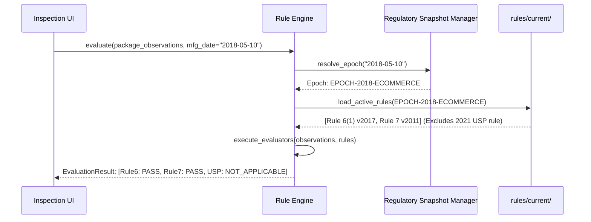

# Deterministic Rule Engine Architecture

## Purpose
Documents the design, execution flow, regulatory versioning logic, and state machine of the Nirikshak deterministic compliance engine.

## Scope
Governs the translation of physical observations and extracted text fields into statutory compliance decisions.

## Authoritative Inputs
- `rules/schema/rule.schema.json`
- `docs/02_LEGAL_AUTHORITY/VERIFIED_RULE_CATALOG/`

## Assumptions
- Rule evaluation is pure and functional: given identical observation inputs and a rule snapshot, the engine produces deterministic outputs with zero stochastic variance.

## Open Questions
- Conflict resolution precedence when multi-panel observations produce contradictory readings (e.g. MRP on label vs. MRP on cap) [TBD — PRIMARY SOURCE REQUIRED].

## Dependencies
- `packages/rules-engine/`
- `rules/current/`

## Implementation Status Notice
> [!NOTE]
> **RULE ENGINE STATUS:**
> - Architecture specified.
> - Candidate rules specified (`rules/proposed/`).
> - Verified executable rules: 0.
> - Runtime implementation: NOT_STARTED.

## Verification Requirements
- Target: Engine must pass all rule unit tests in `tests/rules/` upon implementation (Status: SPECIFIED — PENDING_IMPLEMENTATION).

---

## 1. The 4-State Compliance Model

The engine avoids naive binary PASS/FAIL classifications. Every rule evaluates to one of four mutually exclusive states:

```
┌─────────────────────────────────────────────────────────────────┐
│                          DECISION STATES                        │
├───────────────────┬─────────────────────────────────────────────┤
│ PASS              │ Evidence strictly satisfies all statutory   │
│                   │ thresholds with verified calibration.       │
├───────────────────┼─────────────────────────────────────────────┤
│ FAIL              │ Evidence positively demonstrates statutory  │
│                   │ non-compliance (e.g. missing mandatory field│
│                   │ or verified sub-threshold font height).     │
├───────────────────┼─────────────────────────────────────────────┤
│ REVIEW            │ Uncertainty present: uncalibrated scale,    │
│                   │ borderline measurement, low OCR confidence, │
│                   │ or conflicting cross-panel readings.        │
├───────────────────┼─────────────────────────────────────────────┤
│ NOT_APPLICABLE    │ Package category or commodity is exempt     │
│                   │ under Rule 3 or not governed by this rule.  │
└───────────────────┴─────────────────────────────────────────────┘
```

---

## 2. Regulatory Time Machine Architecture


