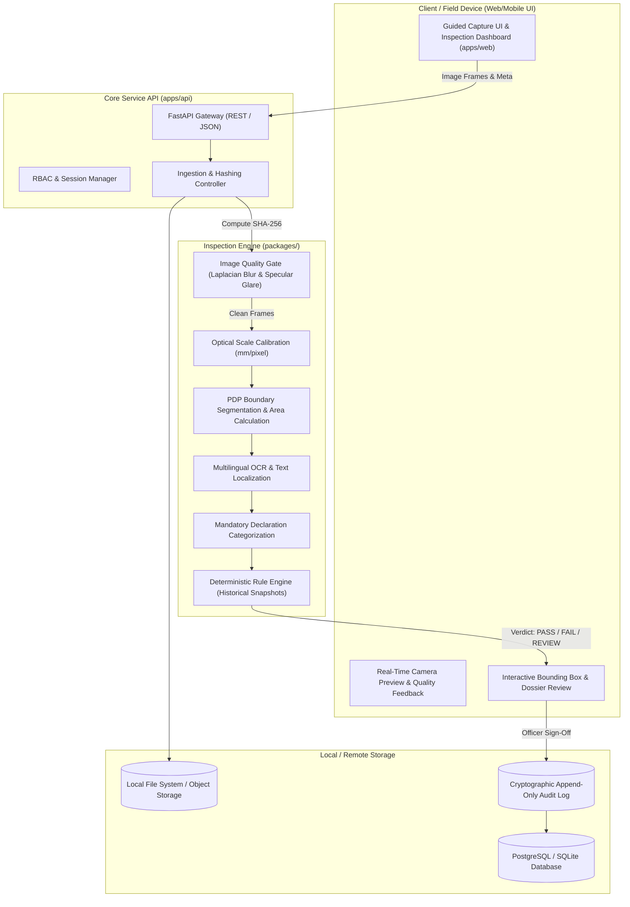

# Nirikshak System Architecture Specification

## Purpose
Documents the high-level architecture, module decomposition, inter-process communication, and technology stack of Nirikshak.

## Scope
Encompasses the client presentation tier, API gateway, inspection pipeline, rule engine, data persistence, and offline edge capabilities.

## Authoritative Inputs
- SIH 2026 Problem Statement 26034.
- Lean Hackathon Architecture Mandate: Avoid microservice overengineering.

## Assumptions
- The system operates as a unified modular monolith / 3-tier architecture capable of running locally on an inspector's workstation or portable device.

## Open Questions
- Target embedded runtime for ultra-low-power field hardware [TBD — MEASURE].

## Dependencies
- `apps/`
- `packages/`
- `infra/`

## Verification Requirements
- End-to-end integration tests must confirm communication between UI, API, pipeline, and storage.

---

## 1. High-Level Architectural Diagram

---

## 2. Core Architectural Principles

1. **AI as Observation, Determinism for Law:**
   Computer vision models locate text and segment polygons. They do NOT evaluate legality. All legal decisions are computed by purely deterministic rule evaluators matching statutory thresholds.

2. **Zero Architecture Cosplay (Lean & Robust):**
   Rather than spinning up 14 distributed microservices, message queues, and Kubernetes pods, Nirikshak uses a battle-tested modular structure:
   - Client Web UI (`apps/web`)
   - High-throughput asynchronous API (`apps/api`)
   - Pure Python / C++ optimized packages (`packages/*`)
   - Embedded SQLite / PostgreSQL storage (`infra/db`)

3. **Regulatory Snapshot Versioning:**
   The rule engine loads historical rule schemas matching the package's declared manufacturing date.

4. **Offline-First Resilience:**
   The entire stack can execute self-contained on a field laptop without active external internet access.
