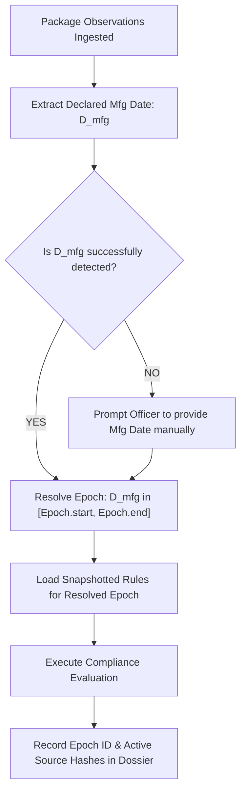

# Regulatory Time-Machine & Rule Versioning Architecture

## Purpose
Specifies the regulatory snapshot resolution mechanism that allows Nirikshak to evaluate a package against the precise statutory rules in force on its date of manufacture.

## Scope
Universal across compliance evaluations and retrospective audits.

## Authoritative Inputs
- `docs/02_LEGAL_AUTHORITY/VERIFIED_RULE_CATALOG/effective_dates.yaml`
- Legal principle against retroactive application of penal regulatory statutes.

## Assumptions
- A package manufactured in 2015 must be evaluated under the rules active in 2015, even if inspected in 2026.
- The latest rules cannot be retroactively enforced against older inventory lawfully packed under earlier standards.

## Open Questions
- Rules governing permissible shelf-life transition periods when an amendment is gazetted with short commencement windows [TBD — PRIMARY SOURCE REQUIRED].

## Dependencies
- `packages/rules-engine/`
- `rules/`

## Verification Requirements
- Test vectors in `tests/rules/test_time_machine.py` must evaluate identical package evidence against three distinct epochs and verify correct differing verdicts.

---

## The Time-Machine Resolution Flow

### Supported Epochs in Snapshot Registry:
1. `EPOCH-2011-BASE` ($2011\text{-}04\text{-}01 \le D_{\text{mfg}} < 2018\text{-}01\text{-}01$):
   - Base 2011 declarations.
   - Standard Table-I font heights.
   - E-commerce and USP rules inactive.

2. `EPOCH-2018-ECOMMERCE` ($2018\text{-}01\text{-}01 \le D_{\text{mfg}} < 2022\text{-}12\text{-}01$):
   - G.S.R. 629(E) active.
   - Barcode/e-commerce statutory requirements active.

3. `EPOCH-2022-CURRENT` ($D_{\text{mfg}} \ge 2022\text{-}12\text{-}01$):
   - G.S.R. 779(E) active.
   - Mandatory Unit Sale Price (USP) active.
   - Revised Schedule II quantity provisions.
