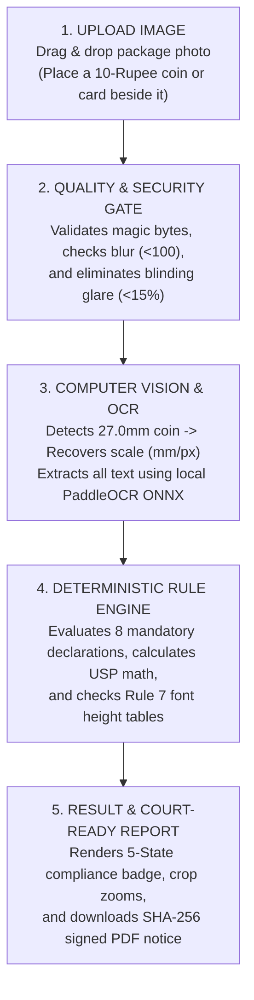

# MetroLens AI™ — Project Details & End-to-End Platform Guide
### Automated Legal Metrology Inspection & Compliance Platform (SIH26034)
**Target Audience:** Evaluators, Legal Metrology Officers, Engineering Teams, Industry & General Public  
**Tagline:** *Bridging Packaging Reality with Statutory Consumer Law (MetroSetu)*

---

## 1. What is MetroLens AI™?

**MetroLens AI™** (also designated as **MetroSetu**, meaning *"The Metrology Bridge"*) is an automated, web-based regulatory compliance and verification platform engineered to enforce the **Legal Metrology (Packaged Commodities) Rules, 2011** and the **Legal Metrology Act, 2009** (incorporating the **Jan Vishwas (Amendment of Provisions) Act, 2026** statutory revisions).

It serves as an authoritative digital bridge between:
1. **The Statutory Law:** Complex rules, amendments, and notification gazettes published by the Department of Consumer Affairs (Ministry of Consumer Affairs, Food & Public Distribution, Government of India).
2. **Field Inspectors & Consumers:** Instant, browser-based inspection capability accessible from commodity smartphones, tablets, or desktop laptops without specialized hardware.
3. **Brands, Manufacturers & E-Commerce Platforms:** Transparent, repeatable pre-market verification checks before packaging cartons are printed or catalogs listed online.

```text
┌────────────────────────┐      ┌────────────────────────┐      ┌────────────────────────┐
│  STATUTORY LAW         │      │      METROLENS AI      │      │   FIELD INSPECTORS     │
│  • PCR Rules 2011      │ ───► │   The Digital Bridge   │ ───► │   • Legal Officers     │
│  • Jan Vishwas 2026    │      │  (Vision + Math + Law) │      │   • Consumers & Brands │
└────────────────────────┘      └────────────────────────┘      └────────────────────────┘
```

---

## 2. The Real-World Problem: Why MetroLens AI is Needed

In India, packaged retail goods represent over **₹12 Lakh Crore ($150 Billion)** in annual consumer spending across 780+ districts. However:

1. **The Severe Inspection Shortage:** There are only around **2,500 District Legal Metrology Officers (LMOs)** nationwide. Consequently, less than **0.01%** of retail packages are ever physically audited before reaching consumer hands.
2. **Manual, Error-Prone Audits:** Currently, an officer must carry handheld vernier calipers, magnifying glasses, and a calculator. Inspecting a single product's font sizes, display area calculations, and price math takes **15 to 20 minutes**.
3. **Deceptive Packaging & Shrinkflation:** Brands frequently downsize package contents (e.g., from 100g down to 82g) while keeping the outer package carton dimensions and retail price identical. Under **Rule 6(11)**, packages must declare **Unit Sale Price (USP)** (e.g., *"₹0.61 per g"*) so consumers can spot this trick. Yet brands frequently omit USP or print it in non-standard units.
4. **Microscopic Font Deficits:** Under **Rule 7**, statutory numeral heights must be between **1.0mm and 6.0mm** depending on the package display area. No human eye can tell if a printed "50g" numeral is 1.15mm or the mandatory 1.50mm without precision instruments.
5. **Decriminalization & Administrative Burden:** Under the **Jan Vishwas Act, 2023 & 2026**, first-time labeling infractions under Section 36(1) are decriminalized and transitioned to an administrative **Improvement Notice** regime. Officers must present objective, indisputable visual evidence and calculation records before issuing statutory notices.

---

## 3. The MetroLens AI Solution: How It Works

MetroLens AI converts that tedious 20-minute manual inspection into a **sub-2.5-second, mathematically verified, tamper-evident regulatory audit**.

### The 5-Step End-to-End User Journey



### Step 1: Upload (Zero Friction)
The inspector opens the web application on any smartphone, tablet, or laptop. They drag and drop a photo of the packaging panel into the upload dropzone. If physical font heights require statutory verification, they place an ordinary **10-Rupee coin** or standard **ATM/ID card** flat on the same surface.

### Step 2: Quality & Security Gate
Before processing, MetroLens AI protects server infrastructure and alerts the user:
- **Decompression Bomb Defense:** Prevents oversized or malicious image attacks (capped at 64 Megapixels via Pillow protections).
- **Blur Filter:** Rejects shaky camera shots (Laplacian variance $<100$) with actionable advice: *"Image too blurry. Please hold camera steady."*
- **Glare Filter:** Detects shiny metallic foil specular reflections ($>15\%$ area) with advice: *"Specular glare detected. Tilt camera 10° to eliminate reflections."*

### Step 3: Perception (Local Vision & OCR)
- **Scale Calibration:** OpenCV contour detection identifies the 10-Rupee coin. Because every official RBI 10-Rupee coin has an outer diameter of exactly **27.0 mm**, the system calculates the real-world scale factor:
  $$\text{Scale } S = \frac{27.0\text{ mm}}{\text{Coin Diameter in Pixels}}$$
- **Perspective Rectification:** Automatically unwarps angular camera tilt so the packaging panel is evaluated perpendicular to the lens.
- **Scene Text OCR:** Server-side **PaddleOCR v4 Mobile** extracts all printed English and Hindi (Devanagari) words, numerals, bounding boxes, and pixel heights in $<800\text{ms}$ on CPU.

### Step 4: Deterministic Legal Evaluation (Zero AI Hallucination)
MetroLens AI passes the extracted text and measurements to a **pure Python statutory state machine** (NO probabilistic LLMs or external cloud APIs):
- **Rule 26 / Rule 3:** Checks if the package is exempt (e.g., wholesale $>25\text{kg}$ or small packs $\le 10\text{g/ml}$, while strictly keeping tobacco and pan masala non-exempt).
- **Rule 6(1)(a)-(h):** Verifies all 8 mandatory declarations (MRP, Net Qty, Mfg Date, Name/Address, Consumer Care phone/email, Country of Origin).
- **Rule 6(11) Unit Sale Price:** Verifies that declared USP matches calculated $\frac{\text{MRP}}{\text{Net Qty}}$ in standard units (₹/g, ₹/kg, ₹/ml, ₹/l).
- **Rule 7 Font Heights:** Matches package display area to mandatory minimum height (e.g. Area $50\text{--}100\text{ cm}^2 \rightarrow \text{minimum } 1.50\text{mm}$).

### Step 5: Plain-Language Verdict & Tamper-Evident Report
The user immediately sees a clear, color-coded result badge, zooms into high-resolution side-by-side evidence crops, and clicks **"Download Official Assessment Report"** to receive a court-admissible PDF embedding cryptographic SHA-256 hashes and a ready-to-issue **Section 36(1) Improvement Notice draft**.

---

## 4. The 5-State Traffic Light Compliance Framework

To eliminate officer guesswork and prevent false accusations against honest merchants, MetroLens AI categorizes every package into five clear states:

| Badge | State Name | Meaning & Statutory Triggers | Recommended Officer Action |
| :---: | :--- | :--- | :--- |
| 🟢 **Green** | `NO_IMAGE_VERIFIABLE_VIOLATION_DETECTED` | All mandatory declarations are present, legible, font heights meet or exceed Rule 7 tables, and USP arithmetic matches. | **Pass.** Clear inspection record logged; product cleared for sale. |
| 🔴 **Red** | `POTENTIAL_NON_COMPLIANCE` | Clear legal defect: Missing mandatory item (e.g. no consumer care email), font height $<0.10\text{mm}$ below statutory minimum, or USP math mismatch $>1\%$. | **Issue Section 36(1) Improvement Notice** (under Jan Vishwas Act, 2026) giving 15-day cure window. |
| 🟡 **Amber** | `MANUAL_REVIEW_REQUIRED` | Text is borderline, camera angle was steep, or package is non-planar (cylindrical bottle). | **Officer Review.** Inspector uses the 1-tap confirmation UI to verify the cropped visual evidence. |
| 🔵 **Blue** | `STATUTORY_EXEMPTION_APPLIED` | Package is legally exempt under Rule 26 (e.g., Net Qty $\le 10\text{g}$ non-tobacco) or Rule 3 wholesale bulk ($>25\text{kg}$). | **Exempt.** Legal exemption logged; violation flags suppressed. |
| ⚪ **Gray** | `NOT_IMAGE_VERIFIABLE` | Requirements that cannot be checked by a photo (e.g., physical net weight on a weighing scale under Rule 24). | **Physical Audit.** Flags package for certified weighing scale test. |

---

## 5. The Four Architectural Pillars (Why MetroLens AI is Trustworthy)

MetroLens AI enforces strict, impenetrable boundaries between perception, mathematics, legal rules, and human governance:

```text
┌─────────────────────────────────────────────────────────────────────────────┐
│ 1. AI PERCEIVES (Probabilistic Optical Extraction)                          │
│ • PaddleOCR ONNX detects character bounding boxes and text tokens on CPU.   │
│ • BOUNDARY: The AI NEVER decides whether a package violates the law.        │
├─────────────────────────────────────────────────────────────────────────────┤
│ 2. MATH VALIDATES (Empirical Geometric & Metric Calibration)                │
│ • 10-Rupee coin contour establishes mm/pixel metric scale ($S$).            │
│ • IEEE-754 floating-point division validates Unit Sale Price arithmetic.    │
│ • BOUNDARY: Zero heuristic guesswork; strict statutory formulas only.       │
├─────────────────────────────────────────────────────────────────────────────┤
│ 3. RULES DECIDE (100% Deterministic Statutory Engine)                       │
│ • Pure Python state machine codifying exact Gazette clauses.                │
│ • Evaluates Rules 6, 6(11), 7, and 26 with zero LLM hallucination.          │
│ • BOUNDARY: 100% repeatable, auditable, and court-admissible.               │
├─────────────────────────────────────────────────────────────────────────────┤
│ 4. HUMANS GOVERN (Regulatory Discretion & Officer Authority)                │
│ • MetroLens AI provides assistive screening evidence under Section 15.      │
│ • BOUNDARY: Software NEVER levies automatic fines. Statutory notices remain │
│   under the sole legal authority of the inspecting officer.                 │
└─────────────────────────────────────────────────────────────────────────────┘
```

---

## 6. Real-World Defect Scenarios Detected by MetroLens AI

### Scenario A: The Microscopic Font Trick (Shrinkflation Stealth)
- **What Brands Do:** A snack brand shrinks net weight from 100g to 50g. To hide the change, they print "50g" in a tiny 1.15mm font.
- **The Law:** Under Rule 7 Table-I, for a package with area $75\text{ cm}^2$, the minimum numeral height is **1.50 mm**.
- **MetroLens AI Action:** Detects a measured height of $1.15\text{mm}$ (a statutory deficit of $0.35\text{mm}$). Flags **RED (POTENTIAL NON-COMPLIANCE)** with side-by-side visual crop and Rule 7 citation.

### Scenario B: The Missing Unit Sale Price (Deceptive Pricing)
- **What Brands Do:** Selling a 180g shampoo bottle for ₹249 without declaring the price per milliliter or gram, preventing consumers from comparing it with a 300g bottle.
- **The Law:** Under Rule 6(11) (enforced October 2022), all goods $>100\text{g/ml}$ must clearly declare Unit Sale Price in standardized units (e.g., ₹/g or ₹/ml).
- **MetroLens AI Action:** Extracts MRP and Net Qty, calculates expected USP ($\text{₹1.38 per ml}$), finds zero declared USP on package, and flags **RED** for missing statutory declaration.

### Scenario C: Prohibited Non-Metric Units
- **What Brands Do:** Printing "Net Wt: 500 Gms" or "Volume: 100 ML" or "200 gms.".
- **The Law:** Rule 6(1)(c) mandates standard SI symbols (`g`, `kg`, `ml`, `l`). Non-standard pluralizations ("Gms", "Kgs", "ML") are prohibited.
- **MetroLens AI Action:** Regex normalizer rejects non-standard notation and flags non-compliance with Gazette citations.

### Scenario D: Miniature Pan Masala & Tobacco Packages
- **What Brands Do:** Manufacturers of tobacco/gutkha pouches claim exemption under Rule 26(a) because their packets are $\le 10\text{g}$.
- **The Law:** Under G.S.R. 881(E), pan masala and tobacco products are **strictly carved out** from small-pack exemptions. They must bear all mandatory declarations regardless of size.
- **MetroLens AI Action:** Identifies commodity category; overrides Rule 26 exemption; enforces full Rule 6 compliance check.

---

## 7. Technology Stack (Clean, Fast & Self-Contained)

MetroLens AI is engineered to run on commodity laptops and cloud servers without expensive GPUs or per-query third-party API bills:

```text
┌─────────────────────────────────────────────────────────────────────────────┐
│ 1. CLIENT TIER (Web Application)                                            │
│ • React 19 + TypeScript + Vite + Tailwind CSS                               │
│ • Responsive ImageUploadZone with client-side drag-and-drop & size check    │
│ • Interactive HTML5 EvidenceCanvas with zoomable bounding-box overlays      │
├─────────────────────────────────────────────────────────────────────────────┤
│ 2. API TRANSPORT TIER (FastAPI Gateway)                                     │
│ • Python 3.14+ FastAPI running asynchronous / synchronous Uvicorn workers   │
│ • Ingestion Security: Magic-byte inspection + Pillow 64MP bomb protection   │
│ • Ephemeral Buffer Store: In-memory / 60-minute temporary disk spooling     │
├─────────────────────────────────────────────────────────────────────────────┤
│ 3. COMPUTER VISION & OCR CORE                                               │
│ • Optical Pre-Flight: OpenCV Laplacian blur & HSV specular glare masks      │
│ • Metric Calibration: OpenCV 4.x ₹10 coin ellipse fitting & planar homography│
│ • Multilingual OCR: Quantized PaddleOCR v4 Mobile ONNX int8 (Server CPU)    │
├─────────────────────────────────────────────────────────────────────────────┤
│ 4. STATUTORY ADJUDICATION & EXPORT                                          │
│ • Canonical Normalizer: Pydantic v2 schemas + regex token extractors        │
│ • Rule Engine: Pure deterministic Python state machine (Rules 6, 6(11), 7)  │
│ • Evidentiary Dossier: ReportLab PDF generator embedding SHA-256 digests    │
│ • Deployment: Multi-stage non-root Docker container booting in < 10 seconds │
└─────────────────────────────────────────────────────────────────────────────┘
```

---

## 8. The 3-Minute Competition Demonstration Story

During competition presentations, the live demonstration follows an unshakeable second-by-second narrative:

1. **The Hook (0:00–0:45):** The presenter places a physical biscuit packet and a digital vernier caliper on the jury table. Challenges the judges: *"Can anyone tell if that printed '50g' numeral is 1.15mm or 1.50mm? No human eye can. Brands exploit this manual enforcement blind spot. We built MetroLens AI to turn that 20-minute manual argument into a 2-second mathematical audit."*
2. **The 2-Second Optical Audit (0:45–1:30):** The presenter drops an ordinary 10-Rupee coin beside the package and taps "Analyze Packaging". Within 2.0s, the system detects the 27.0mm coin, unwarps perspective, and extracts all text.
3. **Scientific Explainability (1:30–2:30):** Clicking the result card zooms into the high-resolution crop:
   - Package display area: $74\text{ cm}^2$
   - Statutory requirement: Rule 7 Table-I mandates minimum $1.50\text{mm}$
   - Measured height: $1.15\text{mm}$ (Deficit: $-0.35\text{mm}$)
   - Unit Sale Price: Declared NONE (Expected: ₹0.40/g under Rule 6(11))
4. **Court-Admissible Report (2:30–3:15):** The presenter clicks "Download Report". A PDF instantly opens, showing the crop, SHA-256 image hashes, GPS coordinates, and a ready-to-issue **Section 36(1) Improvement Notice draft** under the Jan Vishwas Act, 2026.
5. **Zero False-Positive Proof (3:15–3:45):** The presenter uploads a compliant Dettol carton; the system renders 8/8 green declarations, matching USP arithmetic, and invites the jury to verify measurements with the physical digital caliper on the table.

---

## 9. Failover Reliability: The 5-Layer Shield

To guarantee that the demo never fails on stage, MetroLens AI includes 5 layers of operational redundancy:
- **Layer 1 (Offline Localhost):** Runs 100% offline on `127.0.0.1:8000` with laptop Wi-Fi switched completely OFF. Zero cloud dependency.
- **Layer 2 (Pre-Loaded Sample Selector):** A persistent dropdown in the navbar pre-loaded with 10 benchmark packaging photos (5 compliant, 5 synthetic defects) that run immediately without camera hardware.
- **Layer 3 (Manual Caliper Scale Override):** If an odd table surface obscures the coin contour, the inspector taps two points on the coin to manually lock the pixel scale.
- **Layer 4 (Static Pre-Rendered Dashboard):** Static HTML/JSON bundle ready if the local Python server process is disrupted.
- **Layer 5 (4K Uncut Video Walkthrough):** Continuous uncut walkthrough video stored locally on smartphone and USB thumb drive.

---

## 10. Why MetroLens AI Wins (Key Differentiators)

| Dimension | Legacy / Conventional Approach | Generic "AI Startup" Approach | MetroLens AI (SIH26034) |
| :--- | :--- | :--- | :--- |
| **Inspection Time** | 15–20 minutes manual measurement | 5–10 seconds (Cloud API lag) | **$< 2.5\text{ seconds}$** (Local CPU execution) |
| **Legal Adjudication** | Manual human rulebook lookup | Probabilistic LLM (High hallucination risk) | **100% Deterministic Python State Machine** |
| **Scale Calibration** | ₹50,000 optical laser scanner | Guesswork / Uncalibrated pixels | **Ordinary ₹10 RBI Coin ($27.0\text{mm}$) / ATM Card** |
| **Operating Cost** | High inspector labor cost | Per-token OpenAI/Claude API fees | **₹0.00 Per-Inspection Operating Cost** |
| **Evidence Quality** | Subjective handwritten notes | Opaque "Confidence Score" | **Tamper-Evident SHA-256 PDF + Visual Crops** |
| **Legal Architecture** | Outdated criminal penalty claims | Invented legal terminology | **Jan Vishwas Act 2026 Section 36(1) Notice** |

---

## Summary
**MetroLens AI transforms pre-packaged commodities compliance from a 20-minute manual guesswork exercise into a sub-2.5-second, mathematically proven, court-admissible digital audit.** It protects Indian consumers from shrinkflation and deceptive labeling, equips enforcement officers with an unshakeable field tool, and gives brands a transparent pre-market compliance sign-off platform.
