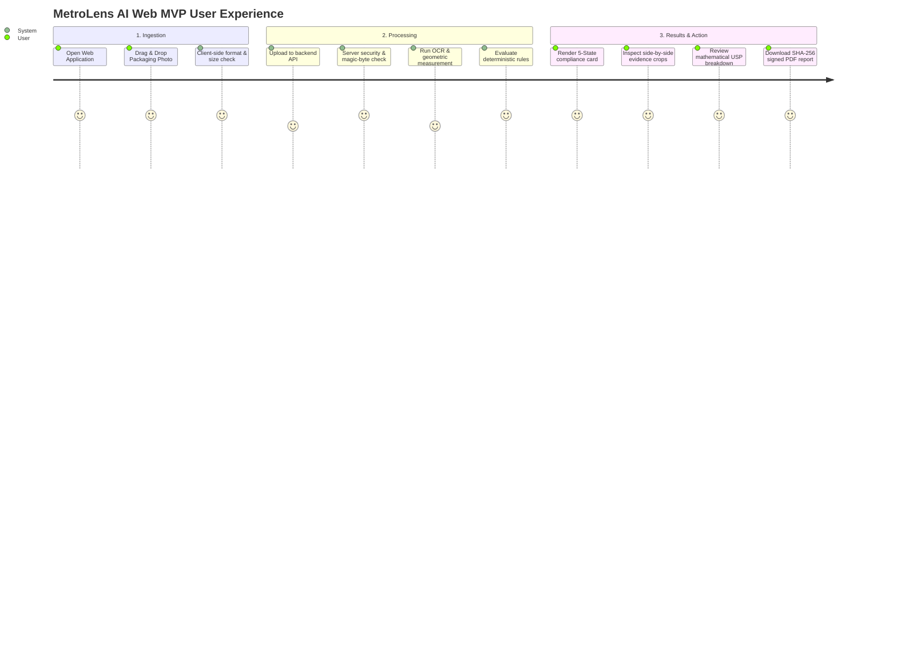

# MASTER PRODUCT BLUEPRINT & SPECIFICATION (V1.0)
# MetroLens AI™ — Automated Legal Metrology Inspection & Compliance System
### Sponsoring Ministry: Ministry of Consumer Affairs, Food & Public Distribution | Problem Statement: SIH26034
**Evaluation Framework:** InnoHack 3.0 / Smart India Hackathon 2026 | **Document Status:** Authoritative Master Specification (Web MVP Edition v1.0)  
**Product Delivery Model:** Modern Online Web Application | **Processing Philosophy:** Deterministic, Modular, Audit-Traceable

---

## 1. Product Vision & Executive Summary

**MetroLens AI™** is an online, cloud-deployable web application and regulatory audit platform designed for District Legal Metrology Officers (LMOs), retail packaging compliance managers, brand quality assurance engineers, and e-commerce catalog auditors. It transforms a tedious, error-prone, 20-minute manual inspection involving vernier calipers, magnifying glasses, and manual math into a **sub-2.5-second, mathematically verified, tamper-evident regulatory compliance audit**.

By combining an intuitive **web-based image upload interface** with **server-side computer vision, local multilingual scene text OCR, and a deterministic statutory rule engine**, MetroLens AI automates the inspection of pre-packaged commodities under the *Legal Metrology Act, 2009* and the *Legal Metrology (Packaged Commodities) Rules, 2011* (incorporating the *Jan Vishwas (Amendment of Provisions) Act, 2023 & 2026* statutory frameworks).

### The Primary Interaction Paradigm
$$\text{UPLOAD IMAGE} \longrightarrow \text{VALIDATE} \longrightarrow \text{PROCESS} \longrightarrow \text{ANALYZE} \longrightarrow \text{VERIFY} \longrightarrow \text{EXPLAIN RESULT}$$

The system operates as a **first-class web application**: users access it via modern web browsers on laptops, tablets, or smartphones, upload packaging photos or digital artwork, and receive a transparent, legally cited compliance dossier with side-by-side visual evidence crops and downloadable cryptographic (SHA-256) assessment reports.

---

## 2. Critical Architectural Distinction: Delivery vs. Processing

MetroLens AI deliberately decouples its **delivery mechanism** from its **computational philosophy**:

```text
┌─────────────────────────────────────────────────────────────────────────────┐
│ 1. PRODUCT DELIVERY MODEL: ONLINE WEB APPLICATION                           │
│ • Accessible via standard HTTP/HTTPS in modern desktop and mobile browsers. │
│ • High-performance FastAPI REST API handling multipart uploads and JSON.    │
│ • Containerized deployment (Docker) scalable on modern cloud infrastructure.│
│ • Ephemeral processing lifecycle with zero persistent unencrypted data.     │
├─────────────────────────────────────────────────────────────────────────────┤
│ 2. ALGORITHMIC PROCESSING PHILOSOPHY: DETERMINISTIC & REPRODUCIBLE          │
│ • OCR, scale calibration, normalizer, and rule engine are pure, modular,    │
│   isolated Python services.                                                 │
│ • Local quantized ONNX neural weights executed on server CPU without any    │
│   external cloud AI API calls (zero dependency on OpenAI, Claude, or AWS).  │
│ • 100% deterministic rule evaluation: legal compliance is decided by code   │
│   codifying Gazette clauses—NEVER by probabilistic LLM hallucination.       │
│ • Fully reproducible in automated offline unit and benchmark test suites.   │
└─────────────────────────────────────────────────────────────────────────────┘
```

This distinction guarantees that while users enjoy the accessibility of a modern web application, the regulatory results remain mathematically rigorous, reproducible in court proceedings, and completely protected from LLM drift or vendor lock-in.

---

## 3. Real-World Problem Statement & Enforcement Realities

### Official Problem Statement (SIH26034)
> *"Software System to check compliance of Packaged Commodities under Legal Metrology (Packaged Commodities) Rules, 2011 by scanning products, images and labels."*

### Field & Market Realities Today
In India, pre-packaged retail commodities represent over ₹12 Lakh Crore ($150 Billion) in annual consumer trade. However, enforcement across millions of SKUs faces severe bottlenecks:
1. **The Human Capacity Deficit:** Only $\sim 2,500$ District Legal Metrology Officers (LMOs) inspect over 780 districts. Fewer than $0.01\%$ of physical retail packages are ever verified before sale.
2. **Deceptive Packaging & Shrinkflation:** Brands frequently downsize package contents (e.g., from 100g to 82g) while maintaining identical carton sizes and pricing. Rule 6(11) mandates Unit Sale Price (USP) declarations (e.g., "₹0.61 per g") in statutory standard denominations to protect consumers, yet brands often omit USP, print non-standard units (e.g., "per gm", "per packet"), or hide microscopic text on unreadable package gussets.
3. **Microscopic Print Infractions:** Rule 7 (Tables I & II) prescribes mandatory minimum font heights ($1.0\text{mm}$ to $6.0\text{mm}$) based on Principal Display Panel (PDP) area. Inspecting officers struggle to measure 1mm numerals on flexible pouches or reflective foils using manual rulers.
4. **Decriminalization & Administrative Evidence Burden:** Under the **Jan Vishwas (Amendment of Provisions) Act, 2023 & 2026**, first-time offenses under Section 36(1) are decriminalized and transitioned to an administrative **Improvement Notice** regime. Officers must present objective, indisputable visual evidence and calculation records before issuing statutory notices.

---

## 4. Target Users & Value Proposition

| User Persona | Context of Use | Core Value Proposition |
| :--- | :--- | :--- |
| **District Legal Metrology Officer (LMO)** | Field inspection reviews, market surveillance audits, seizure assessments. | Replaces manual ruler checks with $<2.5\text{s}$ automated verification, producing a court-admissible Section 15 inspection dossier. |
| **Brand Packaging & QA Compliance Team** | Pre-market digital artwork reviews, pre-print compliance sign-offs. | Identifies statutory omissions, font height deficits, and USP arithmetic errors before costly packaging print runs. |
| **E-Commerce Catalog Compliance Auditor** | Catalog quality gating on Amazon, Flipkart, Blinkit, and Zepto listings. | Validates front/back packaging image uploads against mandatory Rule 6 declarations prior to listing activation. |
| **Consumer Protection Advocates** | Investigation of deceptive packaging, consumer grievance documentation. | Generates objective, evidence-backed proof of shrinkflation and labeling non-compliance for submission to consumer commissions. |

---

## 5. The Four Architectural Pillars

MetroLens AI enforces impenetrable boundaries between perception, mathematics, statutory logic, and human governance:

```text
┌─────────────────────────────────────────────────────────────────────────────┐
│ 1. AI PERCEIVES (Probabilistic Optical Extraction)                          │
│ • Quantized PaddleOCR v4 Mobile (DBNet++, SVTR) running on server CPU.      │
│ • Detects text polygons, character bounding boxes, and raw text strings     │
│   across English and Hindi (Devanagari).                                    │
│ • STRICT BOUNDARY: AI NEVER decides whether a package violates the law.     │
├─────────────────────────────────────────────────────────────────────────────┤
│ 2. MATH VALIDATES (Empirical Geometric & Metric Calibration)                │
│ • Planar scale recovery via coplanar metric reference anchor ($S$ in mm/px).│
│ • Right-cylinder vertical generator strip projection ($\cos\phi \ge 0.94$). │
│ • IEEE 754 floating-point division for Unit Sale Price verification.       │
│ • STRICT BOUNDARY: Zero heuristic rounding; strict statutory denominators.  │
├─────────────────────────────────────────────────────────────────────────────┤
│ 3. RULES DECIDE (100% Deterministic Statutory Engine)                       │
│ • Pure Python isolated state machine codifying LMPC Rules 2011 & Jan Vishwas│
│ • Rules 6(1)(a)-(h), 6(11) USP arithmetic, 7 Table-I/II font height matrix, │
│   and Rule 26 statutory exemptions.                                         │
│ • STRICT BOUNDARY: 100% deterministic, audit-traceable, zero hallucination. │
├─────────────────────────────────────────────────────────────────────────────┤
│ 4. HUMANS GOVERN (Regulatory Discretion & Officer Authority)                │
│ • 5-State compliance classification and interactive web evidence viewer.    │
│ • Borderline, ambiguous, or curved packaging routed to manual review.       │
│ • STRICT BOUNDARY: Software provides assistive screening; statutory notice  │
│   issuance remains the sole legal authority of the inspecting officer.      │
└─────────────────────────────────────────────────────────────────────────────┘
```

---

## 6. End-to-End MVP User Journey

The web application guides the user through an intuitive, transparent workflow:



### Detailed Stage-by-Stage Journey Specification

| Stage | User Action | System Action | Inputs | Outputs | Potential Failures | User-Facing Message | Security Requirement |
| :--- | :--- | :--- | :--- | :--- | :--- | :--- | :--- |
| **1. Landing & Selection** | User visits site, drags package image into upload dropzone or taps file picker. | Activates drag-over styling, previews thumbnail, validates MIME type and file size. | File object from browser event. | Validated local Blob, thumbnail URL. | Unsupported extension, file $>15\text{MB}$. | *"Please upload a JPEG, PNG, or WebP image under 15MB."* | Client-side extension and size check. |
| **2. Upload & Transmission** | User clicks "Analyze Packaging" (or auto-triggers on drop). | Sends `multipart/form-data` request via `POST /api/v1/inspect`. Displays progress bar. | `file: UploadFile`, optional `calibration_anchor` type. | Upload progress percentage, HTTP 200 response. | Network disconnect, HTTP 413 Payload Too Large. | *"Uploading packaging image... (65%)"* | TLS transmission, CORS header enforcement, rate limit verification. |
| **3. Server Validation** | None (background). | Validates magic bytes, checks for decompression bombs, verifies readable image headers. | Binary stream in memory. | Validated PIL Image object or memory buffer. | Corrupt binary, zip/decompression bomb, non-image payload. | *"Invalid or corrupt image file. Please upload an authentic photo."* | `PIL.Image.MAX_IMAGE_PIXELS` cap, magic-byte inspection, path sanitization. |
| **4. Perception & Extraction** | None (system processing state animated). | Runs PaddleOCR int8 detection/recognition; detects metric coin/card anchor contour if present. | Preprocessed image buffer ($1280\text{px}$ standard). | Text tokens, 2D bounding boxes, scale factor $S$ (mm/px). | Severe blur, extreme glare, unreadable text. | *"Processing declarations & measuring packaging geometry..."* | Process isolation, CPU execution timeout ($<5.0\text{s}$ hard cap). |
| **5. Normalization & Audit** | None (system). | Normalizes text into canonical entities; executes deterministic state machine (Rules 6, 6(11), 7, 26). | Extracted text + bounding boxes + $S$. | `ComplianceEvaluationResult` JSON object. | Ambiguous text syntax, borderline font height. | *"Auditing against Legal Metrology Rules, 2011..."* | Pure Python computation, zero external network requests. |
| **6. Result Presentation** | User views executive compliance dashboard. | Displays primary 5-State badge, summary cards, missing declaration alerts, USP math breakdown. | Inspection result JSON payload. | Interactive DOM with color-coded statutory status cards. | Rendering issue, missing schema field. | Color-coded status badge with plain-language explanation. | Content Security Policy (CSP), sanitized text rendering. |
| **7. Evidence Review** | User clicks individual declarations (e.g. MRP, USP, Net Qty, Mfg Date). | Zooms into high-resolution rectified image crop with bounding box overlay and measured height. | Crop coordinate dictionary. | Interactive modal / side-by-side evidence viewer. | Image crop bounding box out-of-bounds. | *"Viewing extracted declaration crop for Rule 6(1)(e) Net Quantity"* | Ephemeral signed image tokens or base64 inline delivery. |
| **8. Evidentiary Export** | User clicks "Download Official Assessment Report". | Backend generates tamper-evident PDF embedding SHA-256 digests, legal citations, and crops. | Inspection ID, officer notes. | Downloadable PDF file (`metrolens_report_INSP-XXXX.pdf`). | PDF compilation timeout, missing font glyphs. | *"Generating tamper-evident PDF report..."* | Cryptographic SHA-256 digest validation, header injection prevention. |

---

## 7. Multi-Image Architecture: MVP vs. Future Packaging Inspection

To prevent the system from becoming permanently constrained to a single flat photograph, the architecture explicitly distinguishes between the MVP baseline and the multi-panel roadmap:

```text
┌─────────────────────────────────────────────────────────────────────────────┐
│ MVP BASELINE: SINGLE-IMAGE INSPECTION (Current Scope)                       │
│ • Ingestion: One high-resolution image of the Principal Display Panel (PDP) │
│   or primary information panel.                                             │
│ • Processing: Single-pass pipeline evaluating all visible declarations.     │
│ • Data Contract: Top-level inspection object contains 1 image payload.      │
├─────────────────────────────────────────────────────────────────────────────┤
│ FUTURE ARCHITECTURE: MULTI-VIEW INSPECTION SESSION (Extensible Schema)       │
│ • Ingestion: Multi-image session supporting 1 to 6 panel views:             │
│   - Front (PDP): Commodity name, Net Quantity, USP, Brand.                  │
│   - Back: Manufacturer address, consumer care, barcode, ingredients.        │
│   - Sides / Top / Bottom: Manufacturing dates, batch codes, MRP stamp.      │
│   - Close-Up: Macro optical shot of microscopic date/batch stamps.          │
│ • Processing: Session aggregator merges declarations across multiple panels │
│   before executing the unified statutory rule engine.                       │
│ • Backward Compatibility: The MVP schema wraps image inputs in a list:      │
│   `images: List[InspectionImageInput]` — ensuring MVP single-image code     │
│   operates seamlessly as an N=1 session.                                   │
└─────────────────────────────────────────────────────────────────────────────┘
```

---

## 8. Five-State Regulatory Compliance Framework

To eliminate false-positive harassment of law-abiding merchants while holding non-compliant manufacturers accountable, MetroLens AI categorizes every inspection into one of five definitive regulatory states:

| Status Badge | Regulatory Classification | Criteria & Statutory Triggers | Recommended Regulatory Action |
| :---: | :--- | :--- | :--- |
| 🟢 **Green** | `NO_IMAGE_VERIFIABLE_VIOLATION_DETECTED` | All mandatory Rule 6 declarations present; numeral heights satisfy Rule 7 Table-I/II minimums; declared USP matches calculated $\text{MRP} / \text{NetQty}$ in standard statutory units. | **Pass.** Clear inspection record logged; no further action required. |
| 🔴 **Red** | `POTENTIAL_NON_COMPLIANCE` | Omission of mandatory declaration (MRP, Net Qty, Mfg Date, Address); severe font height deficit ($> 0.10\text{mm}$ below statutory minimum); arithmetic USP discrepancy ($> 1\%$ error); prohibited non-metric units ("Gms", "Kgs", "ML"). | **Recommend Section 36(1) Improvement Notice** (under Jan Vishwas Act 2026) specifying 15-day cure period. |
| 🟡 **Amber** | `MANUAL_REVIEW_REQUIRED` | OCR confidence on critical field is borderline ($60\text{--}80\%$); measured numeral height within $0.10\text{mm}$ benefit-of-doubt buffer; non-planar packaging curvature detected; ambiguous address syntax. | **Inspector Visual Review.** One-tap confirmation UI allows inspecting officer to verify cropped visual evidence. |
| 🔵 **Blue** | `STATUTORY_EXEMPTION_APPLIED` | Package Net Quantity $\le 10\text{g}$ or $\le 10\text{ml}$ (non-tobacco); wholesale industrial package $> 25\text{kg}$ or $> 25\text{L}$ under Rule 26. | **Exemption Applied.** Statutory violation flags suppressed; documented as legally exempt packaging. |
| ⚪ **Gray** | `NOT_IMAGE_VERIFIABLE` | Physical net contents weight verification under Rule 24; chemical or nutritional purity verification (FSSAI); physical scale anchor missing. | **Physical Audit Required.** Flags package for certified physical weighing scale test or laboratory sampling. |

---

## 9. Web Image Upload & Ingestion Architecture

### Accepted Formats & Specifications
- **Supported File Types:** JPEG (`.jpg`, `.jpeg`), PNG (`.png`), WebP (`.webp`).
- **File Size Constraint:** Maximum $15.0\text{ MB}$ per image (typical camera upload is $2.0\text{--}6.0\text{MB}$).
- **Dimensional Bounds:**
  - Minimum resolution: $800 \times 600\text{ pixels}$ (ensures sufficient stroke pixels for OCR).
  - Maximum resolution: $8000 \times 8000\text{ pixels}$ (rejects decompression bombs).
  - Recommended working resolution: $1920 \times 1080$ or $2560 \times 1440$ (resized down on server for inference if $> 3000\text{px}$).

### Ingestion Validation Pipeline
```text
CLIENT SELECTION (Browser)
   │  • File extension & client-side size pre-check (< 15MB)
   ▼
HTTP MULTIPART UPLOAD (FastAPI)
   │  • Streaming chunk reader enforcing 15MB hard ceiling
   ▼
MAGIC-BYTE VERIFICATION (Server Memory)
   │  • Reads first 16 bytes:
   │    - JPEG: FF D8 FF
   │    - PNG:  89 50 4E 47 0D 0A 1A 0A
   │    - WebP: 52 49 46 46 ... 57 45 42 50
   │  • Rejects spoofed MIME extensions immediately (HTTP 415)
   ▼
DECOMPRESSION BOMB DEFENSE (Pillow Security)
   │  • Enforces Image.MAX_IMAGE_PIXELS = 64_000_000 (~64 Megapixels)
   │  • Wraps decode in protected try/except Image.DecompressionBombError
   ▼
EXIF & METADATA SANITIZATION
   │  • Strips GPS, author, and device EXIF tags to preserve merchant privacy
   ▼
IN-MEMORY / EPHEMERAL BUFFER CREATION
      • Assigns cryptographically random UUID4 Inspection ID
      • Computes SHA-256 hash of raw byte payload
```

### Storage & Retention Policy
- **Processing Storage:** Completely in-memory or ephemeral spooling (`/tmp/metrolens_uploads/<uuid>/`).
- **Retention Lifecycle:** Ephemeral files are automatically deleted after inspection response is transmitted, or cached for a maximum of 60 minutes strictly to allow the user to trigger PDF report generation.
- **Permanent Storage:** None by default. Anonymized benchmark samples are only retained if explicitly submitted via designated test harness tools.

---

## 10. Web Security & Threat Model

Online image processing introduces unique web attack vectors that were not present in a local edge prototype:

```text
┌─────────────────────────┬────────────────────────────────────────────────────────┐
│ Threat Vector           │ Mitigation & Defense Mechanism                         │
├─────────────────────────┼────────────────────────────────────────────────────────┤
│ Decompression Bombs     │ Strict Pillow pixel limits (`MAX_IMAGE_PIXELS`),       │
│ (Zip / Pixel Bombs)     │ pre-allocation memory caps, and dimension validation.  │
├─────────────────────────┼────────────────────────────────────────────────────────┤
│ Malicious File Uploads  │ Magic-byte inspection, strict MIME-type whitelist,     │
│ (Shells, Polyglots)     │ execution of decode strictly in isolated image memory. │
├─────────────────────────┼────────────────────────────────────────────────────────┤
│ Path Traversal Attacks  │ Uploaded files are NEVER written with client-supplied  │
│ (`../../evil.jpg`)      │ filenames. Storage uses server-generated UUID4 tokens. │
├─────────────────────────┼────────────────────────────────────────────────────────┤
│ Denial of Service (DoS) │ Payload size capped at 15MB; rate limiting per IP;     │
│ via CPU Exhaustion      │ synchronous worker timeout at 5.0s per inference job.  │
├─────────────────────────┼────────────────────────────────────────────────────────┤
│ Privacy & EXIF Leaks    │ Automated EXIF metadata stripping prior to pipeline    │
│                         │ processing; ephemeral storage auto-purged post-audit.  │
├─────────────────────────┼────────────────────────────────────────────────────────┤
│ API Tampering & CORS    │ Strict CORS origins, schema-enforced Pydantic payload  │
│                         │ validation, and SHA-256 checksum seal on report data.  │
└─────────────────────────┴────────────────────────────────────────────────────────┘
```

---

## 11. MVP Scope Control (Must / Should / Future)

```text
================================================================================
                    METROLENS AI MVP SCOPE TAXONOMY
================================================================================
  [ MUST HAVE ] (Core 8–9 Day MVP Spine — Non-Negotiable)
  • Web-based responsive upload dropzone with file picker and drag-and-drop.
  • Client and server-side image validation (magic bytes, size, format).
  • Server-side PaddleOCR v4 Mobile ONNX int8 execution on CPU.
  • Metric scale calibration via coplanar 10-Rupee coin / ISO card anchor.
  • Canonical entity normalization (regex + Pydantic schemas).
  • Deterministic rule engine for Rules 6(1)(a)-(h), 6(11) USP, 7, 8, 26.
  • 5-State compliance classification badges and plain-language reasoning.
  • Interactive side-by-side evidence viewer with bounding box image crops.
  • Tamper-evident PDF assessment report generation embedding SHA-256 hashes.
  • Containerized Docker packaging ready for cloud or local demo hosting.

  [ SHOULD HAVE ] (Target for Days 5–6)
  • Right-cylinder vertical generator strip font height invariance module.
  • Camera capture option via HTML5 MediaStream API directly in the browser.
  • eMaap Mock REST Webhook Adapter (`POST /api/v1/emaap/mock-sync`).
  • Inspector 1-tap manual review confirmation toggle.
  • Manual 2-point caliper scale override modal on canvas.

  [ FUTURE ROADMAP ] (Post-Hackathon Roadmap)
  • User accounts, multi-tenant organization authentication, and roles.
  • Multi-image packaging session aggregation (Front, Back, Sides, Close-up).
  • Persistent inspection history database and search dashboard.
  • Automated e-commerce marketplace scraping (Amazon, Blinkit, Zepto).
  • Brand Pre-Flight Artwork Mode (DPI-to-mm validation on direct packaging PDFs).
  • Native Android/iOS store apps.

  [ DO NOT BUILD ] (Excised Distractions)
  • NO live unverified eMaap production integration (mock adapter only).
  • NO blockchain or distributed ledger technology.
  • NO custom neural network training from scratch (use pretrained ONNX).
  • NO complex OAuth2 / JWT authentication bloat for MVP demo.
  • NO Playwright live web scrapers during the hackathon.
================================================================================
```

---

## 12. Measurable Engineering Success Criteria

| Metric Category | Target Metric | Target Value | Measurement Methodology |
| :--- | :--- | :--- | :--- |
| **Perception (OCR)** | Character Error Rate (CER) | $< 6.0\%$ | Evaluated across 35-SKU ground-truth benchmark dataset (`tests/test_ocr_benchmark.py`). |
| **Measurement (CV)** | Metric Scale Factor ($S$) Error | $< 5.0\%$ | Evaluated on ₹10 coin anchor at tilt angles $\le 15^\circ$ against millimeter grid. |
| **Measurement (CV)** | Numeral Height Error (MAE) | $< 0.15\text{ mm}$ | Measured against 1200 DPI flatbed optical ground-truth scans. |
| **Math & Logic** | USP Arithmetic Verification | $100.0\%$ | 25 synthetic cases with standard denominators (₹/g, ₹/kg, ₹/ml, ₹/l, ₹/piece). |
| **Determinism** | Statutory Rule Correctness | $100.0\%$ | Zero false statutory citations; zero LLM drift; reproducible across 100 runs. |
| **Performance** | End-to-End Latency | $< 2.5\text{ seconds}$ | Wall-clock time from upload submission to final result display on consumer CPU. |
| **Reliability** | Upload Pipeline Stability | $> 99.0\%$ | Validated against test suite of corrupted, oversized, and diverse aspect ratio images. |

---

## 13. Project Constraints & Known Risks

### Technical Constraints
1. **CPU Inference Budget:** All neural networks (detection + recognition) must run on standard server/laptop CPUs without requiring discrete NVIDIA GPUs. Total memory footprint must remain under $500\text{MB}$.
2. **Monocular Optical Physics:** Camera distance, perspective tilt, and surface curvature directly impact measurement. Captures exceeding $15^\circ$ perspective tilt or non-cylindrical containers cannot be calibrated automatically and must fail gracefully to `MANUAL_REVIEW_REQUIRED`.
3. **Packaging Surface Realities:** Crumpled snack bags, metallic foil glare, and dot-matrix inkjet expiration stamps represent the most difficult real-world optical scenarios. Preprocessing filters (glare masking, contrast equalization) are mandatory.

### Legal Constraints
1. **Statutory Status:** The software is an **assistive screening system under Section 15** of the Legal Metrology Act, 2009. It provides evidence dossiers and recommendations; it does NOT replace the statutory discretion of an authorized inspector.
2. **Evidentiary Integrity:** Under Section 63 of Bharatiya Sakshya Adhiniyam, 2023 / Section 65B of Indian Evidence Act, 1872, reports must maintain cryptographic chain of custody (SHA-256 hashes of input images, crops, and metadata).
