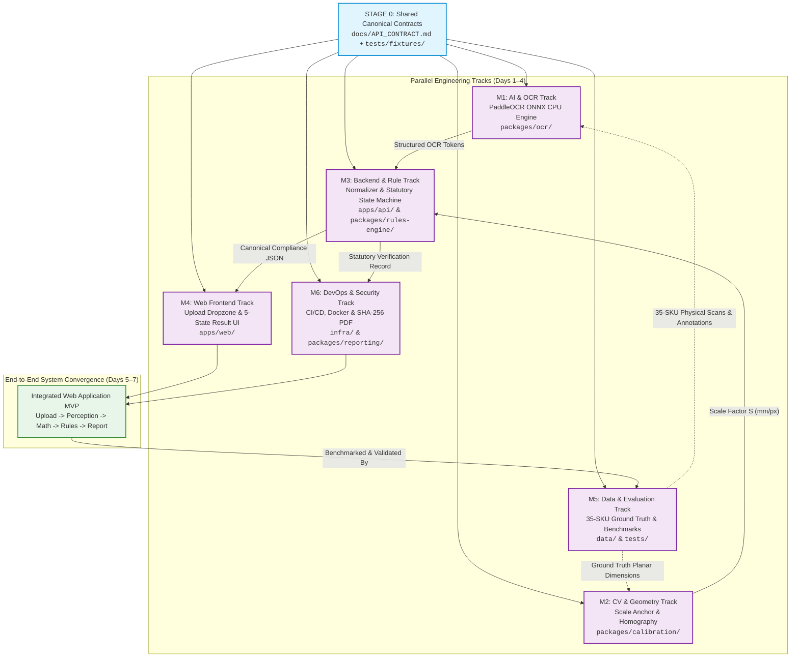

# TEAM WORKSTREAM ARCHITECTURE & RESPONSIBILITY SPECIFICATION (V1.0)

# MetroLens AI™ — 6-Member Engineering Ownership Matrix (M1–M6)

### Document Status: Authoritative Single Source of Truth for Team Allocation | Conformance: RFC 2119

**Project Evaluation:** InnoHack 3.0 / Smart India Hackathon 2026 | **Governance Model:** Single Accountable Lead per Domain

---

## 1. Executive Purpose & Team Governance Philosophy

MetroLens AI is executed by a cross-functional engineering team of **six members (M1 through M6)**. To maximize engineering velocity during an intensive hackathon cycle and eliminate the catastrophic bottlenecks of sequential waiting, the team operates under **decoupled parallel tracks** governed by strict interface contracts and mock test fixtures (`tests/fixtures/`).

### Core Governance Principles

1. **Single Accountable Owner (No Dual Accountabilities):** Every critical subsystem has exactly **one Accountable Lead (A)**. Multiple owners for a single deliverable create finger-pointing and delayed reviews.
2. **Explicit "Not My Job" Boundaries:** Preventing role creep is as vital as defining duties. Teammates must know what they are explicitly forbidden from doing (e.g., frontend leads must not write legal rules in React; OCR leads must not decide legal violations).
3. **Contract-First Independence:** On Day 1, all API and data contracts are frozen. Downstream engineers build against canonical mock JSON fixtures immediately without waiting for upstream algorithms to finish.

---

## 2. Workstream Dependency Graph & Parallel Sprints



---

## 3. Authoritative Member Specifications (M1 to M6)

---

### M1 — AI & Multilingual OCR Lead

* **Mission:** Deliver a high-accuracy, sub-800ms scene text extraction engine running entirely on server CPU without external cloud APIs.
* **Primary Ownership:**
  - `packages/ocr/` (PaddleOCR v4 Mobile ONNX int8 runtime, CPU thread tuning).
  - Multilingual recognition pipeline (English alphanumeric + Devanagari Hindi text).
  - Text bounding box extraction, confidence filtering, and character tokenization.
  - OCR benchmark evaluation (`tests/test_ocr_benchmark.py`).
* **Secondary Support:** Backend API integration (`apps/api/services/ocr_service.py`).
* **Inputs Received:** Rectified image buffer (`numpy.ndarray`) from M2 or raw preprocessed image.
* **Outputs Provided:** Structured OCR Token List: `List[Dict[text: str, bbox: List[int], confidence: float]]`.
* **What M1 Reviews:** Any PR modifying OCR preprocessing, text parsing, or font tokenization.
* **What M1 Does NOT Own ("Not My Job"):**
  - Does NOT decide whether an extracted text token violates a legal rule.
  - Does NOT write regex rules for parsing entities (owned by M3).
  - Does NOT implement frontend UI components (owned by M4).
* **Testing Responsibilities:** `tests/test_ocr_benchmark.py` (Character Error Rate $<6.0\%$, latency $<800\text{ms}$).
* **Definition of Done (DoD):** ONNX runtime initializes in $<200\text{ms}$ on CPU, passes 15 ground-truth benchmark packaging crops with CER $<6.0\%$, and returns standardized token dictionaries.

---

### M2 — Computer Vision, Calibration & Measurement Lead

* **Mission:** Solve the monocular scale ambiguity of smartphone camera uploads and deliver mathematically verifiable millimeter measurements.
* **Primary Ownership:**
  - `packages/calibration/` (Optical metric scale recovery via 10-Rupee coin / ISO card).
  - `packages/vision/` (Image quality gate: Laplacian blur filter and HSV specular glare detector).
  - Planar homography unwarping ($3 \times 3$ matrix $H$) and perspective rectification.
  - Right-cylinder vertical generator invariance logic ($\cos\phi \ge 0.94$).
  - Physical font height stroke measurement ($h_{\text{mm}} = h_{\text{px}} \times S$).
* **Secondary Support:** Physical packaging data collection with M5.
* **Inputs Received:** Raw uploaded image buffer from API gateway.
* **Outputs Provided:** Metric Scale Factor $S$ ($\text{mm/pixel}$), rectified image crop, and measured numeral stroke heights ($h_{\text{mm}}$).
* **What M2 Reviews:** Any PR touching OpenCV preprocessing, contour detection, homography, or geometric math.
* **What M2 Does NOT Own ("Not My Job"):**
  - Does NOT evaluate Legal Metrology Area Brackets or Rule 7 Table-I/II thresholds (owned by M3).
  - Does NOT parse OCR text strings (owned by M1).
  - Does NOT configure Docker deployment or web server routes (owned by M3/M6).
* **Testing Responsibilities:** `tests/test_calibration.py` and `tests/test_quality_gate.py` (Scale factor error $<5.0\%$, font height MAE $<0.15\text{mm}$).
* **Definition of Done (DoD):** Coin contour detection accurately recovers $27.0\text{mm}$ diameter on planar packaging with $<5\%$ error up to $15^\circ$ tilt; gracefully emits `is_calibrated: false` if coin is absent without crashing pipeline.

---

### M3 — Backend, Domain Logic & Rule Engine Lead

* **Mission:** Guard system architecture boundaries, enforce canonical data schemas, and deliver a 100% deterministic, audit-traceable statutory rule engine.
* **Primary Ownership:**
  - `apps/api/` (FastAPI application gateway, REST routes, error handling).
  - `packages/rules-engine/` (Statutory state machine: Rules 6(1)(a)-(h), 6(11) USP math, 7 Table-I/II, 8, 26).
  - Normalization layer (`packages/rules-engine/normalizer.py`: regex key-value extraction into `CanonicalDeclaration`).
  - Canonical Pydantic schemas and serialization.
* **Secondary Support:** Architecture governance and PR review across all backend packages.
* **Inputs Received:** Structured OCR tokens from M1, Metric scale and stroke heights from M2.
* **Outputs Provided:** Canonical `ComplianceEvaluationResult` JSON object and API responses.
* **What M3 Reviews:** All API routes, Pydantic schemas, normalization logic, and statutory rule implementations.
* **What M3 Does NOT Own ("Not My Job"):**
  - Does NOT implement raw OpenCV contour or ellipse fitting algorithms (owned by M2).
  - Does NOT build React frontend UI components or CSS (owned by M4).
  - Does NOT train or fine-tune neural networks (owned by M1).
* **Testing Responsibilities:** `tests/test_rules_engine.py` and `tests/test_api_integration.py` (100% pass on 25 statutory synthetic cases; zero legal hallucination).
* **Definition of Done (DoD):** Rule engine executes in $<20\text{ms}$ in pure Python; passes all 25 statutory test cases including standard unit denominations (₹/g, ₹/kg, ₹/ml, ₹/l, ₹/piece); emits complete 5-State classification with legal citations.

---

### M4 — Frontend & Web User Experience Lead

* **Mission:** Deliver an intuitive, responsive, and trustworthy web application experience that makes complex legal metrology compliance understandable to non-technical users.
* **Primary Ownership:**
  - `apps/web/` (React + Vite + Tailwind CSS web application).
  - Packaging Image Upload Dropzone (drag & drop, file selection, mobile camera capture option).
  - Client-side format, size, and aspect-ratio validation.
  - Executive 5-State compliance result dashboard (Green/Red/Amber/Blue/Gray badges).
  - Interactive side-by-side evidence viewer with synchronized bounding box crops.
  - Web accessibility (WCAG 2.1 AA) and mobile responsive layout.
* **Secondary Support:** Demo stagecraft and presentation UI polishing.
* **Inputs Received:** Canonical `ComplianceEvaluationResult` JSON from M3 API.
* **Outputs Provided:** Complete, responsive web user interface and user interactions.
* **What M4 Reviews:** All UI components, styling, client-side validation, and frontend state logic.
* **What M4 Does NOT Own ("Not My Job"):**
  - Does NOT implement statutory compliance logic or USP math in JavaScript/TypeScript (owned by M3).
  - Does NOT alter backend API response schemas independently (governed by `docs/API_CONTRACT.md`).
  - Does NOT process raw OpenCV computer vision tasks (owned by M2).
* **Testing Responsibilities:** Frontend unit tests (`npm test`), UI error state rendering, and mobile browser compatibility tests.
* **Definition of Done (DoD):** Web UI loads in $<1.0\text{s}$; provides immediate visual feedback on drag-and-drop; displays upload progress bar; renders 5-state result cards with synchronized evidence crops from mock or live API.

---

### M5 — Data, Evaluation, Benchmark & QA Lead

* **Mission:** Provide empirical proof that MetroLens AI works in reality; act as the independent quality auditor challenging the algorithms of M1, M2, and M3.
* **Primary Ownership:**
  - `data/` (35-SKU physical retail packaging dataset across FMCG categories).
  - Flatbed optical ground-truth scanning (1200 DPI) and coordinate annotation.
  - Automated evaluation harness (`tests/test_benchmark_suite.py`).
  - Empirical accuracy benchmarking (CER, scale error, font height MAE, false violation rate).
  - Anti-hallucination verification scripts (`scripts/verification/`).
* **Secondary Support:** Metric calibration validation with M2.
* **Inputs Received:** Physical retail packages from retail stores; pipeline outputs from M1, M2, M3.
* **Outputs Provided:** Ground-truth JSON manifests, automated benchmark reports, regression alerts.
* **What M5 Reviews:** All test scripts, benchmark assertions, data manifests, and accuracy claims.
* **What M5 Does NOT Own ("Not My Job"):**
  - Does NOT rewrite core OCR or calibration algorithms merely to fit a single benchmark image.
  - Does NOT modify legal rules without gazette citation (owned by M3).
  - Does NOT manage cloud server deployment (owned by M6).
* **Testing Responsibilities:** Full regression benchmark test suite (`python -m pytest tests/benchmarks/`).
* **Definition of Done (DoD):** Curates 35 real Indian packaging SKUs with verified ground truth; runs automated evaluation reporting CER, scale accuracy, and rule accuracy; blocks PRs that introduce accuracy regressions.

---

### M6 — Product, DevOps, Security & Integration Lead

* **Mission:** Guarantee that MetroLens AI is a deployable, secure, tamper-evident, and reliable product with flawless live demo execution.
* **Primary Ownership:**
  - `infra/` (Docker containerization, environment configuration, web deployment scripts).
  - `.github/workflows/` (Automated CI/CD pipelines: linting, typechecking, automated test runs).
  - Web upload security verification (decompression bomb protection, magic-byte checks, CORS, rate limiting).
  - `packages/reporting/` (Tamper-evident SHA-256 PDF Assessment Report compiler embedding Section 36(1) notices).
  - Mock eMaap REST Sync Adapter (`POST /api/v1/emaap/mock-sync`).
  - Live hackathon demo rehearsal and 5-layer failover runbook (`docs/DEMO_PLAN.md`).
* **Secondary Support:** Architecture governance with M3; presentation design.
* **Inputs Received:** System compliance evaluation JSON from M3, visual crops from M2.
* **Outputs Provided:** Deployable Docker images, passing CI/CD pipelines, cryptographically sealed PDF reports, and stable demo environment.
* **What M6 Reviews:** All Dockerfiles, CI workflows, security configurations, PDF templates, and release tags.
* **What M6 Does NOT Own ("Not My Job"):**
  - Does NOT become the default owner of unfinished application code from other teammates.
  - Does NOT invent statutory interpretations without primary gazette sources.
  - Does NOT modify frontend React layouts without M4 alignment.
* **Testing Responsibilities:** `tests/test_reporting_and_api.py`, `infra/` health checks, CI build validation.
* **Definition of Done (DoD):** Docker container builds clean and boots in $<10\text{s}$; GitHub CI runs tests on all PRs; PDF report compiles in $<500\text{ms}$ with valid SHA-256 hashes; staging web URL is live and accessible.

---

## 4. Comprehensive RACI Responsibility Matrix

* **A — Accountable:** The single person with final decision authority and ownership for the deliverable.
* **R — Responsible:** The person(s) who implement and execute the task.
* **C — Consulted:** Two-way communication; provides key technical inputs and reviews.
* **I — Informed:** Kept updated on progress and outcomes.

| Project Domain / Area                |   M1 (AI/OCR)   |  M2 (CV/Calib)  | M3 (Backend/Rule) | M4 (Frontend/UX) |  M5 (Data/QA)  | M6 (Product/DevOps) |
| :----------------------------------- | :-------------: | :-------------: | :---------------: | :--------------: | :-------------: | :-----------------: |
| **Scene Text OCR Pipeline**    | **A / R** |        C        |         C         |        I        |        C        |          I          |
| **Metric Scale & Calibration** |        C        | **A / R** |         C         |        I        |        C        |          I          |
| **Image Quality & Pre-check**  |        I        | **A / R** |         I         |        C        |        C        |          I          |
| **Backend API & Gateway**      |        C        |        I        |  **A / R**  |        C        |        I        |          C          |
| **Entity Normalization**       |        C        |        I        |  **A / R**  |        I        |        C        |          I          |
| **Statutory Rule Engine**      |        I        |        I        |  **A / R**  |        I        |        C        |          C          |
| **Web Frontend & Dropzone**    |        I        |        I        |         C         | **A / R** |        C        |          C          |
| **Side-by-Side Evidence UI**   |        I        |        C        |         C         | **A / R** |        C        |          I          |
| **Dataset & Ground Truth**     |        C        |        C        |         C         |        I        | **A / R** |          I          |
| **Regression & Benchmarking**  |        C        |        C        |         C         |        I        | **A / R** |          C          |
| **Tamper-Evident PDF Report**  |        I        |        I        |         C         |        I        |        I        |   **A / R**   |
| **Upload Security & Threats**  |        I        |        C        |         C         |        C        |        I        |   **A / R**   |
| **CI/CD & Cloud Deployment**   |        I        |        I        |         C         |        I        |        C        |   **A / R**   |
| **eMaap Mock Sync Adapter**    |        I        |        I        |         C         |        I        |        I        |   **A / R**   |

---

## 5. Cross-Team Handoff Contracts

To prevent integration friction, all subsystem handoffs are governed by explicit input/output contracts:

```text
┌─────────────────────────────────────────────────────────────────────────────┐
│ 1. M1 (OCR) ──► M3 (Backend & Rules)                                        │
│ • Handshake: List of extracted character strings, bounding boxes, and       │
│   recognition confidences.                                                  │
│ • Contract: `List[Dict[str, Any]]` matching `OCRToken` schema.              │
│ • Acceptance Gate: CER < 6.0% on benchmark; all mandatory fields present.   │
├─────────────────────────────────────────────────────────────────────────────┤
│ 2. M2 (Calibration) ──► M3 (Backend & Rules)                                │
│ • Handshake: Scale factor S (mm/px), PDP area (cm²), and measured font      │
│   stroke heights (mm).                                                      │
│ • Contract: `MetricScaleResult` schema.                                     │
│ • Acceptance Gate: Scale error < 5.0%; if anchor missing, S = null.         │
├─────────────────────────────────────────────────────────────────────────────┤
│ 3. M5 (Data & QA) ──► M1, M2, M3 (Engineering Core)                         │
│ • Handshake: High-resolution ground-truth scan crops, verified bounding     │
│   boxes, true metric dimensions, and expected statutory verdicts.           │
│ • Contract: `ground_truth_manifest.yaml` + `tests/fixtures/sample_packages/`│
│ • Acceptance Gate: 100% verified against physical packaging samples.       │
├─────────────────────────────────────────────────────────────────────────────┤
│ 4. M3 (Backend & Rules) ──► M4 (Web Frontend)                               │
│ • Handshake: Complete inspection result JSON including 5-State verdict,     │
│   parsed declarations, arithmetic audit, and crop coordinates.              │
│ • Contract: `ComplianceEvaluationResult` schema (docs/API_CONTRACT.md).     │
│ • Acceptance Gate: Response latency < 2.0s; conforms 100% to OpenAPI spec.  │
├─────────────────────────────────────────────────────────────────────────────┤
│ 5. M3 / M2 ──► M6 (Evidentiary Reporting)                                   │
│ • Handshake: Inspection record metadata, raw image hash, rectified crop     │
│   hashes, and rule violation breakdown.                                     │
│ • Contract: `DossierPayload` schema.                                        │
│ • Acceptance Gate: SHA-256 integrity verifiable; compiles PDF in < 500ms.   │
├─────────────────────────────────────────────────────────────────────────────┤
│ 6. M6 (DevOps) ──► Entire Engineering Team                                  │
│ • Handshake: Stable Docker container, passing CI lint/test gates, and live  │
│   staging preview URL.                                                      │
│ • Contract: `docker-compose up` succeeds with zero manual host configuration│
│ • Acceptance Gate: All tests pass in CI; environment variables documented.  │
└─────────────────────────────────────────────────────────────────────────────┘
```

---

## 6. Code Review & Stability Governance

To ensure high code quality, PRs must be reviewed by the designated primary and cross-support leads:

| Subsystem / PR Scope                                           | Primary Reviewer (Required) | Secondary Cross-Reviewer | Escalation & Merge Authority |
| :------------------------------------------------------------- | :-------------------------- | :----------------------- | :--------------------------- |
| **OCR & Neural Runtime** (`packages/ocr/`)             | M1 (AI Lead)                | M5 (Data/Benchmark)      | M3 (Backend Lead)            |
| **CV & Calibration** (`packages/calibration/`)         | M2 (CV Lead)                | M5 (Data/Benchmark)      | M3 (Backend Lead)            |
| **API & Rule Engine** (`apps/api/`, `rules-engine/`) | M3 (Backend Lead)           | M6 (Security/DevOps)     | M3 / M6                      |
| **Web Frontend** (`apps/web/`)                         | M4 (Frontend Lead)          | M6 (Product/Integration) | M4 / M6                      |
| **Datasets & Benchmarks** (`data/`, `tests/`)        | M5 (QA Lead)                | M1 (OCR) / M2 (CV)       | M5 / M6                      |
| **CI/CD, Docker & PDF** (`infra/`, `reporting/`)     | M6 (DevOps Lead)            | M3 (Backend Lead)        | M6 (Project Lead)            |

*Rules:*

- No developer may approve or merge their own Pull Request.
- At least **1 Primary Reviewer approval** is strictly required to merge into `main`.
- The Project Lead (M6) and Backend Lead (M3) have unilateral veto authority over any PR that introduces security vulnerabilities or breaks the synchronous sub-2.5s execution budget.
