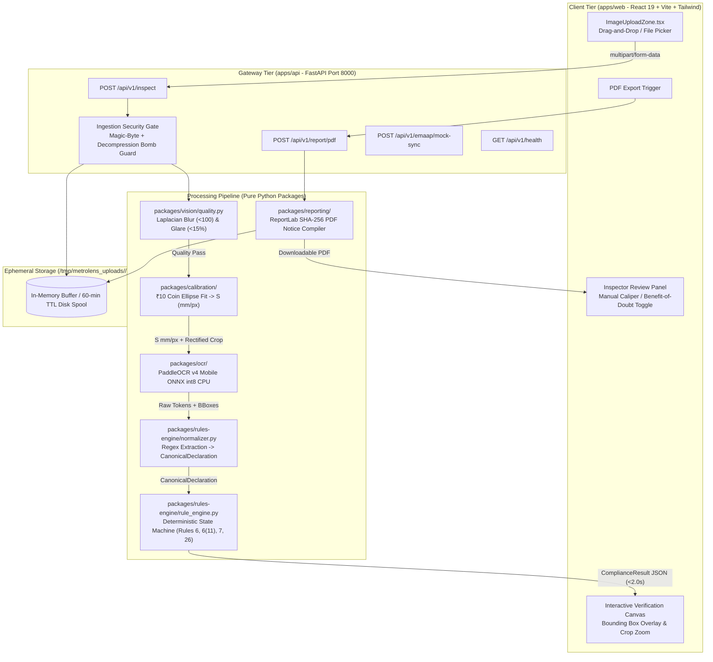
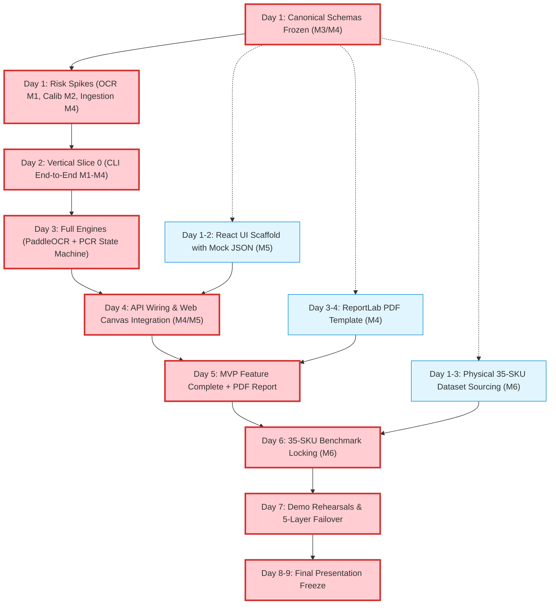

# MASTER PROJECT EXECUTION OVERVIEW
# MetroLens AI™ — 6-Member Engineering Execution Plan (SIH26034)
### Evaluation: Smart India Hackathon 2026 | Sponsoring Ministry: Ministry of Consumer Affairs
**Document Status:** Definitive Master Team Execution Blueprint | **Version:** 1.0.0 (Web MVP Edition)  
**Target Duration:** 8–9 Day Sprint | **Team Size:** 6 Engineers | **Execution Paradigm:** Decoupled Parallelism + Early Integration

---

## 1. Project Summary

**MetroLens AI™** is an online, cloud-deployable web application and statutory regulatory audit platform designed for District Legal Metrology Officers (LMOs), retail packaging quality assurance teams, brand compliance managers, and consumer rights advocates.

### The Problem
In India, over ₹12 Lakh Crore ($150 Billion) of packaged retail commodities are traded annually across 780+ districts. However, fewer than 2,500 inspecting officers exist nationwide. Inspections under the *Legal Metrology (Packaged Commodities) Rules, 2011* (PCR 2011) currently rely on handheld vernier calipers, magnifying glasses, and manual arithmetic. A single inspection requires 20 minutes, leaving over 99.99% of retail packages unverified. This enforcement blind spot allows rampant shrinkflation, missing Unit Sale Prices (USP), and microscopic, unreadable statutory declarations.

### The Solution
MetroLens AI converts that 20-minute manual inspection into a **sub-2.5-second, mathematically verified, tamper-evident regulatory audit**. Users open the web application on any device, upload a photograph of a retail packaging panel (optionally with an ordinary 10-Rupee coin or card for metric scale calibration), and receive an instant, court-admissible statutory assessment dossier with synchronized visual evidence crops, unit price calculations, and downloadable Section 36(1) compounding/improvement notice drafts.

---

## 2. Final MVP (Scope & Architecture)

The MVP is strictly scoped to deliver an unbreakable, production-quality, demonstration-ready web application:

$$\text{BROWSER UPLOAD} \longrightarrow \text{SECURITY & PRE-FLIGHT} \longrightarrow \text{LOCAL ONNX OCR \& SCALE CV} \longrightarrow \text{DETERMINISTIC RULES} \longrightarrow \text{5-STATE AUDIT DOSSIER \& PDF}$$

```
┌─────────────────────────────────────────────────────────────────────────────────────────────────┐
│ INPUT                                                                                           │
│ • Single-image upload of packaging panel via responsive web dropzone (JPEG, PNG, WebP ≤ 15MB). │
│ • Optional coplanar 10-Rupee coin (27.0mm) or standard ISO card (85.60x53.98mm) for metric     │
│   scale calibration ($S$ in mm/px).                                                             │
├─────────────────────────────────────────────────────────────────────────────────────────────────┤
│ PROCESSING (Server-Side CPU, Sub-2.5s Budget, Zero Cloud AI APIs)                              │
│ • Stage 1: Ingestion security (magic-byte check, decompression bomb cap at 64MP, EXIF strip).    │
│ • Stage 2: Optical pre-flight (Laplacian blur variance ≥ 100, HSV specular glare mask < 15%).   │
│ • Stage 3: Metric scale recovery & planar rectification (OpenCV contour / ellipse fitting).     │
│ • Stage 4: Multilingual scene text extraction (PaddleOCR v4 Mobile ONNX int8 on CPU).           │
│ • Stage 5: Canonical entity normalization (regex token parser into Pydantic declaration models).│
├─────────────────────────────────────────────────────────────────────────────────────────────────┤
│ DECISION (100% Deterministic Statutory Python Engine)                                           │
│ • Rule 3 / Rule 26: Statutory applicability & exemption gate (≤10g/ml small pack exemptions;    │
│   pan masala & tobacco carve-outs; >25kg wholesale exclusions).                                 │
│ • Rule 6(1)(a)-(h): Mandatory 8-declaration completeness validation.                            │
│ • Rule 6(11): Unit Sale Price (USP) arithmetic verification ($\text{MRP} / \text{NetQty}$).     │
│ • Rule 7 (Tables I & II): Principal Display Panel area to minimum numeral font height check.    │
│ • Statutory Classification: 5-State regulatory taxonomy.                                        │
├─────────────────────────────────────────────────────────────────────────────────────────────────┤
│ OUTPUT                                                                                          │
│ • Interactive Web UI: 5-State compliance badges, color-coded declaration cards, side-by-side    │
│   synchronized high-resolution evidence crops with bounding boxes.                              │
│ • Tamper-Evident Dossier: Downloadable PDF with SHA-256 image hashes, exact legal citations,   │
│   calibrated measurements, and Section 36(1) Improvement Notice draft (Jan Vishwas Act, 2026).  │
│ • Mock eMaap Adapter: REST webhook sync (`POST /api/v1/emaap/mock-sync`).                       │
└─────────────────────────────────────────────────────────────────────────────────────────────────┘
```

---

## 3. Non-Goals (Explicit Sprint Exclusions)

To protect the 8–9 day timeline and prevent engineering derailment while managing a secondary hackathon project in parallel, the following are strictly prohibited from the sprint:

1. **NO Cloud LLM/VLM APIs in Adjudication:** No OpenAI, Anthropic, or Gemini calls for legal evaluation. Statutory rules must remain 100% deterministic Python code.
2. **NO Asynchronous Worker Queues (Celery/Redis):** Synchronous request-response is mandated by ADR-012 for the MVP. No Redis, RabbitMQ, or Celery daemons.
3. **NO User Authentication / Database Bloat:** Anonymous public demo posture (ADR-015). No JWT, OAuth2, Postgres database migrations, or password resets.
4. **NO Multi-Image Packaging Aggregation in UI:** The data contract supports `images: List[ImageInput]`, but the MVP UI implements single-image inspection only.
5. **NO Live e-Commerce Web Scraping:** No Playwright/Selenium scrapers for Amazon, Blinkit, or Zepto listings during this sprint.
6. **NO Native Mobile App Packaging:** No Android APK or iOS IPA builds. Responsive web SPA running in modern mobile and desktop browsers only.
7. **NO Custom Neural Network Training:** Use pre-trained, quantized ONNX model weights (PaddleOCR v4 Mobile). Zero training from scratch.
8. **NO Physical Weight Verification:** Monocular cameras cannot weigh products. Physical net contents verification remains explicitly out of scope.

---

## 4. Architecture Overview



---

## 5. Six-Member Team Map

| Member | Primary Ownership | Secondary Support | Main Deliverable | Critical Upstream Dependency |
| :--- | :--- | :--- | :--- | :--- |
| **Member 1 (M1)** | AI & Multilingual OCR Pipeline | Backend OCR Service Integration | `packages/ocr/` (PaddleOCR ONNX int8 CPU engine, token extractor, CER benchmark) | Image buffer from API / M2 |
| **Member 2 (M2)** | CV, Calibration & Measurement | Data Ground Truth Collection | `packages/calibration/` & `packages/vision/` (Pre-flight blur/glare filter, ₹10 coin homography, font height measurement) | Raw uploaded image buffer |
| **Member 3 (M3)** | Legal Rules & Compliance Engine | Architecture & Statutory Compliance | `packages/rules-engine/` (Normalizer regex, deterministic state machine for Rules 6, 6(11), 7, 26, 25 statutory tests) | OCR tokens (M1), Scale factor (M2) |
| **Member 4 (M4)** | Backend API, Security & PDF Reporting | Integration & Performance Tuning | `apps/api/` & `packages/reporting/` (FastAPI gateway, magic-byte validator, ephemeral storage, SHA-256 PDF generator, mock eMaap) | Canonical schemas (M3), Evaluation results |
| **Member 5 (M5)** | Frontend & Web User Experience | Demo Polish & Presentation UI | `apps/web/` (React 19 + Vite upload dropzone, interactive bounding-box canvas, 5-state result cards, responsive layout) | API Contracts & Mock JSON (M4/M3) |
| **Member 6 (M6)** | Integration, QA, Benchmark & Release | Live Demo Stagecraft & DevOps | `infra/`, `data/` & `tests/` (35-SKU empirical benchmark, 1200 DPI ground truth, Docker build, CI/CD, 5-layer demo failover) | All component modules |

---

## 6. Responsibility Matrix (RACI)

```
A = Accountable (Single final decision-maker)
R = Responsible (Implements and executes)
C = Consulted (Provides inputs and reviews)
I = Informed (Kept updated)
```

| Subsystem / Deliverable | M1 (OCR) | M2 (CV/Calib) | M3 (Legal) | M4 (API/PDF) | M5 (Web/UX) | M6 (QA/DevOps) |
| :--- | :---: | :---: | :---: | :---: | :---: | :---: |
| **Pre-Flight Filter (Blur/Glare)** | I | **A / R** | I | C | C | I |
| **Optical Metric Calibration ($S$)**| C | **A / R** | C | I | C | I |
| **Physical Font Measurement** | C | **A / R** | C | I | I | C |
| **PaddleOCR ONNX CPU Runtime** | **A / R** | C | C | I | I | C |
| **Multilingual (Hindi/Eng) Tokens**| **A / R** | I | C | I | I | I |
| **Entity Normalizer (Regex)** | C | I | **A / R** | I | I | I |
| **Statutory Rule Engine (PCR 2011)**| I | I | **A / R** | I | I | C |
| **25 Statutory Rule Tests** | I | I | **A / R** | I | I | C |
| **FastAPI Gateway & Endpoints** | C | I | C | **A / R** | C | C |
| **Upload Security (Magic-Bytes/Bomb)**| I | C | I | **A / R** | C | C |
| **Ephemeral Spooling (60-min TTL)** | I | I | I | **A / R** | I | C |
| **SHA-256 PDF Assessment Report** | I | I | C | **A / R** | I | C |
| **Mock eMaap Webhook Gateway** | I | I | C | **A / R** | I | I |
| **Web Upload Dropzone Component** | I | I | I | C | **A / R** | I |
| **Interactive Bounding Box Canvas** | C | C | I | C | **A / R** | I |
| **5-State Compliance UI Dashboard** | I | I | C | C | **A / R** | I |
| **35-SKU Ground-Truth Dataset** | C | C | C | I | I | **A / R** |
| **1200 DPI Optical Ground Truth** | I | C | I | I | I | **A / R** |
| **Empirical Benchmark Suite (CER/MAE)**| C | C | C | I | I | **A / R** |
| **Docker Multi-Stage Container** | I | I | I | C | C | **A / R** |
| **CI/CD Automated GitHub Actions** | I | I | I | C | I | **A / R** |
| **5-Layer Live Demo Failover** | C | C | C | C | C | **A / R** |

---

## 7. Critical Path & Dependency Graph



### Critical Path Bottlenecks & Explanations:
1. **Day 1 Contract Freeze $\rightarrow$ All Members:** If schemas drift, M5 builds the wrong UI and M3 builds the wrong normalizer. Must freeze at Hour 12.
2. **M1 (OCR) + M2 (Calibration) $\rightarrow$ Day 2 Vertical Slice 0:** Without local OCR and scale output, the pipeline cannot pass live data to M3.
3. **M3 (Rule Engine) $\rightarrow$ M4 (API) $\rightarrow$ M5 (UI):** The frontend depends on stable compliance JSON structures. Decoupled via mock fixtures on Days 1–3, integrated on Day 4.
4. **M6 (35-SKU Ground Truth) $\rightarrow$ Day 6 Benchmark:** Formal scientific accuracy claims require physical ground-truth measurements before freezing results.

---

## 8. 8–9 Day Master Engineering Schedule

| Day | M1 (AI/OCR) | M2 (CV/Calib) | M3 (Legal Rules) | M4 (API/PDF) | M5 (Web/UX) | M6 (QA/DevOps) | Daily Integration Milestone |
| :---: | :--- | :--- | :--- | :--- | :--- | :--- | :--- |
| **Day 1** | CPU ONNX Spike; verify $<1200\text{ms}$ on 5 packs | ₹10 Coin ellipse spike; measure scale error vs grid | Draft Pydantic schemas; map Rule 6, 6(11), 7 logic | Scaffold FastAPI; write upload magic-byte validator | Scaffold React+Vite app; create UploadDropzone component | Collect first 15 physical SKUs; setup Docker & CI pipeline | **Gate 1 (T+24h):** All risky technical assumptions verified on hardware. |
| **Day 2** | Text bounding box & confidence extraction | Laplacian blur (<100) & HSV glare mask | Implement Normalizer regex for MRP & Net Qty | Ephemeral spooling logic; write Headless CLI runner | Build 5-State Result card components using mock JSON | Flatbed 1200 DPI scanning of 15 packs; write verify script | **Gate 2 (T+48h):** Vertical Slice 0 works end-to-end via CLI. |
| **Day 3** | Quantized model loading; Devanagari Hindi check | Planar homography unwarp ($3\times3$ $H$); font stroke meas. | Codify Rule 6(1)(a)-(h) completeness & Rule 26 | Scaffold ReportLab PDF layout; embed SHA-256 hashes | Build Interactive Canvas with bounding box overlays | Collect remaining 20 SKUs (35 total); draft synthetic defect sleeves | **Gate 3 (Day 3):** Local OCR + Rule Engine integrated in backend. |
| **Day 4** | Multilingual token normalization dictionary | Right-cylinder generator strip invariance ($\cos\phi$) | Codify Rule 6(11) USP arithmetic across all units | Connect FastAPI to pipeline; implement error taxonomy | Wire React UI to live `POST /api/v1/inspect` endpoint | Measure ground-truth font heights with dual-rater protocol | **Gate 4 (Day 4):** Complete Web UI $\rightarrow$ API $\rightarrow$ Engine integration loop. |
| **Day 5** | OCR latency profiling & batch CPU thread tuning | Manual caliper 2-point fallback on canvas | Codify Rule 7 Tables I/II font height matrix | Complete PDF compilation with side-by-side crops | Implement inspector review panel & manual scale toggle | Build automated benchmark evaluation harness (`pytest`) | **Gate 5 (Day 5):** Feature Complete MVP (Upload $\rightarrow$ Audit $\rightarrow$ PDF). |
| **Day 6** | Handle dot-matrix inkjet expiration date edge cases | Handle non-planar / reflective packaging edge cases | Finalize 25 statutory unit test cases; 100% pass | Implement mock eMaap REST adapter (`/emaap/mock-sync`)| Mobile responsive UI polish; WCAG AA contrast check | Run formal 35-SKU benchmark; record CER, WER, font MAE | **Gate 6 (Day 6):** Benchmark locked; zero invented metrics. |
| **Day 7** | Model load caching; memory leak verification | Glare rejection UI messaging refinement | Rule engine execution audit; zero hallucination check | Security audit: test 20MB payload & decompression bombs | Build "Load Sample Package" dropdown (5 compliant, 5 defect)| Rehearse 5-Layer Demo Failover; test offline localhost execution | **Gate 7 (Day 7):** Demo candidate hardened; failover verified. |
| **Day 8** | Code freeze; write OCR tech specs for jury | Code freeze; write geometry specs for jury | Code freeze; verify all legal gazette citations | Code freeze; verify non-root Docker build | UI Freeze; test edge cases on mobile & tablet browsers | Conduct full 3-minute demo dry runs with jury Q&A drill | **Gate 8 (Day 8):** Complete Code & Demo Freeze. |
| **Day 9** | Buffer / Q&A support | Buffer / Q&A support | Buffer / Q&A support | Buffer / Q&A support | Buffer / Q&A support | Final slide deck & 4K backup video production | **Gate 9 (Day 9):** Final Hackathon Submission & Stage Readiness. |

---

## 9. Checkpoint & Gate System

Every gate has an uncompromising binary verdict: **PASS, WARNING, or FAIL**.

```
GATE 0 (Hour 0) ──► GATE 1 (T+24h) ──► GATE 2 (T+48h) ──► GATE 3 (Day 3) ──► GATE 4 (Day 5) ──► GATE 5 (Day 7) ──► GATE 6 (Final)
```

### GATE 1: T+24 Hours (Proof of Riskiest Technical Assumptions)
- **What Must Exist:**
  1. PaddleOCR ONNX CPU inference runs on demo laptop in $\le 1200\text{ms}$ with $\text{CER} < 8\%$ on 5 sample packs (M1).
  2. ₹10 Coin scale recovery error $< 5.0\%$ at $\le 15^\circ$ tilt against a millimeter grid (M2).
  3. Canonical Pydantic schemas frozen and accepted by all 6 members (M3/M4).
  4. FastAPI upload endpoint successfully validates magic bytes and rejects corrupt files (M4).
- **Evidence:** Terminal benchmark logs, scale error spreadsheet, passing upload tests.
- **Fail Action:** If OCR fails, drop multilingual Hindi to focus on English only. If coin calibration fails, mandate standard ISO card anchor or planar box guide in UI.

### GATE 2: T+48 Hours (Vertical Slice 0 — The 48-Hour Kill-Switch)
- **What Must Exist:** A single headless CLI command (`python -m apps.cli inspect sample.jpg`) executes: Ingestion $\rightarrow$ Quality Filter $\rightarrow$ Coin Calibration $\rightarrow$ PaddleOCR $\rightarrow$ Normalizer $\rightarrow$ Rules 6 & 6(11) $\rightarrow$ Emits valid JSON and writes temporary PDF.
- **Evidence:** Terminal execution in $< 2.5\text{s}$ producing valid `ComplianceEvaluationResult` JSON.
- **Fail Action (The Kill-Switch):** If core pipeline fails fundamentally, team triggers binding kill-switch protocol: pivot to secondary SIH project (SIH26073). If minor bugs, team deselects font height measurement and locks to text-only compliance.

### GATE 3: Day 3 (Core Subsystem Maturity)
- **What Must Exist:** Rule engine passes 20 statutory test cases; React UI renders interactive bounding boxes from mock JSON; ReportLab generates valid PDF report embedding SHA-256 hashes.
- **Evidence:** `pytest tests/rules/` passes 100%; visual screenshot of UI bounding boxes.
- **Fail Action:** Cut complex font tables; fall back to mandatory text presence verification.

### GATE 4: Day 5 (Feature-Complete Web MVP)
- **What Must Exist:** Complete web application loop functional: Drag-and-drop image in browser $\rightarrow$ FastAPI $\rightarrow$ OpenCV + PaddleOCR $\rightarrow$ Rules 6, 6(11), 7, 26 $\rightarrow$ Result dashboard rendered in $< 2.5\text{s}$ $\rightarrow$ PDF downloaded.
- **Evidence:** Uncut screencast of full web user journey.
- **Fail Action:** Freeze feature additions immediately; excise eMaap sync and mobile camera capture.

### GATE 5: Day 7 (Benchmark & Demo Hardening)
- **What Must Exist:** 35-SKU empirical benchmark executed with verified ground truth; Docker container builds cleanly; 5-Layer failover tested with Wi-Fi disabled in OS.
- **Evidence:** `benchmarks/results/summary.json`, clean Docker boot log in $< 10\text{s}$.
- **Fail Action:** If localhost offline fails, fallback to Layer 4 (Static Pre-rendered Dashboard) and Layer 5 (4K Video Walkthrough).

### GATE 6: Day 8 (Final Code & Presentation Freeze)
- **What Must Exist:** Git `main` branch locked; zero active development; slides finalized; physical props (defective pack, compliant pack, ₹10 coin, digital vernier caliper) packed.
- **Evidence:** Signed-off master checklist; zero pending PRs.

---

## 10. Integration Checkpoints & Interface Contracts

To eliminate interface drift, handoffs between teammates are strictly governed by immutable Pydantic schemas:

### Contract 1: OCR Tokens (`M1` $\longrightarrow$ `M3/M4`)
```python
class OCRToken(BaseModel):
    token_id: str = Field(description="Unique token identifier e.g. 'tok_001'")
    text: str
    confidence: float = Field(ge=0.0, le=1.0)
    polygon: List[List[float]] = Field(description="Clockwise 4-point quad [[x1,y1],[x2,y2],[x3,y3],[x4,y4]] in original image pixels")
    bbox: List[float] = Field(description="Derived axis-aligned bbox: [xmin, ymin, xmax, ymax]")
    script: ScriptType = ScriptType.UNKNOWN
    line_id: int = 0
    raw_pixel_height: Optional[float] = Field(None, description="Average quad height in original image pixels. NOTE: THIS IS NOT LEGAL FONT HEIGHT. Physical font height in mm is computed exclusively by Member 2.")
    model_name: str = ""
```

### Contract 2: Metric Calibration (`M2` $\longrightarrow$ `M3/M4`)
```python
class MetricScaleResult(BaseModel):
    is_calibrated: bool
    scale_factor_mm_per_px: Optional[float] = Field(None, description="S in mm/px")
    pdp_area_sqcm: Optional[float] = None
    anchor_type_detected: Optional[str] = Field(None, description="'coin_10rs' | 'iso_card' | 'none'")
    tilt_angle_deg: Optional[float] = None
    is_cylindrical: bool = False
    unwarped_crop_path: Optional[str] = None
```

### Contract 3: Canonical Declarations (`M3` Normalizer Output)
```python
class CanonicalDeclaration(BaseModel):
    mrp: Optional[float] = None
    mrp_currency: str = "INR"
    mrp_inclusive_taxes: bool = False
    net_quantity_value: Optional[float] = None
    net_quantity_unit: Optional[str] = None  # Standardized: 'g', 'kg', 'ml', 'l', 'piece'
    unit_sale_price_value: Optional[float] = None
    unit_sale_price_unit: Optional[str] = None
    mfg_month_year: Optional[str] = None  # MM/YYYY
    manufacturer_name: Optional[str] = None
    manufacturer_address: Optional[str] = None
    consumer_care_phone: Optional[str] = None
    consumer_care_email: Optional[str] = None
    country_of_origin: Optional[str] = None
    generic_commodity_name: Optional[str] = None
```

### Contract 4: Full Compliance Result (`M3/M4` $\longrightarrow$ `M5 Web UI`)
```python
class ComplianceEvaluationResult(BaseModel):
    inspection_id: str
    timestamp_utc: str
    overall_verdict: str  # 5-State Regulatory Status
    verdict_badge_color: str  # 'green' | 'red' | 'amber' | 'blue' | 'gray'
    primary_legal_summary: str
    rule_evaluations: List[RuleEvaluationRecord]
    declarations: CanonicalDeclaration
    calibrated_measurements: MetricScaleResult
    evidence_crops: List[EvidenceCropMetadata]
    sha256_hash: str
    pdf_report_url: str
```

---

## 11. Shared Data & Directory Structure

```
c:\Users\kunal\Desktop\MetroLens\
├── apps/
│   ├── api/                     # M4: FastAPI Application Gateway
│   │   ├── main.py
│   │   ├── routes/              # inspect.py, report.py, health.py, emaap.py
│   │   └── middleware/          # security.py (magic bytes, bomb guard, rate limit)
│   └── web/                     # M5: React 19 + Vite Web Application
│       ├── src/
│       │   ├── components/      # UploadDropzone, CanvasViewer, ResultCards, ReviewPanel
│       │   └── types/           # Generated from Pydantic schemas
├── packages/
│   ├── vision/                  # M2: Image Quality Gate (Blur, Glare)
│   ├── calibration/             # M2: ₹10 Coin / Card Scale & Rectification
│   ├── ocr/                     # M1: PaddleOCR v4 Mobile ONNX CPU Engine
│   ├── rules-engine/            # M3: Normalizer & Deterministic Statutory State Machine
│   └── reporting/               # M4: Tamper-Evident SHA-256 PDF Generator
├── data/                        # M6: Curated Benchmark Datasets
│   ├── raw/                     # 35-SKU original camera captures
│   ├── ground_truth/            # 1200 DPI flatbed scans & caliper measurement sheets
│   └── manifests/               # ground_truth_benchmark.json
├── tests/                       # M5/M6: Comprehensive Test Suites
│   ├── unit/                    # Unit tests for OCR, CV, and Normalizer
│   ├── rules/                   # 25 statutory test cases (M3)
│   ├── integration/             # API integration tests (M4)
│   └── benchmarks/              # Automated CER, MAE, and latency benchmarks (M6)
└── infra/                       # M6: Deployment & Containerization
    ├── Dockerfile
    └── docker-compose.yml
```

---

## 12. Final Definition of Done (Project DoD)

MetroLens AI is declared **DONE and Demonstration-Ready** when and only when:
1. **Zero Cloud AI Dependency:** Full pipeline executes offline on server CPU with zero external API calls.
2. **Sub-2.5s Latency:** Wall-clock response from upload click to UI render completes in $< 2.5\text{s}$.
3. **100% Deterministic Rules:** All 25 statutory rule test cases pass with zero legal hallucination.
4. **Empirical Benchmark Verified:** Character Error Rate $< 6.0\%$ and Font Height MAE $< 0.15\text{mm}$ across 35 physical SKUs documented in `benchmarks/results/`.
5. **Tamper-Evident Reporting:** Generates court-admissible PDF embedding SHA-256 digests and Section 36(1) notices.
6. **5-Layer Demo Redundancy:** 100% functional on localhost with OS Wi-Fi disabled; backup pre-loaded sample dropdown operational.
7. **Zero Git Regressions:** Master branch clean, passing CI, and Docker container booting in $< 10\text{s}$.

---

## 13. Final Live Demonstration Plan

### The Live Demonstration Story (3 to 4 Minutes)
- **The Hook (0:00–0:45):** Presenter places a physical defective biscuit packet on the jury table with a digital vernier caliper. Challenges judges: *"Can anyone tell if that printed Net Qty numeral is 1.15mm or the statutory 1.50mm? No human eye can. Manual checks take 20 minutes; brands exploit this blind spot."*
- **The AHA! Moment (0:45–1:30):** Drops an ordinary 10-Rupee coin beside the pack, uploads the photo on the live web UI. Within 2.0s, the system detects the coin (27.0mm), recovers metric scale ($S$), unwarps perspective, and extracts declarations.
- **Explainable Statutory Audit (1:30–2:30):** Displays side-by-side visual evidence crop. Explains: *"Rule 7 mandates 1.50mm minimum height for this PDP area. Our optical engine measured 1.15mm—a deficit of 0.35mm. Furthermore, Rule 6(11) Unit Sale Price was omitted entirely."*
- **Tamper-Evident Report (2:30–3:15):** Clicks "Generate Official Report". Instantly renders PDF with SHA-256 hash, GPS coordinates, and draft Section 36(1) Improvement Notice.
- **Zero False-Positive Proof (3:15–3:45):** Scans a compliant Dettol carton; renders 8/8 green declarations, matching USP arithmetic, and invites jury to verify measurements with the physical caliper.

### Physical Props Checklist
1. Defective benchmark package with synthetic defect label.
2. Compliant retail package (Dettol sanitizer / Colgate carton).
3. Crisp uncirculated Indian 10-Rupee coin (27.0mm diameter) + ISO ATM card.
4. Physical digital vernier caliper ($0.01\text{mm}$ precision) on the table.
5. Laptop running local server + smartphone/webcam for live capture.

---

## 14. Empirical Benchmark Protocol

| Metric Category | Target Value | Baseline | Measurement Protocol | Hardware Environment |
| :--- | :---: | :---: | :--- | :--- |
| **OCR Accuracy (CER)** | $< 6.0\%$ | Tesseract ($18.4\%$) | Levenshtein character distance across 35-SKU ground truth | Intel Core i7 / AMD Ryzen 7 (No GPU) |
| **Scale Error ($S$)** | $< 5.0\%$ | Uncalibrated ($\infty$) | ₹10 coin diameter error vs RBI standard ($27.0\text{mm}$) | Monocular camera at $\le 15^\circ$ tilt |
| **Font Height Error (MAE)** | $< 0.15\text{mm}$ | Manual ruler ($\pm 0.5\text{mm}$) | Optical measurement vs 1200 DPI flatbed optical scan | Flatbed scanner ground truth |
| **USP Arithmetic Accuracy**| $100.0\%$ | Manual calculator | Verification across 25 standard denomination cases | Pure Python IEEE-754 validation |
| **End-to-End Latency** | $< 2.5\text{s}$ | Manual (20 min) | Wall-clock time: HTTP upload request to JSON render | Single-worker Uvicorn CPU thread |

---

## 15. Quality Gates & Risk Dashboard

### Top 10 Project Risks & Action Plan
| Risk ID | Threat Description | Owner | Trigger | Mitigation Mechanism | Fallback Mechanism | Deadline |
| :---: | :--- | :---: | :--- | :--- | :--- | :---: |
| **R-01** | Venue Wi-Fi crashes during live demo | M4 / M6 | Network timeout | 100% offline localhost architecture (`127.0.0.1:8000`) | Execute demo with Wi-Fi switched OFF in OS | Day 1 |
| **R-02** | Coin contour detection fails under glare/shadow | M2 | Ellipse fit error $>8\%$ | Planar ISO card corner homography ($85.6 \times 53.98\text{mm}$) | Manual 2-point caliper scale override on canvas | Day 2 |
| **R-03** | Dual-project workload derails sprint | M3 / M6 | Milestones slip $>12\text{h}$ | Ruthlessly excise non-essential features; enforce T+48h gate | Trigger 48h kill-switch: pivot team to secondary SIH project | Day 2 |
| **R-04** | Specular glare washes out foil text | M2 | Saturation $>5\%$ in ROI | Laplacian blur & HSV glare pre-flight rejection alert | CLAHE adaptive contrast equalization filter | Day 3 |
| **R-05** | Jury challenges legal notice terminology | M3 / M6 | "Automatic fine" mentioned | Reconcile all text to Jan Vishwas 2026 Section 36(1) Notice | Presenter cites Section 15 assistive screening role | Day 1 |
| **R-06** | Curvature distorts text on round cans | M2 | BBox compression | Right-cylinder vertical generator invariance ($\cos\phi \ge 0.94$) | Gracefully flag as `MANUAL_REVIEW_REQUIRED` | Day 4 |
| **R-07** | Dot-matrix inkjet dates unreadable | M1 | Missing mfg date token | Morphological dilation filter to bridge dot gaps | Flag Rule 6(1)(d) as `MANUAL_REVIEW_REQUIRED` | Day 3 |
| **R-08** | AI hallucination in legal adjudication | M3 | LLM prompt found in PR | Enforce pure deterministic Python state machine | Pre-commit git hook blocking generative AI calls | Continuous |
| **R-09** | Physical packaging dataset collection slips | M6 | $<15$ packs by Day 2 | Prioritize 35 core retail SKUs; use 1200 DPI flatbed scan | Synthesize 8 high-priority defect mockups | Day 3 |
| **R-10** | Decompression bomb exhausts server RAM | M4 | Image $>64\text{MP}$ uploaded | Pillow `MAX_IMAGE_PIXELS = 64_000_000` cap + 15MB limit | HTTP 413 / 422 error rejection in middleware | Day 1 |

---

## 16. Cut List (Ordered De-scoping Priority)

If the team falls behind schedule by $>12$ hours at any checkpoint, features MUST be cut in this exact order:

```
CUT 1: eMaap Mock REST Sync Webhook Adapter (Has zero impact on core inspection).
CUT 2: Mobile HTML5 Camera Video Stream (Fall back strictly to file upload dropzone).
CUT 3: Multilingual Hindi OCR Recognition (Fall back to 100% English packaging declarations).
CUT 4: Right-Cylinder Curvature Invariance (Restrict demo strictly to planar cartons & pouches).
CUT 5: Automated Metric Coin Scale Calibration (Fall back to manual 2-point scale override).
NEVER CUT: PaddleOCR English Extraction, Normalizer Regex, Rules 6 & 6(11), UI Dashboard, PDF Report.
```

---

## 17. Freeze Rule & Final Team Operating Principles

### The Final 48-Hour Freeze Rule
After **Day 7, 11:59 PM**, the codebase enters **ABSOLUTE FEATURE FREEZE**:
- Zero new features, UI re-themes, or model experiments may be merged.
- Only critical demo-blocking bugs or crash fixes are permitted with approval from both M3 and M6.

### 10 Team Operating Commandments
1. **One Accountable Owner per Subsystem:** No task belongs to "everyone". One name on every module.
2. **Zero Silent Blockers:** If blocked for $>30$ minutes, escalate immediately to your cross-support lead.
3. **Integrate Early via Mock Fixtures:** Never wait for upstream code to finish. Program against frozen schemas.
4. **Test Your Own Work First:** A task is not done because code was written; it is done when automated tests pass.
5. **Never Trust AI-Generated Code Blindly:** Review every line generated by LLMs; verify edge cases and memory safety.
6. **Never Fabricate Metrics:** All benchmark figures must come from physical measurements on real hardware.
7. **Never Hallucinate Legal Claims:** Every rule, penalty, and citation must map to verified Gazette sources.
8. **Preserve a Working Demo at All Times:** Main branch must boot clean and pass tests at all times.
9. **Respect the Dual-Project Constraint:** Work with extreme efficiency; do not engage in architectural bikeshedding.
10. **The Final Output is a Working Product:** Deliver working software, empirical proof, and an unshakeable live demonstration.
